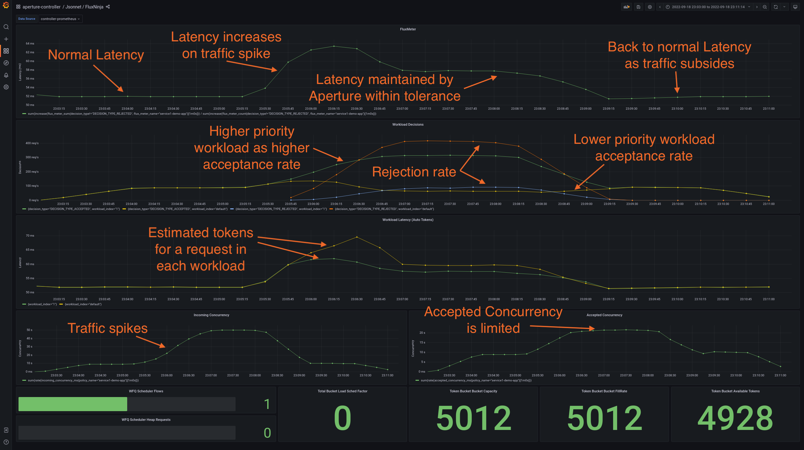

<!-- vale off -->
<!-- markdownlint-disable -->

  
   
  
  
  
  
  
  

<!-- markdownlint-enable -->
<!-- vale on -->

# 🥷 FluxNinja Aperture

Aperture is an observability-driven load management platform designed for
classifying, scheduling, and rate-limiting API traffic in cloud applications.
Built upon a foundation of observability and a global control plane, it offers a
comprehensive suite of load management capabilities that enhance the reliability
and performance of cloud applications while also optimizing resource
utilization.

Aperture seamlessly integrates with existing control points such as gateways,
service meshes, and application middlewares. Moreover, it offers SDKs for
developers to establish control points around specific features or code sections
inside applications

## ⚙️ Features

Aperture provides a variety of advanced load management features:

- **Adaptive service protection:** Enhance resource utilization and safeguard
  against abrupt service overloads with an intelligent queue at the entry point
  of services. This queue dynamically adjusts the rate of requests based on live
  service health, thereby mitigating potential service disruptions and ensuring
  optimal performance under all load conditions.
- **Global quota management:** Maintain compliance with external API quotas with
  a global token bucket and smart request queuing. This feature regulates
  requests aimed at external services, ensuring that the usage remains within
  prescribed rate limits and avoids penalties or additional costs.
- **Workload prioritization:** Safeguard crucial user experience pathways and
  ensure prioritized access to external APIs even during high-load conditions by
  strategically prioritizing workloads. This is achieved through the use of
  declarative policies that label and prioritize workload requests, such as API
  calls. By employing
  [weighted fair queuing](https://en.wikipedia.org/wiki/Weighted_fair_queueing)
  for scheduling, Aperture ensures a fair distribution of resources that aligns
  with the business value and urgency of requests.
- **Load-based auto-scaling:** Eliminate the need for costly over-provisioning
  and enhance efficiency with Aperture's load-based auto-scaling. Aperture's
  policies are expressed as circuit graphs that continuously track deviations
  from service-level objectives and calculate recovery or escalation actions.
  Auto-scaling can be implemented as an escalation that triggers based on load
  throttling signal.
- **Distributed rate-limiting:** Safeguard APIs from potential abuse with
  Aperture's high-performance, distributed rate limiter. This feature enforces
  per-key limits based on fine-grained labels, ensuring precise control and
  prevention of excessive usage.
- **Percentage rollouts:** Enable teams to gradually release new features to a
  subset of users, without impacting the rest of the system. Aperture provides
  automated load ramping functionality, allowing for a safe and controlled
  increment of load to new features or API endpoints. This feature continuously
  monitors for potential performance issues and includes an automatic response
  mechanism to dial back load in case of a performance regression. This
  proactive approach minimizes service disruptions and maintains consistent
  performance, even when rolling out new features.

## 🏗️ Architecture

- 🚦 Aperture Agents are typically deployed next to the services and provide
  high-performance load management capabilities. They are responsible for
  scheduling and rate-limiting incoming requests based on the policies defined
  in the Aperture Controller. In addition, they also collect service health and
  flow metrics.

- 🤖 Aperture Controller executes observability-driven control policies and
  configures Aperture Agents. The control policies are expressed as circuit
  graphs consisting of interconnected signal processing blocks. The Aperture
  policies provide a programmable way to tailor sophisticated control policies
  to match any application's needs.

## 🏁 Getting Started

### 🎮 Playground

To try Aperture in a local Kubernetes environment, refer to
[Playground docs](./playground/README.md).

### 🏎️ Installation

To install the Aperture system, please follow the
[Installation](https://docs.fluxninja.com/get-started/installation) guide.

### 📖 Use Cases

- [Use Cases](https://docs.fluxninja.com/use-cases) section in Aperture
  documentation.

### 🖥️ Slide Decks

- [Observability-driven Load Management](https://docs.google.com/presentation/d/1Funig5u63w96G91ZjHV7ftgLOl1c5z5yDeuoVRH1QSs/edit?usp=sharing)
  deck covers the overview and use-cases of Aperture.

## 🎥 Videos

- [SREcon 23 APAC - Mastering Chaos: Achieving Fault Tolerance with Observability-Driven Prioritized Load Shedding](https://www.youtube.com/watch?v=ws9__JjaJsE)
- [Chaos Carnival 2023-Graceful Degradation:Keeping The Lights On When Everything Goes Wrong](https://www.youtube.com/watch?v=yHKPXsZOc5I)
- [Graceful Degradation: When All Goes Wrong | Tanveer Gill | Conf42 Chaos Engineering 2023](https://www.youtube.com/watch?v=nm62d2gYqNk)
- [How Concurrency Limits Help Protect Against Cascading Failures](https://youtu.be/m070bAvrDHM)
- [Build Indestructible Applications with Aperture Flow Control](https://www.youtube.com/watch?v=sEl4SMo3KNo)

## 👷 Contributing

[Reporting bugs](https://github.com/fluxninja/aperture/issues/new?assignees=&labels=bug&template=bug_report.md&title=)
helps us improve Aperture to be more reliable and user-friendly. Please make
sure to include all the required information to reproduce and understand the bug
you are reporting. Follow helper questions in the bug report template to make it
easier. If you see a way to improve Aperture, use the
[feature request](https://github.com/fluxninja/aperture/issues/new?assignees=&labels=feature+request&template=feature_request.md&title=)
template to create an issue.

To contribute code, please read the [Contribution guide](CONTRIBUTING.md).
