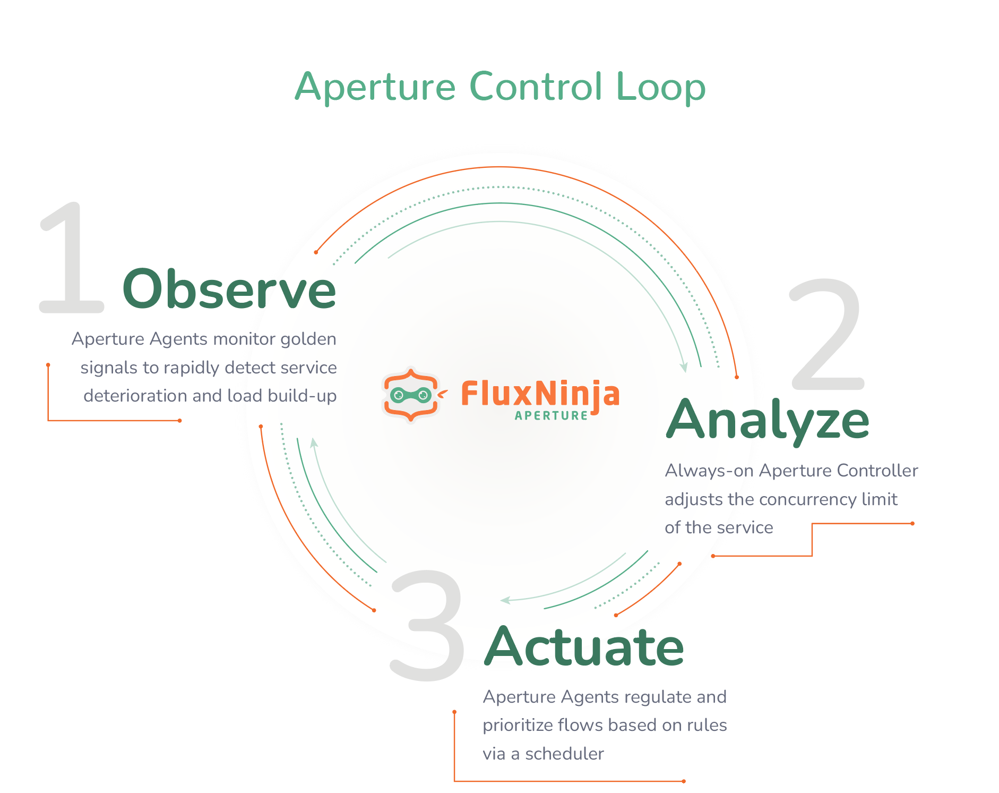

  
  
  

  

## What is Aperture?

Aperture is the first open-source flow control and reliability management platform for modern web applications.

Aperture enables flow control through observing, analyzing, and actuating, facilitated by agents and a controller.

  

For more detailed description, refer to [the docs](docs/content/introduction.md).

## Contributing

We would really appreciate you help!

See our [Code of Conduct](CODE_OF_CONDUCT.md).

### Reporting bugs or requesting features

Reporting bugs helps us improve our product to be more reliable and user friendly.
Please make sure to include all the required information to reproduce and understand the bug you are reporing.

Follow helper questions in bug report template to make it easier.

If you see a way to improve Aperture, by extending it's rich features portfolio, use the feature request
template to create an issue. Make sure to explain the problem you are trying to solve and what is the
expected behavior.

### Creating Pull Requests

When you are ready to contribute, pick an issue you'd like to solve.
Try starting with:

- [Good First Issue](https://github.com/fluxninja/aperture/issues?utf8=%E2%9C%93&q=is%3Aissue+is%3Aopen+label%3A%22good+first+issue%22)

After your first PR is created you'd be asked to sign our [Contributor License Agreement](https://cla-assistant.io/fluxninja/aperture).

## Resources

For better understanding of Aperture, refer to the following external resources.

- [Documentation](docs/content/introduction.md)
