  
   
  
  
  
  
  
  

## 🥷 What is FluxNinja Aperture?

Aperture is the first open-source flow control and reliability management
platform for modern cloud applications.

  <picture>
    <source media="(prefers-color-scheme: dark)" srcset="https://raw.githubusercontent.com/fluxninja/aperture/main/docs/content/assets/img/oaadark.png" />
    <source media="(prefers-color-scheme: light)" srcset="https://raw.githubusercontent.com/fluxninja/aperture/main/docs/content/assets/img/oaalight.png" />
    
  </picture>

## 🎛️ Why is flow control needed?

Modern cloud application architectures such as microservices are vulnerable to [cascading failures](https://sre.google/sre-book/addressing-cascading-failures/) in face of sudden loads, new deployments and performance issues. Reliable operation is impossible without [effective flow control](https://sre.google/sre-book/handling-overload/). In addition, flow control enables graceful degradation, which is the ability to preserve key user experience pathways even in the face of application failures.

## ⚙️ Features

At the fundamental level, Aperture enables flow control through observing, analyzing, and actuating, facilitated by agents and a controller.

- 🚦 Aperture Agents live next to your service instances as a sidecar and provide powerful [flow control](https://docs.fluxninja.com/docs/concepts/flow-control/) components such as a [weighted fair queuing scheduler](https://docs.fluxninja.com/docs/concepts/flow-control/concurrency-limiter) for prioritized load-shedding and a [distributed rate-limiter](https://docs.fluxninja.com/docs/concepts/flow-control/rate-limiter). A [flow](https://docs.fluxninja.com/docs/concepts/flow-control/flow-label) is the fundamental unit of work from the perspective of an Aperture Agent. It could be an API call, a feature, or even a database query.

- 🤖 Aperture Controller is the "brain" of system. It is powered by always-on, [circuit graph driven policies](https://docs.fluxninja.com/docs/concepts/policy/) that continuously track deviations from service-level objectives (SLOs) and calculate recovery or escalation actions.

## ▶️ Explainer Video

## 🏗️ Architecture

## 🏁 Getting Started

### 🎮 Playground

To try aperture in a local Kubernetes environment, refer to
[Playground docs](https://docs.fluxninja.com/docs/get-started/playground/).

### 🏎️ Installation

To install Aperture system, please follow the [Installation](https://docs.fluxninja.com/docs/development/category/installation) guide.

## 👷 Contributing

[Reporting bugs](https://github.com/fluxninja/aperture/issues/new?assignees=&labels=bug&template=bug_report.md&title=) helps us improve Aperture to be more reliable and user friendly. Please make sure to include all the required information to reproduce and understand the bug you are reporting. Follow helper questions in bug report template to make it easier.
If you see a way to improve Aperture, use the [feature request](https://github.com/fluxninja/aperture/issues/new?assignees=&labels=feature+request&template=feature_request.md&title=) template to create
an issue. Make sure to explain the problem you are trying to solve and what is
the expected behavior.

To contribute code, please read the [Contribution guide](CONTRIBUTING.md).

## 📄 License Compliance

