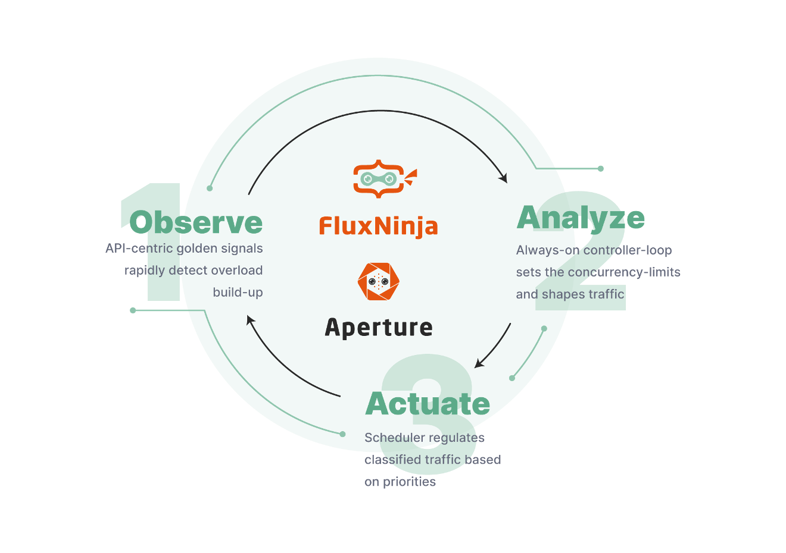

Welcome to official guide for Aperture open source! This guide is the best place
to start with Aperture. If you are ready, deploy Aperture locally with
[Aperture Learn tutorial](../Setup/aperture-setup.md).

Aperture primarily provides "Flow Control as a Service" for modern cloud
applications, notably in web-scale applications. Aperture's adaptive flow
control policies are orders-of-magnitude effective in preventing cascading
failures and ensuring a consistent end-user experience than traditional
workflows and tools. Aperture's flow control policies include capabilities such
as distributed rate limiting (for abuse prevention) and concurrency limiting
(for service protection) to prevent cascading failures. The limits are applied
to the API traffic or features in the code to gracefully degrade the service in
overload scenarios and user abuse.

## How it Works

Policies configured in Aperture are always-on "Observe, Analyze, Actuate"
control-loops:

- Observe: Aperture has a built-in, on-demand, telemetry collection system that is
  tuned towards control purposes. The telemetry collected by Aperture is very
  selective compared to traditional monitoring but it is higher-frequency and
  higher-fidelity. For instance, Aperture provides Traffic Classification rules that label live traffic based on request payloads for telemetry and flow
  control purposes.
- Analyze: Aperture continuously tracks deviations from service-level objectives
  and automatically calculates recovery and escalation actions. To accomplish
  that, Aperture policies are expressed as signal processing graphs. The policy
  graph consumes telemetry signals, processing them through composable signal
  processing components such as arithmetic, conditional combinators, controllers
  (such as PID, Gradient), etc. The processed signals are fed into actuation
  components that perform flow control, auto-scaling (coming soon) and so on.
- Actuate: Aperture has actuation components such as concurrency limiters and
  rate limiters. These components together provide powerful flow control
  capabilities such as prioritized load-shedding, fairness and abuse prevention.

Please refer to the [Architecture workflow section](../Architecture/Workflows/) to understand
Aperture insertion.
