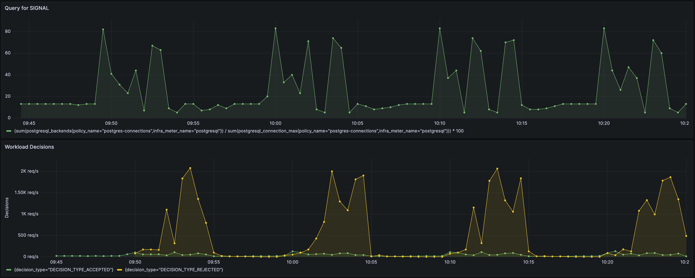
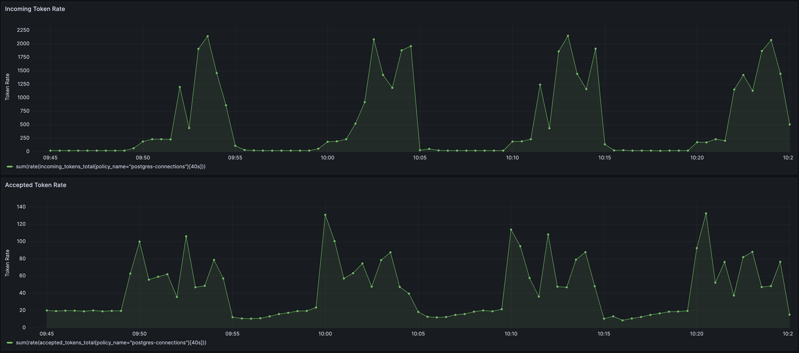

```mdx-code-block
import {apertureVersion} from '../../../apertureVersion.js';
import CodeBlock from '@theme/CodeBlock';
import Tabs from '@theme/Tabs';
import TabItem from "@theme/TabItem";
import {BashTab, TabContent} from '../blueprintsComponents.js';
import Zoom from 'react-medium-image-zoom';
```

## Overview

The PostgreSQL primary server process forks a new process every time a client
requests a connection. PostgreSQL sets a connection limit, which determines the
maximum number of connections that can be opened to the backend at any point of
time.

In scenarios where the number of connections exceeds the limit, the PostgreSQL
server will reject the connection request along with a relevant error on the
client side. Such scenarios can indicate that client applications are sending
long-running or heavy queries to the database and constantly creating new
connections instead of reusing existing connections, which can lead to an
overload scenario.

This policy is designed to detect overload in PostgreSQL database based on
real-time percentage of active connections against the maximum number of
connections.

## Configuration

This policy is built using the
[PostgreSQL](/reference/blueprints/load-scheduling/postgresql.md) blueprint.

The below `values.yaml` file can be generated by following the steps in the
[Installation](#installation) section.

```mdx-code-block

<Tabs>
<TabItem value="aperturectl values.yaml">
```

```yaml
{@include: ./assets/postgresql/values.yaml}
```

```mdx-code-block
</TabItem>
</Tabs>
```

<details><summary>Generated Policy</summary>
<p>

```yaml
{@include: ./assets/postgresql/policy.yaml}
```

</p>
</details>

:::info

[Circuit Diagram](./assets/postgresql/graph.mmd.svg) for this policy.

:::

## Installation

Generate a values file specific to the policy. This can be achieved using the
command provided below.

```mdx-code-block
<CodeBlock language="bash">aperturectl blueprints values --name=load-scheduling/postgres --version={apertureVersion} --output-file=values.yaml</CodeBlock>
```

Apply the policy using the `aperturectl` CLI or `kubectl`.

```mdx-code-block
<Tabs>
  <TabItem value="aperturectl (Aperture Cloud)" label="aperturectl (Aperture Cloud)">
    <TabContent valuesFile="values" tabValue="aperturectl (Aperture Cloud)" />
  </TabItem>
  <TabItem value="aperturectl (self-hosted controller)" label="aperturectl (self-hosted controller)">
```

Pass the `--kube` flag with `aperturectl` to directly apply the generated policy
on a Kubernetes cluster in the namespace where the Aperture Controller is
installed.

```mdx-code-block
  <TabContent valuesFile="values" tabValue="aperturectl (self-hosted controller)" policyName="postgres-connections" />
</TabItem>
<TabItem value="kubectl (self-hosted controller)" label="kubectl (self-hosted controller)">
```

Apply the generated policy YAML (Kubernetes Custom Resource) with `kubectl`.

```mdx-code-block
  <TabContent valuesFile="values" tabValue="kubectl (self-hosted controller)" policyName="postgres-connections" />
</TabItem>

</Tabs>
```

## Policy in Action

To see the policy in action, the traffic is generated such that it starts within
the PostgreSQL's max connection limit and then goes beyond the capacity after
some time. Such a traffic pattern is repeated periodically.




