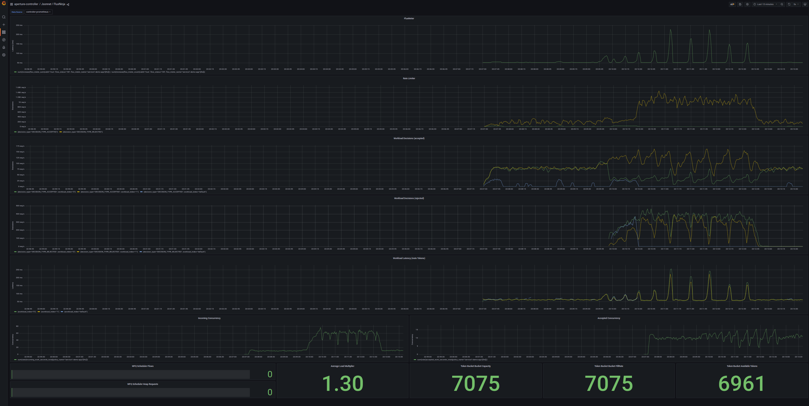

```mdx-code-block
import Tabs from '@theme/Tabs';
import TabItem from '@theme/TabItem';
import Zoom from 'react-medium-image-zoom';
```

Load-based auto-scaling is a technique used to dynamically adjust the number of
instances or resources allocated to a service based on workload demands. This
policy builds upon the _Service Protection_
[blueprint](/reference/policies/bundled-blueprints/policies/service-protection/average-latency.md)
to add an escalation for auto-scaling. The basic service protection policy
protects the service from sudden traffic spikes. But it is necessary to scale
the service to meet demand in case of a persistent change in load.

To achieve this, the policy makes use of an
[_Auto Scaler_](/concepts/auto-scale/components/auto-scaler.md) component to
adjust the number of instances allocated to the service. Load-based auto-scaling
is achieved by defining a scale-out _Controller_ that acts on the load
multiplier signal from the service protection policy. This signal measures the
fraction of traffic that the
[_Load Scheduler_](/concepts/flow-control/components/load-scheduler.md) is
throttling into a queue. The _Auto Scaler_ is configured to scale-out using a
_Gradient Controller_ based on this signal and a setpoint of 1.0.

In addition to load-based scaling, the policy includes a scale-in _Controller_
based on CPU utilization. These _Controllers_ adjust the resources allocated to
the service based on changes in CPU usage, ensuring that the service can handle
the workload efficiently.

## Policy

This policy extends the _Service Protection_
[blueprint](/reference/policies/bundled-blueprints/policies/service-protection/average-latency.md)
by adding auto-scaling to meet persistent changes in demand.

At a high level, this policy consists of:

- Service protection based on response latency trend of the service.
- An _Auto Scaler_ that adjusts the number of replicas of the Kubernetes
  Deployment for the service.
- Load based scale-out is done based on `OBSERVED_LOAD_MULTIPLIER` signal from
  the blueprint. This signal measures the fraction of traffic that the
  _Concurrency Limiter_ is throttling into a queue. The _Auto Scaler_ is
  configured to scale-out based on a _Gradient Controller_ using this signal and
  a setpoint of 1.0.
- In addition to the load based scale-out, the policy also includes a scale-in
  _Controller_ based on CPU utilization which adjusts the instances of the
  service based on changes in CPU usage, ensuring that the service is not
  over-provisioned.

```mdx-code-block
<Tabs>
<TabItem value="aperturectl values.yaml">
```

```yaml
{@include: ./assets/values.yaml}
```

```mdx-code-block
</TabItem>
</Tabs>
```

<details><summary>Generated Policy</summary>
<p>

```yaml
{@include: ./assets/policy.yaml}
```

</p>
</details>

:::info

[Circuit Diagram](./assets/graph.mmd.svg) for this policy.

:::

### Playground

When the above policy is loaded in Aperture's
[Playground](/get-started/playground/playground.md), it can be observed that as
the response latency increases, the service protection policy queues a
proportion of requests. The _Auto Scaler_ makes a scale-out decision as the
`OBSERVED_LOAD_MULTIPLIER` becomes less than 1. As replicas get added to the
deployment, the `OBSERVED_LOAD_MULTIPLIER` increases to more than 1, allowing
the service to meet increased demand. The response latency returns to a normal
range, and the _Concurrency Limiter_ won't load shed any traffic.

After the scale-out cooldown period, the scale-in based on CPU utilization gets
triggered, which will cause the replicas to decrease. Once the traffic ramps up
again, the above cycle continues.

<Zoom>



</Zoom>
