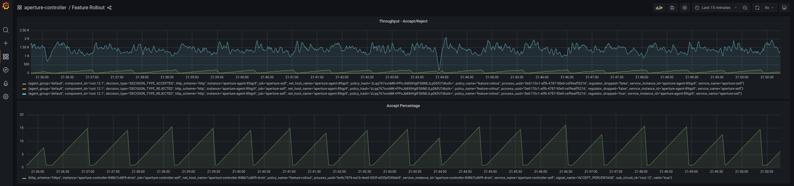

```mdx-code-block
import Tabs from '@theme/Tabs';
import TabItem from '@theme/TabItem';
import Zoom from 'react-medium-image-zoom';
```

Feature flags provide a mechanism for shipping new features to production
without compromising existing functionality. By utilizing Aperture, features can
be toggled on or off for specific user segments. The following policy enables
you to progressively introduce a new feature, all the while assessing its impact
on your application's latency. If the latency deteriorates beyond the configured
threshold, the rollout can be halted or reversed to ensure a seamless user
experience.

## Policy

This policy uses the
[`Feature Rollout with Average Latency Feedback`](/reference/policies/bundled-blueprints/policies/feature-rollout/average-latency.md)
blueprint that enables incremental roll out of a new feature. In this example,
we will create a policy that slowly ramps up the percentage of requests that are
served with the new feature. We will continuously monitor the application's
latency and roll back the feature if the latency deteriorates beyond the
configured limit.

At a high-level, this policy consists of:

- Latency monitoring: Continuously measure the application's latency using the
  [`average_latency_driver`](/reference/policies/bundled-blueprints/policies/feature-rollout/base.md#average-latency-driver).
- Rollout control: Gradually increase the percentage of requests that are to be
  served the new feature using
  [`steps`](/reference/policies/spec#load-ramp-parameters-step). Monitor the
  application's latency and roll back the feature if the latency deteriorates
  beyond the configured limit.

```mdx-code-block
<Tabs>
<TabItem value="aperturectl values.yaml">
```

```yaml
{@include: ./assets/with-average-latency-feedback/values.yaml}
```

```mdx-code-block
</TabItem>
</Tabs>

```

<details><summary>Generated Policy</summary>
<p>

```yaml
{@include: ./assets/with-average-latency-feedback/policy.yaml}
```

</p>
</details>

## Playground

The above policy can be loaded using the `feature_rollout` scenario in
[Playground](/playground/playground.md)

:::info

[Circuit Diagram](./assets/with-average-latency-feedback/graph.mmd.svg) for this
policy.

:::

<Zoom>



</Zoom>
