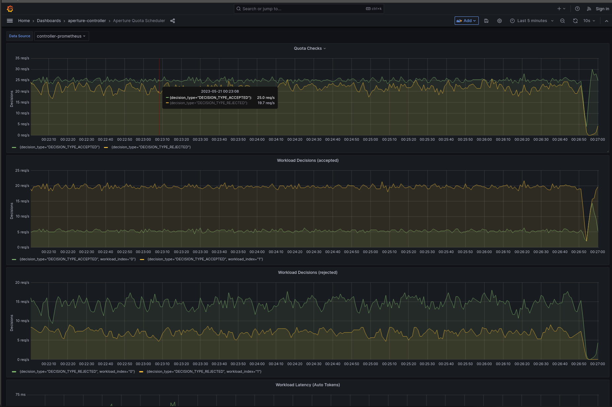

```mdx-code-block
import Tabs from '@theme/Tabs';
import TabItem from '@theme/TabItem';
import Zoom from 'react-medium-image-zoom';
```

External Rate Limiting is a technique to limit the number of outgoing requests
from services to an external API server. Turning apps into spend aware and stay
within quota limits to avoid cost overages. However, not all workloads are on
same priority, based on application, their priority can be different. While
doing external rate limiting, it is important to ensure prioritized access for
your critical workloads. This policy builds upon the
[`Quota Scheduler`](/reference/policies/bundled-blueprints/policies/quota-scheduler.md)
Blueprint, which comprises components like the token bucket rate limiting to
ensure quota limits and a
[Weighted Fair Queuing (WFQ)](/concepts/flow-control/components/load-scheduler.md#scheduler)
based Workload Scheduler to assure prioritized access for critical workloads.

## Policy

In this policy,
[Quota Scheduler](reference/policies/bundled-blueprints/policies/quota-scheduler.md#policy-quota-scheduler)
component is configured with `bucket_capacity`, and rate limiting is configured
based on label key `api_key` extracted from the request header. While the lazy
sync of between the agent is set to false.

WFQ Scheduler is configured two workloads priorities; `guest` and `subscriber`
with 50 and 200 respectively. Matching labels using `user_type` value from the
request header.

```mdx-code-block
<Tabs>
<TabItem value="aperturectl values.yaml">
```

```yaml
{@include: ./assets/with-external-api-calls-prioritization/values.yaml}
```

```mdx-code-block
</TabItem>
</Tabs>

```

<details><summary>Generated Policy</summary>
<p>

```yaml
{@include: ./assets/with-external-api-calls-prioritization/policy.yaml}
```

</p>
</details>

## Playground

The above policy can be loaded using the `quota-scheduler` scenario in
[Playground](https://github.com/fluxninja/aperture/blob/main/playground/README.md)

:::info

[Circuit Diagram](./assets/with-external-api-calls-prioritization/graph.mmd.svg)
for this policy.

:::

<Zoom>



</Zoom>
