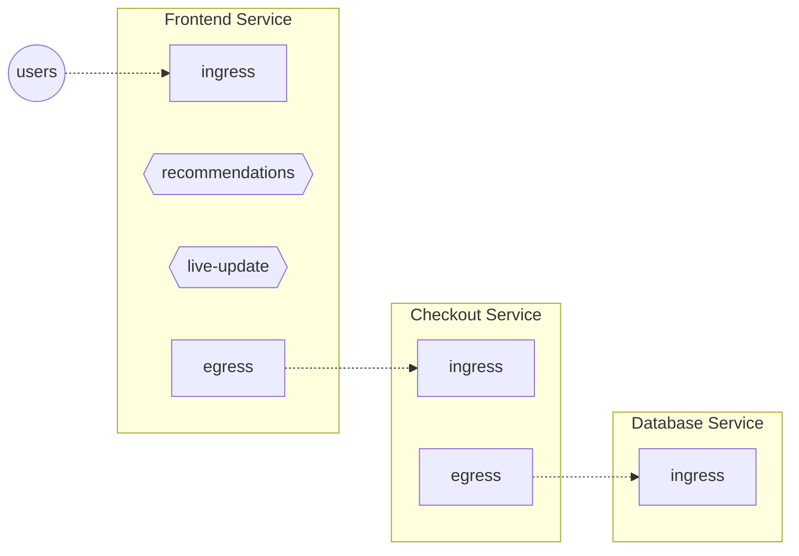

```mdx-code-block
import Tabs from '@theme/Tabs';
import TabItem from '@theme/TabItem';
import Zoom from 'react-medium-image-zoom';
```

## Control Point

Control Points are key components of Aperture policies as they somewhat like
feature flags, but with a broader scope. Specifically, Control Points identify
key junctures in your code or data plane – such as web servers, service meshes,
and API gateways – where flow control decisions are applied. Similarly,
developers can use the Aperture SDKs to define Control Points.

## How to Integrate Control Points

To empower Aperture to act at any of the Control Points, integrations need to be
installed to be able to interact with the Aperture Agent. Here are the two
primary types of Control Points: HTTP Control Points and Feature Control Points.

### HTTP Control Points

HTTP Control Points use web framework and service-mesh-based integrations to
establish Control Points in the traffic path of a service.

In principle, any web proxy or web framework can be integrated with Aperture
using this method. These integrations use Envoy's External Authorization API,
and there are ready integrations available for many popular web frameworks.

For example, instructions for integration with
[Istio/Envoy](/integrations/flow-control/envoy/istio.md) are provided. In such a
setup, the Control Point can be labeled to identify a specific filter chain in
Envoy. If insertion is achieved via Istio, the default filter configuration
designates ingress and egress Control Points as identified by
[Istio](https://istio.io/latest/docs/reference/config/networking/envoy-filter/#EnvoyFilter-PatchContext).

### Feature Control Points

Feature Control Points are facilitated by the
[Aperture SDKs](/integrations/flow-control/sdk/sdk.md), which are available for
a variety of popular programming languages. These SDKs allow any function call
or code snippet within the service code to be wrapped as a _Feature Control
Point_. In Aperture's context, every execution of the feature is seen as a flow.

The SDK offers an API to initiate a flow, which corresponds to a
[`flowcontrol.v1.Check`][flowcontrol-proto] call into the Agent. The response
from this call comprises a decision on whether to authorize or decline the flow.
The execution of a feature might be gated based on this decision. There is also
an API to end a flow, which dispatches an OpenTelemetry span representing the
flow to the Agent as telemetry data.

## Understanding and Implementing Control Points

<Zoom>



</Zoom>

In the above diagram, each service has HTTP or gRPC control points. Every
incoming API request to a service is a flow at its `ingress` control point.
Likewise, every outgoing request from a service is a flow at its `egress`
control point.

In addition, the `Frontend` service has feature control points identifying
_recommendations_ and _live-update_ features inside the `Frontend` service's
code.

:::note

The _Control Point_ definition does not care about which particular entity (like
a pod) is handling a particular flow. A single _Control Point_ covers _all_ the
entities belonging to the same service.

:::

:::tip

Use the [`aperturectl flow-control control-points`][aperturectl] CLI command to
list active control points.

:::
