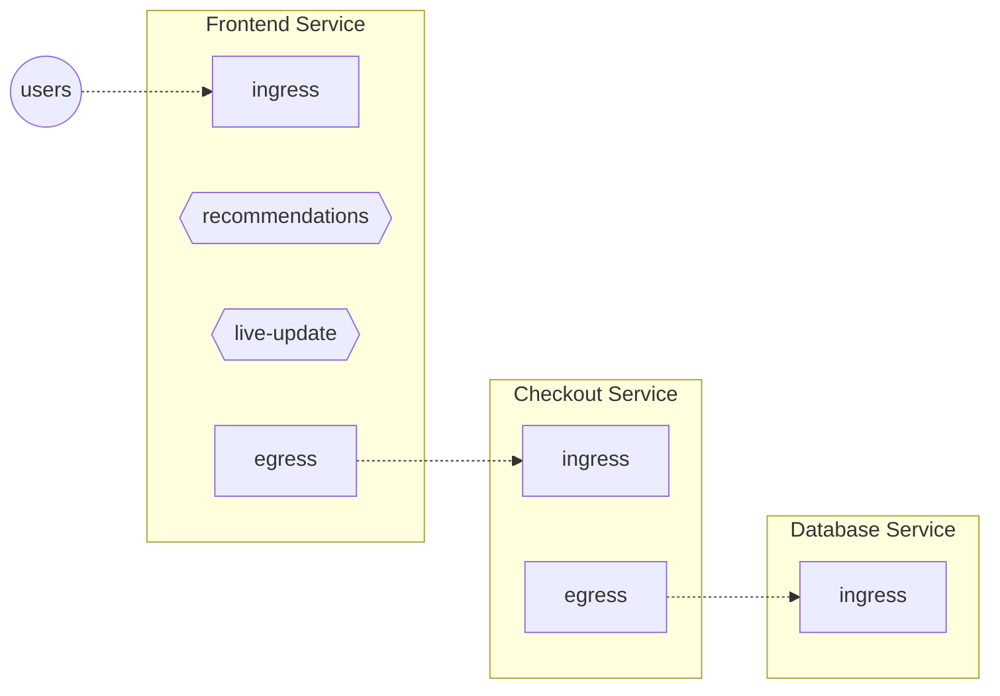

```mdx-code-block
import Tabs from '@theme/Tabs';
import TabItem from '@theme/TabItem';
import Zoom from 'react-medium-image-zoom';
```

Control points are similar to feature flags. They identify the location in the
code or data plane (web servers, service meshes, API gateways, and so on) where
flow control decisions are applied. They're defined by developers using the SDKs
or configured when integrating with API Gateways or Service Meshes.

## How to Integrate Control Points

To empower Aperture to act at any of the control points, integrations need to be
installed to be able to interact with the Aperture Agent. Here are the two
primary types of control points: HTTP/gRPC control points and Feature Control
Points.

### HTTP/gRPC Control Points

HTTP control points use web framework and service-mesh-based integrations to
establish control points in the traffic path of a service.

In principle, any web proxy or web framework can be integrated with Aperture
using this method. There are integrations available for many popular web
frameworks.

The integration with Envoy uses the External Authorization API. In such a setup,
the control point can be used to identify a specific filter chain in Envoy. If
insertion is achieved using the
[Istio integration](/aperture-for-infra/integrations/istio/istio.md), the
default filter configuration designates `ingress` and `egress` control points as
identified by
[PatchContext](https://istio.io/latest/docs/reference/config/networking/envoy-filter/#EnvoyFilter-PatchContext)
of Istio's EnvoyFilter CRD.

### Feature Control Points

Feature control points are facilitated by the [Aperture SDKs](/sdk/sdk.md),
which are available for a variety of popular programming languages. These SDKs
allow any function call or code snippet within the service code to be wrapped as
a feature control point. In Aperture's context, every execution of the feature
is seen as a flow.

The SDK offers an API to initiate a flow, which corresponds to a
[`flowcontrol.v1.Check`][flowcontrol-proto] call into the Agent. The response
from this call comprises a decision on whether to accept or reject the flow. The
execution of a feature might be gated based on this decision. There is also an
API to end a flow, which creates an OpenTelemetry span representing the flow and
dispatches it to the Agent.

## Understanding Control Points

<Zoom>



</Zoom>

In the above diagram, each service has HTTP or gRPC control points. Every
incoming API request to a service is a flow at its `ingress` control point.
Likewise, every outgoing request from a service is a flow at its `egress`
control point.

In addition, the `Frontend` service has feature control points identifying
_recommendations_ and _live-update_ features inside the `Frontend` service's
code.

:::note

The control point definition does not care about which particular entity (such
as a pod) is handling a particular flow. A single control point covers _all_ the
entities belonging to the same service.

:::

## Live Preview of Control Points

Use the
[`aperturectl flow-control control-points`](../reference/aperture-cli/aperturectl/discovery/entities/)
CLI command to list active control points.

For example:

```sh
aperturectl flow-control control-points --kube
```

Returns:

```json
AGENT GROUP   SERVICE                                       NAME      TYPE
default       service1-demo-app.demoapp.svc.cluster.local   egress    http
default       service1-demo-app.demoapp.svc.cluster.local   ingress   http
default       service2-demo-app.demoapp.svc.cluster.local   egress    http
default       service2-demo-app.demoapp.svc.cluster.local   ingress   http
default       service3-demo-app.demoapp.svc.cluster.local   ingress   http
```

[flowcontrol-proto]:
  https://buf.build/fluxninja/aperture/docs/main:aperture.flowcontrol.check.v1
