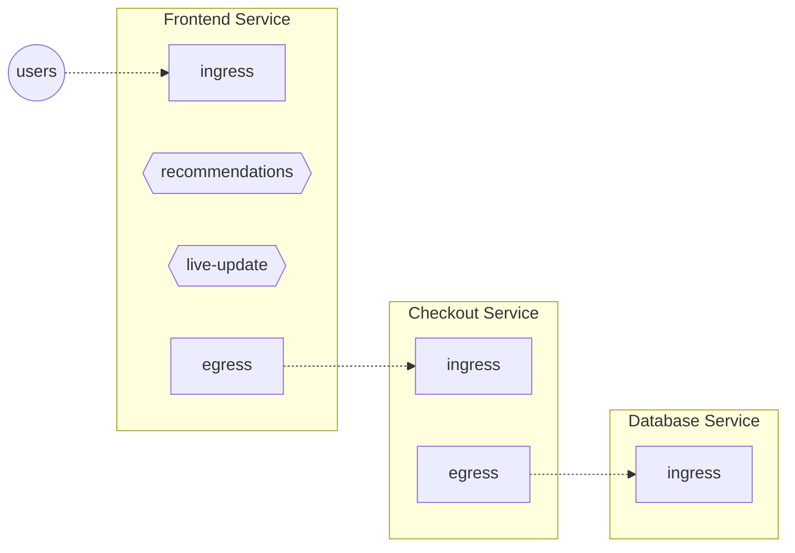

## Control Point {#control-point}

Control points are similar to
[feature flags](https://en.wikipedia.org/wiki/Feature_toggle). They identify the
location in the code or data plane (web servers, service meshes, API gateways,
and so on) where flow control decisions are applied. They're defined by
developers using the SDKs or configured when integrating with API Gateways or
Service Meshes.

<Zoom>

</Zoom>

In the above diagram, each service has HTTP or gRPC control points. Every
incoming API request to a service is a flow at its `ingress` control point.
Likewise, every outgoing request from a service is a flow at its `egress`
control point.

In addition, the `Frontend` service has feature control points identifying
_recommendations_ and _live-update_ features inside the `Frontend` service's
code.

:::note

The _Control Point_ definition does not care about which particular entity (like
a pod) is handling a particular flow. A single _Control Point_ covers _all_ the
entities belonging to the same service.

:::

:::tip

Use the `aperturectl flow-control control-points` CLI command to list active
control points.

:::
