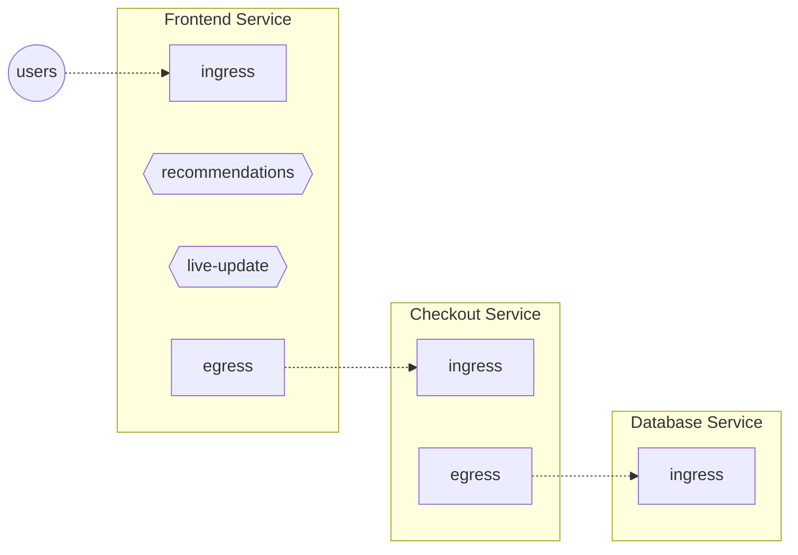

# Flow Control

Reliable operations at web-scale are impossible without effective flow control.
Aperture splits the process of flow control in two layers:

- Governing the flow control process and making high-level decisions. This is
  done by Aperture Controller through _policies_. You can read more about
  policies in [the next chapter][policies].
- Actual execution of flow control is performed by Aperture Agent via
  [Concurrency Limiters][concurrency-limiter] or [Rate Limiters][rate-limiter].
  Additionally the Agent handles other flow-control related tasks, like
  gathering metrics via [Flux Meters][flux-meter] and classifying traffic via
  [Classifiers][classifier]. This chapter describes flow control capabilities at
  the Agent.

## What is a flow? {#flow}

A flow is the fundamental unit of work from the perspective of an Aperture
Agent. It could be an API call, a feature, or even a database query. A flow in
Aperture is similar to [OpenTelemetry span][span].

## Control points and services {#control-point}

To describe where the flows are happening, Aperture divides the world into
control points, located in services:

:::info

Aperture defines a service as a collection of entities delivering a common
functionality, such as checkout, billing etc. [Read more on Service
page][service].

:::

There are two types of control points:

- **Traffic** control points. Every incoming API request to a service is a flow
  at its **ingress** control point. Likewise every outgoing request from a
  service is a flow at its **egress** control point.

- **Feature** control points. When using Aperture library, you can define
  arbitrary piece of code as a feature and give it a name. In the example above,
  frontend service defines two features: _recommendations_ and _live-update_.
  Let's imagine that…
  <!-- TODO tgill: move this example elsewhere like policy tutorial -->
  - …recommendations processing is heavyweight and slows down the frontend
    service (or some other downstream service), thus we want to track its
    execution time and perhaps conditionally disable recommendations via some
    policy. This is the typical type of feature.
  - …live-update feature “just” switches on auto-refresh flag for on-client code
    – it's basically a boolean feature-flag. While there's no inherent
    “processing” for this feature, enabling it will has consequences for the
    system (as the client will make more requests in the future). This is a bit
    less common type of a feature, but still useful.

:::note

Control point definition doesn't care about which particular entity (like a pod)
is handling particular flow. A single control point covers _all_ the entities
belonging to the same service.

:::

## Integrations

For Aperture to be able to act at any of the control points, you need to install
integrations that will communicate with the Aperture Agent.

- _Traffic_ control points: We provide integration instructions for
  [Istio/Envoy][istio].

  In principle, any web proxy or web framework could be integrated with Aperture
  in this way. Envoy integration uses [Envoy's External Authorization
  API][ext-authz].

- _Feature_ control points: We provide [Aperture library][aperture-go] for the
  Go programming language.

  The library provides API to begin a flow which translates to a
  [flowcontrol.v1.Check](https://github.com/fluxninja/aperture/blob/main/api/aperture/flowcontrol/v1/flowcontrol.proto)
  call into Agent. Response of this call contains a decision on whether to allow
  or reject the flow. The execution of a feature may be gated based on this
  decision. There is an API to end a flow which sends an OpenTelemetry span
  representing the flow to the Agent as telemetry.

:::note

Exact instructions on custom proxies / web frameworks / library integrations
will be added in the future.

:::

## Dataplane components {#components}

Agent uses the following observability and control components:

- [Classifiers][classifier]
- [Flux Meters][flux-meter]
- [Concurrency Limiter][concurrency-limiter]
- [Rate Limiter][rate-limiter]

You can learn about their purposes in subsequent pages, but we recommend to
start by first reading on concepts like [services][service] and [labels][label].

[policies]: ../policy/policy.md
[concurrency-limiter]: ./concurrency-limiter.md
[rate-limiter]: ./rate-limiter.md
[flux-meter]: ./flux-meter.md
[classifier]: ./flow-classifier.md
[span]: https://opentelemetry.io/docs/reference/specification/trace/api/#span
[istio]: /get-started/istio.md
[ext-authz]:
  https://www.envoyproxy.io/docs/envoy/latest/api-v3/service/auth/v3/external_auth.proto#authorization-service-proto
[aperture-go]: https://github.com/FluxNinja/aperture-go
[service]: ./selector/service.md
[label]: ./selector/flow-label.md
