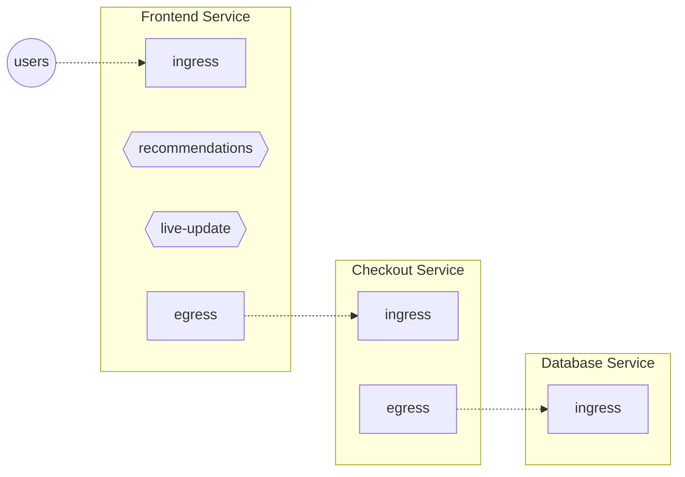

# Flow Control

```mdx-code-block
import Tabs from '@theme/Tabs';
import TabItem from '@theme/TabItem';
import Zoom from 'react-medium-image-zoom';
import {apertureVersion} from '../../apertureVersion.js';
```

Reliable operations at web-scale are impossible without effective flow control.
Aperture splits the process of flow control in two layers:

- Governing the flow control process and making high-level decisions. This is
  done by Aperture Controller through _policies_. You can read more about
  policies in [Policies chapter][policies].
- Actual execution of flow control is performed by Aperture Agent via
  [Concurrency Limiters][concurrency-limiter] or [Rate Limiters][rate-limiter].
  Additionally the Agent handles other flow-control related tasks, like
  gathering metrics via [Flux Meters][flux-meter] and classifying traffic via
  [Classifiers][classifier]. This chapter describes flow control capabilities at
  the Agent.

## What is a Flow? {#flow}

A Flow is the fundamental unit of work from the perspective of an Aperture
Agent. It could be an API call, a feature, or even a database query. A Flow in
Aperture is similar to [OpenTelemetry span][span] and contains [flow
labels][flow-label].

## Control Points and Services {#control-point}

To describe where the Flows are happening, Aperture divides the world into
Control Points, located in services:

:::info

Aperture defines a service as a collection of entities delivering a common
functionality, such as checkout, billing etc. Read more about
[Service][service].

:::

<Zoom>



</Zoom>

In the above diagram, each service has **Traffic** Control Points. Every
incoming API request to a service is a Flow at its **ingress** Control Point.
Likewise every outgoing request from a service is a Flow at its **egress**
Control Point.

In addition, "Frontend" service has **Feature** Control Points identifying
_recommendations_ and _live-update_ features inside the Frontend service's code.

:::note

Control Point definition doesn't care about which particular entity (like a pod)
is handling particular Flow. A single Control Point covers _all_ the entities
belonging to the same service.

:::

## Flow Control Integrations {#integrations}

For Aperture to be able to act at any of the Control Points, you need to install
integrations that will communicate with the Aperture Agent.

- _Traffic_ Control Points: Web framework and service-mesh based integrations
  expose control points at in the traffic path of a service.

  In principle, any web proxy or web framework can be integrated with Aperture
  in this way. These integrations use [Envoy's External Authorization
  API][ext-authz]. Integrations with several popular web frameworks are
  available.

  We provide integration instructions for [Istio/Envoy][istio]. The user can
  name the Control Point to identify a particular filter chain in Envoy. In case
  of insertion via Istio, the <a
  href={`https://github.com/fluxninja/aperture/tree/${apertureVersion}/manifests/charts/istioconfig/templates/envoy_filter.yaml`}>default
  filter config</a>, assigns _ingress_ and _egress_ Control Points as
  [identified by Istio][istio-patch-context].

- _Feature_ Control Points: We provide <a
  href={`https://github.com/fluxninja/aperture/tree/${apertureVersion}/sdks/`}>Aperture
  SDKs</a>[][aperture-go] for popular languages. Aperture SDK wraps any function
  call or code snippet inside the Service code as a Feature Control Point. Every
  invocation of the Feature is a Flow from the perspective of Aperture.

  The SDK provides API to begin a flow which translates to a
  [flowcontrol.v1.Check][flowcontrol-proto] call into Agent. Response of this
  call contains a decision on whether to allow or reject the flow. The execution
  of a feature may be gated based on this decision. There is an API to end a
  flow which sends an OpenTelemetry span representing the flow to the Agent as
  telemetry.

:::note

Exact instructions on custom proxies / web frameworks / SDK integrations will be
added in the future.

:::

## Flow Control Components {#components}

Agent uses the following observability and control components (in order of
execution):

- [Classifiers][classifier]
- [Rate Limiter][rate-limiter]
- [Concurrency Limiter][concurrency-limiter]
- [Flux Meters][flux-meter]

[Flux Meters][flux-meter] enrich the telemetry stream and can be thought to
apply after the [Flow](#flow) has ended.

You can learn more about each of the components in the subsequent sections, but
we recommend to start with concepts like [services][service] and
[labels][flow-label] first.

[policies]: /concepts/policy/policy.md
[concurrency-limiter]: /concepts/flow-control/concurrency-limiter.md
[rate-limiter]: /concepts/flow-control/rate-limiter.md
[flux-meter]: /concepts/flow-control/flux-meter.md
[classifier]: /concepts/flow-control/flow-classifier.md
[span]: https://opentelemetry.io/docs/reference/specification/trace/api/#span
[istio]: /get-started/flow-control/envoy/istio.md
[ext-authz]:
  https://www.envoyproxy.io/docs/envoy/latest/api-v3/service/auth/v3/external_auth.proto#authorization-service-proto
[aperture-go]: https://github.com/FluxNinja/aperture-go
[service]: /concepts/service.md
[flow-label]: /concepts/flow-control/flow-label.md
[flowcontrol-proto]:
  https://buf.build/fluxninja/aperture/docs/main:aperture.flowcontrol.v1
[istio-patch-context]:
  https://istio.io/latest/docs/reference/config/networking/envoy-filter/#EnvoyFilter-PatchContext
