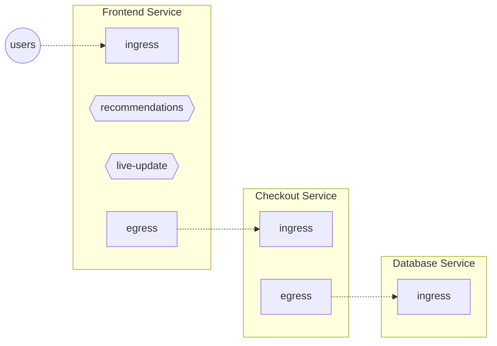
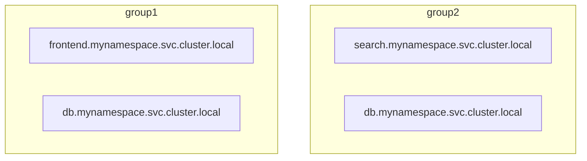
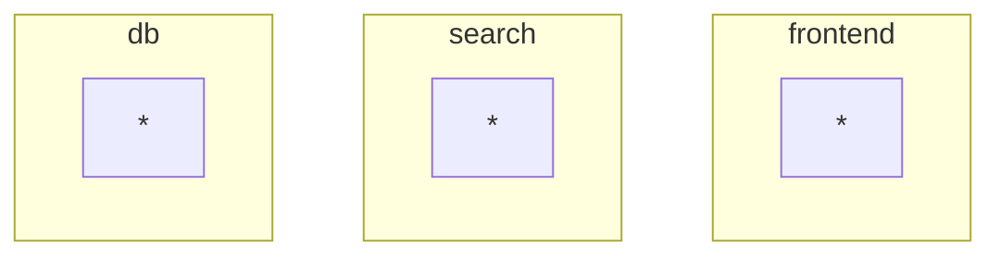

```mdx-code-block
import Tabs from '@theme/Tabs';
import TabItem from '@theme/TabItem';
import Zoom from 'react-medium-image-zoom';
```

:::info

See also [_Flow Selector_ reference](/reference/policies/spec.md#flow-selector)

:::

_Flow Selectors_ are used by flow control and observability components
instantiated by Aperture Agents like [_Classifiers_][classifier], [_Flux
Meters_][flux-meter] and [_Concurrency Limiters_][cl]. _Flow Selectors_ define
scoping rules that decide how these components should select flows for their
operations.

A _Flow Selector_ consists of:

- _Flow Matcher_, containing

  - [_Control Point_](#control-point) (required)
  - [_Flow Matcher_](#label-matcher) (optional)

- _Service Selector_, containing

  - [_Agent Group_](#agent-group) (optional)
  - [_Service_](#service) (optional)

## Flow Matcher {#flow-matcher}

:::info

See also [_Flow Matcher_ reference](/reference/policies/spec.md#flow-matcher)

:::

### Control Point {#control-point}

Control points are similar to
[feature flags](https://en.wikipedia.org/wiki/Feature_toggle). They identify the
location in the code or data plane (web servers, service meshes, API gateways,
and so on) where flow control decisions are applied. They're defined by
developers using the SDKs or configured when integrating with API Gateways or
Service Meshes.

<Zoom>



</Zoom>

In the above diagram, each service has _Traffic_ (HTTP or GRPC) control points.
Every incoming API request to a service is a flow at its `ingress` control
point. Likewise, every outgoing request from a service is a flow at its `egress`
control point.

In addition, the `Frontend` service has _Feature_ control points identifying
_recommendations_ and _live-update_ features inside the `Frontend` service's
code.

:::note

The _Control Point_ definition does not care about which particular entity (like
a pod) is handling a particular flow. A single _Control Point_ covers _all_ the
entities belonging to the same service.

:::

:::tip

Use the [`aperturectl flow-control control-points`][aperturectl] CLI command to
list active control points.

:::

### Label Matcher {#label-matcher}

The _Label Matcher_ optionally narrows down the selected flow based on
conditions on [Flow Labels][label].

There are multiple ways to define a label matcher. The simplest way is to
provide a map of labels for exact-match:

```yaml
label_matcher:
  match_labels:
    http.method: GET
```

Matching expression trees can also be used to define more complex conditions,
including regular expression matching. Refer to [Label Matcher
reference][label-matcher] for further details.

## Example

```yaml
service_selector:
  service: checkout.myns.svc.cluster.local
  agent_group: default
flow_selector:
  control_point: ingress
  label_matcher:
    match_labels:
      user_tier: gold
```

## Service Selector {#service-selector}

:::info

See also
[_Service Selector_ reference](/reference/policies/spec.md#service-selector)

:::

:::note

The _Service Selector_ is an optional construct that helps scale Aperture
configuration in complex environments, such as Kubernetes, or in multi-cluster
installations.

In standalone Aperture Agent deployments (not co-located with any service), the
_Control Points_ alone can be used to match flows to policies and that
deployment can be used as a feature flag decision service serving remote flow
control requests.

:::

### Agent Group {#agent-group}

_Agent Group_ is a flexible label that defines a collection of agents that
operate as peers. For example, an Agent Group can be a Kubernetes cluster name
in the case of DaemonSet deployment, or it can be a service name for sidecar
deployments.

_Agent Group_ defines the scope of agent-to-agent synchronization, with agents
within the group forming a peer-to-peer network to synchronize fine-grained
state per-label global counters that are used for rate-limiting purposes.
Additionally, all agents within an _Agent Group_ instantiate the same set of
flow control components as published by the controller.

### Service {#service}

A service in Aperture is similar to services tracked in Kubernetes or Consul.
Services in Aperture are usually referred by their fully qualified domain names
(FQDN).

A service is a collection of entities delivering a common functionality, such as
checkout, billing and so on. Aperture maintains a mapping of entity IP addresses
to service names. For each flow control decision request sent by an entity,
Aperture looks up the service name and then decides which flow control
components to execute.

:::note

An entity (Kubernetes pod, VM) might belong to multiple services.

:::

:::tip Special Service Names

- `any`: Can be used in a policy to match all services

:::

:::info Service Discovery

Aperture Agents perform automated discovery of services and entities in
environments such as Kubernetes and watch for any changes. Service and entity
entries can also be created manually through configuration.

:::

Services in Aperture are scoped within _Agent Groups_, creating two level
hierarchies, e.g.:

<Zoom>



</Zoom>

In this example, there are two independent `db.mynamespace.svc.cluster.local`
services.

For single-cluster deployments, a single `default` _Agent Group_ can be used:

<Zoom>

```mermaid
graph TB
    subgraph default
        s1[frontend.mynamespace.svc.cluster.local]
        s3[search.mynamespace.svc.cluster.local]
        s2[db.mynamespace.svc.cluster.local]
    end
```

</Zoom>

as another extreme, if _Agent Groups_ already group entities into logical
services, the _Agent Group_ can be treated as a service to match flows to
policies (useful when installing as a sidecar):

<Zoom>



</Zoom>

_Agent Group_ name together with _Service_ name determine the
[service](#service) to select flows from.

## Filtering out liveness/health probes, and metrics endpoints

Liveness and health probes are essential for checking the health of the
application, and metrics endpoints are necessary for monitoring its performance.
However, these endpoints do not contribute to the overall latency of the
service, and if included in latency calculations, they might cause requests to
be rejected, leading to unnecessary pod restarts.

To prevent these issues, traffic to these endpoints can be filtered out by
matching expressions. In the example below, flows with `http.target` starting
with /health, /live, or /ready, and User Agent starting with `kube-probe/1.23`
are filtered out.

```yaml
service_selector:
  service: checkout.myns.svc.cluster.local
  agent_group: default
flow_selector:
  control_point: ingress
  label_matcher:
    match_expressions:
      - key: http.target
        operator: NotIn
        values:
          - /health
          - /live
          - /ready
          - /metrics
      - key: http.user_agent
        operator: NotIn
        values:
          - kube-probe/1.23
```

Filtering out traffic to these endpoints can prevent unnecessary pod restarts
and ensure that the application is available to handle real user traffic

Other flows can be filtered out by matching on different keys and operators,
such as `http.method` with `NotIn` operator and `GET` value. For more
information on how to configure the Label Matcher, see the [Label Matcher
reference][label-matcher].

:::info

Remember that while these endpoints might have a low latency, they should not be
included in the overall latency of the service. Filtering them out can help
improve the accuracy of latency calculations and prevent requests from being
rejected.

:::

[label]: ./flow-label.md
[flux-meter]: ./resources/flux-meter.md
[cl]: ./components/concurrency-limiter.md
[classifier]: ./resources/classifier.md
[label-matcher]: /reference/policies/spec.md#label-matcher
[aperturectl]: /get-started/aperture-cli/aperture-cli.md
