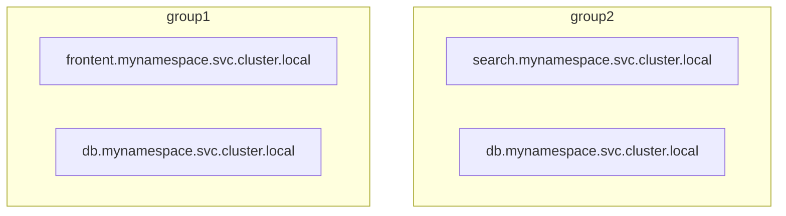
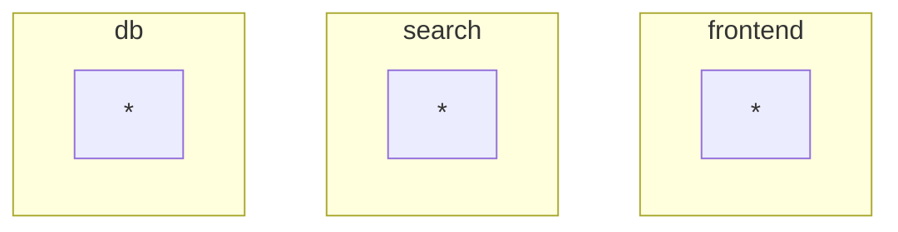

A service in Aperture is similar to services tracked in Kubernetes or Consul. A
Service is a collection of entities delivering a common functionality, such as
checkout, billing etc. Aperture maintains a mapping of entity IP addresses to
Service names. For each flow control decision request sent by an entity,
Aperture looks up the service name and then decides which flow control
components to execute.

:::note

One entity may belong to multiple services.

:::

Services in Aperture are usually referred by their fully qualified domain names.

## Service Discovery

Aperture Agents perform automated discovery of services and entities in
environments such as Kubernetes and watch for any changes. Service and entity
entries can also be created manually via configuration.

## Agent Groups {#agent-group}

Services in Aperture are additionally scoped within Agent Groups, creating two
level hierarchy, eg.:



In this example there are two independent _db.mynamespace.svc.cluster.local_
services.

Agent Group is a flexible label that defines a collection of agents that operate
as peers. For example, an Agent Group can be a Kubernetes cluster name in case
of DaemonSet deployment or it can be a service name for sidecar deployments.

:::info

In addition to providing scoping of services, Agent Group also defines the scope
of **Agent-to-Agent synchronization**. Agents within their Group form a
peer-to-peer network to synchronize fine-grained state such as per-label global
counters that are used for [rate limiting purposes][distributed-counters]. Also,
all the agents within an Agent Group instantiate the same set of [dataplane
components][components], as published by Aperture Controller.

:::

For single-cluster deployments, a single `default` Agent Group can be used:

```mermaid
graph TB
    subgraph default
        s1[frontent.mynamespace.svc.cluster.local]
        s3[search.mynamespace.svc.cluster.local]
        s2[db.mynamespace.svc.cluster.local]
    end
```

as an other extreme, if your Agent Groups already group entities into logical
services, you can treat the Agent Group as a service and [ignore the second
level of hierarchy][catch-all-service]:



[distributed-counters]: ../rate-limiter.md#distributed-counters
[components]: ../flow-control.md#components
[catch-all-service]: selector.md#service
