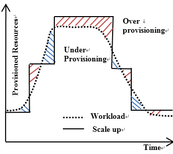

# Auto Scaling

In today's digital age, enterprises must deal with a huge amount of data and
traffic that comes with the growth of online services. This creates a need for
auto-scaling, where an application can adjust its resources dynamically based on
demand. Autoscaling is crucial because it can help to optimize resource usage
and improve user experience, while also preventing system failures due to
overload.

In the past, many organizations faced challenges related to scaling their
applications manually. They had to predict future traffic, provision enough
resources to handle the peak load, and then manually de-provision those
resources when the traffic subsided. This approach led to several issues.

 TODO: Replace with a better image

One of the primary issues was over-provisioning of resources. When organizations
had to predict future traffic, they often ended up provisioning more resources
than necessary. This led to wastage of resources, which resulted in increased
costs. Additionally, it took time to provision new resources, which could result
in service outages during periods of high traffic.

On the other hand, under-provisioning of resources was another major issue. When
traffic exceeded the capacity of the provisioned resources, services became
slow, unresponsive, or completely unavailable. This led to poor user experience
and customer dissatisfaction. Furthermore, this could also result in missed
revenue opportunities or loss of customers to competitors.

This is where FluxNinja Aperture Auto-scaling comes in where it address these
issues by automatically adjusting the resources allocated to an application
using load-based autoscaling. This helps manage load and ensure resources are
used efficiently while keeping the system stability, costs are in check, and
customers receive the best possible experience.

# Kubernetes Control Points

Kubernetes Control Points are a type of Kubernetes resource that can be scaled
up or down dynamically. These resources can be used to manage and optimize the
allocation of computing resources for containerized applications.

Some of Kubernetes Control Points include:

- Deployments: A Kubernetes deployment is a resource that manages a set of
  identical pods.
- ReplicaSets: A ReplicaSet is a Kubernetes resource that manages the deployment
  of a set of identical pods.
- StatefulSets: A StatefulSet is a Kubernetes resource that manages the
  deployment of a set of identical pods with unique identities. They are
  commonly used for stateful applications that require stable, unique network
  identities and persistent storage.

## Kubernetes Resource Discovery

Aperture has a discover mechanism to discover all the Kubernetes resources that
are scalable as Kubernetes Control points. Kubernetes Control points are grouped
via kind of resource. For example, all the deployments are grouped together and
all the replica sets are grouped together.
