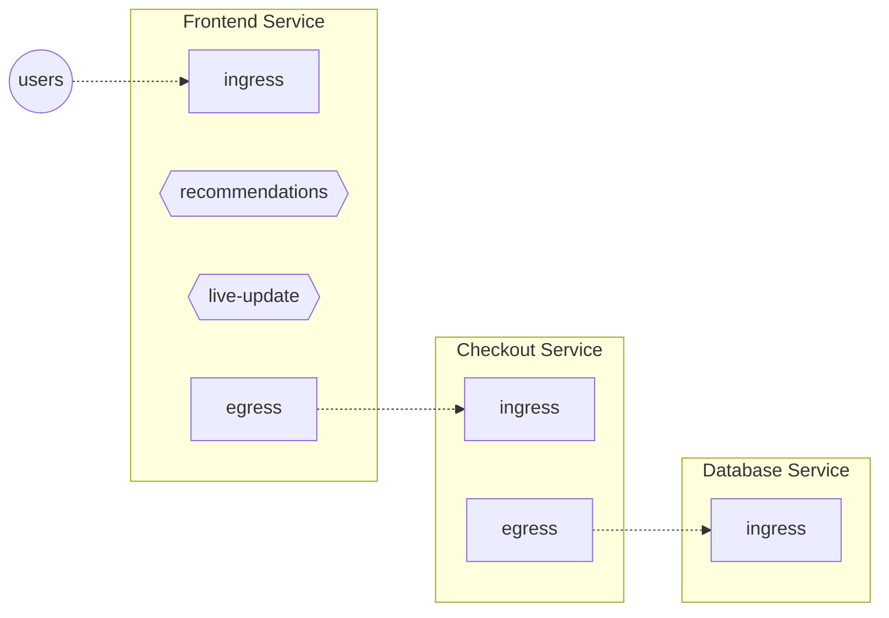

To describe where the Flows are regulated or monitored, Aperture tracks Control
Points, within [services](service.md).

<Zoom>

</Zoom>

In the above diagram, each service has **HTTP** Control Points. Every incoming
API request to a service is a Flow at its **ingress** Control Point. Likewise
every outgoing request from a service is a Flow at its **egress** Control Point.

In addition, "Frontend" service has **Feature** Control Points identifying
_recommendations_ and _live-update_ features inside the Frontend service's code.

:::note

Control Point definition doesn't care about which particular entity (like a pod)
is handling particular Flow. A single Control Point covers _all_ the entities
belonging to the same service.

:::
