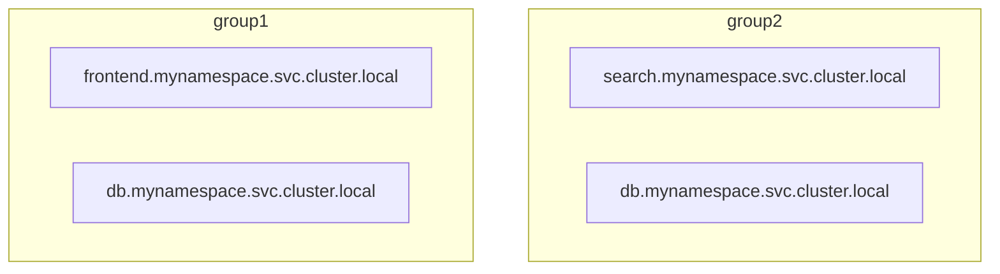
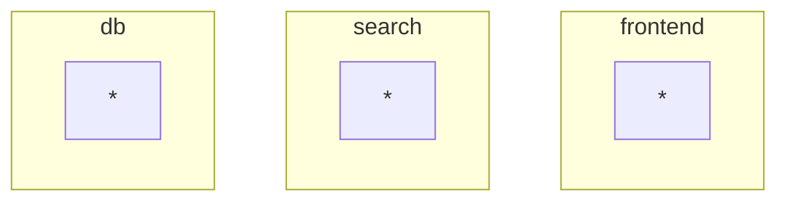
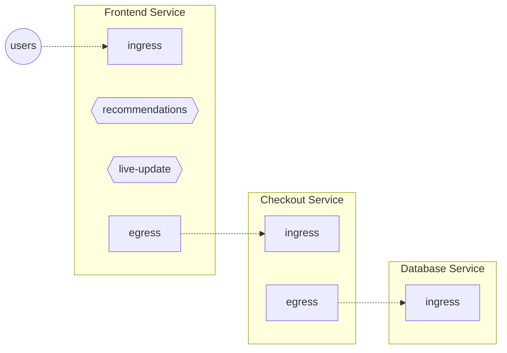

```mdx-code-block
import Tabs from '@theme/Tabs';
import TabItem from '@theme/TabItem';
import Zoom from 'react-medium-image-zoom';
```

:::info

See also [Flow Selector reference](/reference/policies/spec.md#flow-selector)

:::

Flow Selectors are used by flow control and observability components
instantiated by Aperture Agents like [`Classifiers`][classifier],
[`Flux Meters`][flux-meter] and [`Concurrency Limiters`][cl]. Flow Selectors
define scoping rules – how these components should select flows for their
operations.

A Flow Selector consists of:

- Service Selector, containing

  - [service][service] name,
  - [agent group][agent-group] name,

- Flow Matcher, containing
  - [control point][control-point], and
  - optional [flow label matcher](#label-matcher).

### Service Selector {#service-selector}

:::info

See also
[ServiceSelector reference](/reference/policies/spec.md#service-selector)

:::

A service in Aperture is similar to services tracked in Kubernetes or Consul. A
Service is a collection of entities delivering a common functionality, such as
checkout, billing etc. Aperture maintains a mapping of entity IP addresses to
Service names. For each flow control decision request sent by an entity,
Aperture looks up the service name and then decides which flow control
components to execute.

:::note

An entity (K8s Pod, VM, etc) may belong to multiple services.

:::

Services in Aperture are usually referred by their fully qualified domain names.

:::tip Catch-all service

If the agent group is already logically a single service or you simply want to
select all services within the agent group, you can set the service name as
`all`.

:::

#### Service Discovery

Aperture Agents perform automated discovery of services and entities in
environments such as Kubernetes and watch for any changes. Service and entity
entries can also be created manually via configuration.

### Agent Groups {#agent-group}

Services in Aperture are additionally scoped within Agent Groups, creating two
level hierarchy, eg.:

<Zoom>



</Zoom>

In this example there are two independent _db.mynamespace.svc.cluster.local_
services.

Agent Group is a flexible label that defines a collection of agents that operate
as peers. For example, an Agent Group can be a Kubernetes cluster name in case
of DaemonSet deployment or it can be a service name for sidecar deployments.

:::info

In addition to providing scoping of services, Agent Group also defines the scope
of **Agent-to-Agent synchronization**. Agents within their Group form a
peer-to-peer network to synchronize fine-grained state such as per-label global
counters that are used for [rate limiting purposes][dc]. Also, all the agents
within an Agent Group instantiate the same set of [dataplane
components][components], as published by Aperture Controller.

:::

For single-cluster deployments, a single `default` Agent Group can be used:

<Zoom>

```mermaid
graph TB
    subgraph default
        s1[frontend.mynamespace.svc.cluster.local]
        s3[search.mynamespace.svc.cluster.local]
        s2[db.mynamespace.svc.cluster.local]
    end
```

</Zoom>

as an other extreme, if your Agent Groups already group entities into logical
services, you can treat the Agent Group as a service and catch-all-service
(useful when installing as a sidecar):

<Zoom>



</Zoom>

_Agent group_ name together with _service_ name determine the [service][service]
to select flows from.

:::tip Default Agent Group

The default Agent Group is called `default`. If you're using this group, you can
skip the _agent group_ field.

:::

### Flow Matcher

:::info

See also [FlowMatcher reference](/reference/policies/spec.md#flow-matcher)

:::

#### Control Point

Flow Selector selects flows from a specific [_Control Point_][control-point]
within a service.

<Zoom>



</Zoom>

In the above diagram, each service has **HTTP** Control Points. Every incoming
API request to a service is a flow at its **ingress** Control Point. Likewise
every outgoing request from a service is a flow at its **egress** Control Point.

In addition, "Frontend" service has **Feature** Control Points identifying
_recommendations_ and _live-update_ features inside the Frontend service's code.

:::note

Control Point definition doesn't care about which particular entity (like a pod)
is handling particular flow. A single Control Point covers _all_ the entities
belonging to the same service.

:::

#### Label Matcher

Label matcher allows to optionally narrow down the selected flow based on
conditions on [Flow Labels][label].

There are multiple ways to define a label matcher. The simplest way is to
provide a map of labels for exact-match:

```yaml
label_matcher:
  match_labels:
    http.method: GET
```

You can also provide a matching-expression-tree, which allows for arbitrary
conditions, including regex matching. Refer to [LabelMatcher][label-matcher] for
further details.

### Example

```yaml
service_selector:
  service: checkout.myns.svc.cluster.local
  agent_group: default
flow_selector:
  control_point:
    traffic: ingress
  label_matcher:
    match_labels:
      user_tier: gold
```

[label]: ./flow-label.md
[control-point]: #control-point
[service]: #service
[agent-group]: #agent-group
[flux-meter]: ./resources/flux-meter.md
[cl]: ./components/concurrency-limiter.md
[classifier]: ./resources/classifier.md
[label-matcher]: /reference/policies/spec.md#label-matcher
[dc]: components/rate-limiter.md#distributed-counters
[components]: ./flow-control.md#components
