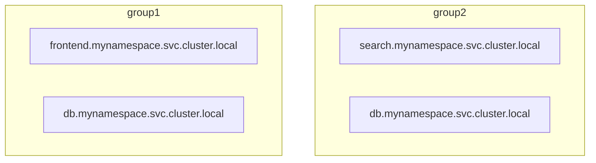
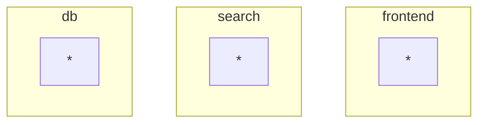

```mdx-code-block
import Tabs from '@theme/Tabs';
import TabItem from '@theme/TabItem';
import Zoom from 'react-medium-image-zoom';
```

A Selector is a part of flow control components which helps determine where a
flow control and observability component, such as a [Classifier][classifier],
[Flux Meter][flux-meter], or [Load Scheduler][load-scheduler], should be
applied. It does this based on a combination of factors including the control
point, flow labels, agent group, and the service. Basically, a scoping rules
that determine how these components should select flows for their operations.
[_Selector_ configuration specification.](/reference/policies/spec.md#selector)

A Selector consists of the following fields:

- **Control Point (required)**: The control point identifies the location within
  the services where policies can act on flows. It could represent a specific
  feature, execution block, or ingress/egress calls within a service.
- **Label Matcher (optional)**: It narrows down the selected flows based on
  conditions defined on labels. It allows for precise filtering of flows based
  on specific criteria.
- **Agent Group (optional)**: An Agent Group is a flexible label that defines a
  collection of agents operating as peers.
- **Service (optional)**: The service represents a collection of entities
  delivering a common functionality, such as checkout or billing in an ecommerce
  example.

**Example:**

```yaml
selectors:
  service: checkout.myns.svc.cluster.local # Service
  control_point: ingress # Control Point
  agent_group: default # Agent Group
  label_matcher: # Label Matcher
    match_labels:
      user_tier: gold
      http.method: GET
    match_expressions:
      - key: query
        operator: In
        values:
          - insert
          - delete
    expression: # Using Label Matcher with expression
      label_matches:
        - label: user_agent
          regex: ^(?!.*Chrome).*Safari
```

## Control Point {#control-point}

Control Points serve as the "where" of flow control. They specify where in the
system a policy should be applied. This could be at the ingress or egress of a
service (for HTTP/gRPC Control Points) or at specific features within the
service code (for Feature Control Points).

## Label Matcher {#label-matcher}

The "Label Matcher" is optional in selector fields, but it is helpful to narrow
down the selected flow using conditions defined on [Labels][label]. It allows
for precise filtering of flows based on specific criteria.

There are multiple ways to define a label matcher, and they can be used in
combination with each other.

- **Exact Match**: It is the simplest way to match a label. It matches the label
  value exactly.

  ```yaml
  label_matcher:
    match_labels:
      http.method: GET
  ```

- **Matching Expressions**: It allows for more complex matching conditions using
  operators such as `In`, `NotIn`, `Exists`, and `DoesNotExists`.

  ```yaml
  label_matcher:
    match_expressions:
      - key: http.method
        operator: In
        values:
          - GET
          - POST
  ```

- **Arbitrary Expression**: This allows for defining complex matching
  conditions, including regular expression matching.

  ```yaml
  label_matcher:
    expression:
      label_matches:
        - label: user_agent
          regex: ^(?!.*Chrome).*Safari
  ```

Refer to [Label Matcher Reference][label-matcher] for further details on each of
these matching methods.

## Agent Group {#agent-group}

_Agent Group_ is a flexible label that defines a collection of agents that
operate as peers. For example, an Agent Group can be a Kubernetes cluster name
in the case of DaemonSet deployment of Agent, or it can be a service name for
sidecar deployments of Agent.

When employing sidecar mode, it's advisable to name the Agent Group based on the
respective application, therefore fostering a unified Agent Group for all pods
within an application. For instance, all pods within the 'Checkouts' application
should be under the same Agent Group.

In DaemonSet mode, the Kubernetes cluster name typically becomes the Agent Group
name, which applies to all agents deployed on each node. This ensures all Agents
spanning entire cluster comes under same Agent Group.

<!-- vale off -->

### Where does Agent Groups help?

<!-- vale on -->

- **Complex Environments**: It helps manage multiple agents efficiently within
  intricate environments, like Kubernetes or multi-cluster installations.
  Basically, helping scale Aperture configuration.

- **State Synchronization**: _Agent Group_ defines the scope of agent-to-agent
  synchronization, with agents within the group forming a peer-to-peer network
  to synchronize fine-grained state per-label global counters that are used for
  rate-limiting purposes. Additionally, all agents within an _Agent Group_
  instantiate the same set of flow control components as published by the
  controller.

:::note In standalone Aperture Agent deployments

Where Aperture Agent is not co-located with any service, the _Control Points_
alone can be used to match flows to policies and that deployment can be used as
a feature flag decision service serving remote flow control requests.

:::

Example:

```yaml
agent_group: default # Agent Group
control_point: ingress
label_matcher:
  match_labels:
    user_tier: gold
```

## Service {#service}

In Aperture, a service represents a collection of entities that deliver a common
functionality, such as checkout or billing in an ecommerce example, or provide a
specific service, such as a database or a search service. It is similar to the
concept of services tracked in platforms like Kubernetes or Consul. Services in
Aperture are typically referred to by their fully qualified domain names (FQDN).

<!-- vale off -->

### How does it work?

<!-- vale on -->

Aperture maintains a mapping of entity IP addresses to service names. Upon
receiving a flow control decision request from an entity, Aperture uses this
mapping to identify the service name and determines which flow control
components to execute.

:::note An entity (Kubernetes pod, VM) might belong to multiple services.

:::

### Service Discovery

Aperture agents in environments like Kubernetes automatically discover services
and entities. They actively monitor and observe changes in services and
entities. This service discovery ensures that the mapping between entity IP
addresses and service names remains up to date. It allows for accurate and
reliable identification of services during flow control decision-making.

:::tip Special Service Names

- `any`: Can be used in a policy to match all services

:::

In the example below, the service name is `checkout.myns.svc.cluster.local`.

```yaml
service: checkout.myns.svc.cluster.local #Service Name
agent_group: default
control_point: ingress
label_matcher:
  match_labels:
    user_tier: gold
```

### Scoping and Configuration

Services in Aperture are scoped within _Agent Groups_, creating two level
hierarchies. The combination of the Agent Group name and the service name
determines the specific service to which flows are assigned and policies are
applied. This scoping mechanism ensures that policies are targeted and applied
to the relevant services within the system.

In this example, there are two independent `db.mynamespace.svc.cluster.local`
services.

<Zoom>



</Zoom>

For single-cluster deployments, a single `default` _Agent Group_ can be used:

<Zoom>

```mermaid
graph TB
    subgraph default
        s1[frontend.mynamespace.svc.cluster.local]
        s3[search.mynamespace.svc.cluster.local]
        s2[db.mynamespace.svc.cluster.local]
    end
```

</Zoom>

as another extreme, if _Agent Groups_ already group entities into logical
services, the _Agent Group_ can be treated as a service to match flows to
policies (useful when installing as a sidecar):

<Zoom>



</Zoom>

_Agent Group_ name together with _Service_ name determine the
[service](#service) to select flows from.

## Extra References {#resources}

### Gateways Integration {#gateways-integration}

Aperture can be integrated with [Gateways][gateway] to control traffic before
that is routed to the upstream service. Gateways should be configured to send flow
control requests to Aperture for every incoming request.

As the requests to Aperture are sent from the Gateway, the service selector has
to be configured to match the Gateway's service. For example, if the Gateway
controller is running with service name `nginx-server` in namespace `nginx`, for
upstream service having location/route as `/service1`, the selector should be
configured as follows:

```yaml
service: nginx-server.nginx.svc.cluster.local
agent_group: default
control_point: service1
label_matcher:
  match_labels:
    http.target: "/service1"
```

Also, if the control point is configured uniquely for each location/route, the
`control_point` field alone can be used to match the upstream service and the
rest of the fields can be omitted:

```yaml
agent_group: default
control_point: service1
```

### Filtering out liveness/health probes, and metrics endpoints

Liveness and health probes are essential for checking the health of the
application, and metrics endpoints are necessary for monitoring its performance.
However, these endpoints do not contribute to the overall latency of the
service, and if included in latency calculations, they might cause requests to
be rejected, leading to unnecessary pod restarts.

To prevent these issues, traffic to these endpoints can be filtered out by
matching expressions. In the example below, flows with `http.target` starting
with /health, /live, or /ready, and User Agent starting with `kube-probe/1.23`
are filtered out.

```yaml
service: checkout.myns.svc.cluster.local
agent_group: default
control_point: ingress
label_matcher:
  match_expressions:
    - key: http.target
      operator: NotIn
      values:
        - /health
        - /live
        - /ready
        - /metrics
    - key: http.user_agent
      operator: NotIn
      values:
        - kube-probe/1.23
```

Filtering out traffic to these endpoints can prevent unnecessary pod restarts
and ensure that the application is available to handle real user traffic

Other flows can be filtered out by matching on different keys and operators,
such as `http.method` with `NotIn` operator and `GET` value. For more
information on how to configure the Label Matcher, see the [Label Matcher
reference][label-matcher].

:::info

Remember that while these endpoints might have a low latency, they should not be
included in the overall latency of the service. Filtering them out can help
improve the accuracy of latency calculations and prevent requests from being
rejected.

:::

[label]: ./flow-label.md
[flux-meter]: ./flux-meter.md
[load-scheduler]: ./scheduler.md
[classifier]: ./classifier.md
[label-matcher]: /reference/policies/spec.md#label-matcher
[gateway]: /integrations/gateway/gateway.md
