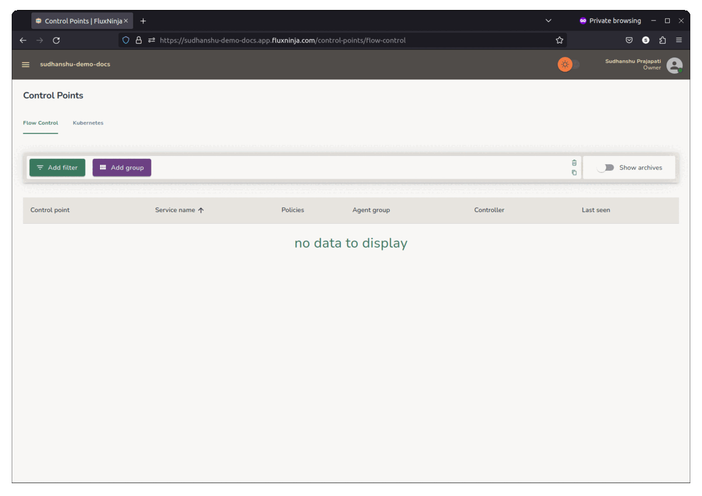

```mdx-code-block
import Zoom from 'react-medium-image-zoom';
```

Aperture Cloud uses API keys to authenticate requests coming from
[Agents][Agents] and [Controllers][Controllers]. You can create API keys for
your project in the Aperture Cloud UI.

## Pre-requisites

You have [signed up][sign-up] on Aperture Cloud and created a project.

## Create API Keys

1. In the Aperture Cloud UI, navigate to your project. _API keys are
   project-specific. You need to create a new API key for each project._
2. Now, from the left sidebar, click **Aperture**.
3. Click **API Keys** tab.
4. Click **Create API Key**.
5. Copy the API key and save it in a secure location.



[sign-up]: /get-started/aperture-cloud/sign-up.md
[Agents]: /get-started/installation/agent/agent.md
[Controllers]: /get-started/self-hosting/controller/controller.md
