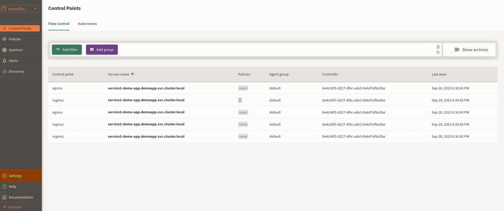

```mdx-code-block
import Zoom from 'react-medium-image-zoom';
```

Aperture Cloud uses Personal API keys to authenticate requests coming from
[aperturectl][configure aperturectl]. You can create Personal API keys for
yourself in the Aperture Cloud UI.

## Pre-requisites

You have [signed up][sign-up] on Aperture Cloud and created an organization.

## Create API Keys

1. In the Aperture Cloud UI, navigate to your organization. _Personal API keys
   are user-specific per organization. You need to create a new API key for each
   organization._
2. Now, from the left sidebar, click **Settings**.
3. Click **Personal API Keys** tab.
4. Click **New Personal API Key**.
5. Copy the API key and save it in a secure location.



[configure aperturectl]: /get-started/installation/configure-cli.md
[sign-up]: /get-started/aperture-cloud/sign-up.md
