```mdx-code-block
import Zoom from 'react-medium-image-zoom';
```

:::info

Aperture Cloud provides a 30-day free trial period. You can use all the features
of Aperture Cloud during the trial period. After the trial period, you can
choose to continue using Aperture Cloud by subscribing to one of the [plans][].

:::

To begin using Aperture Cloud, you need to sign up and create an organization &
a project.

1. For sign up, head over to
   [Aperture Cloud](https://app.fluxninja.com/sign-up).
2. There are two ways you can sign up --

   - using your Google account
   - using your email address. We recommend using your work email — it keeps
     work and life separate.

   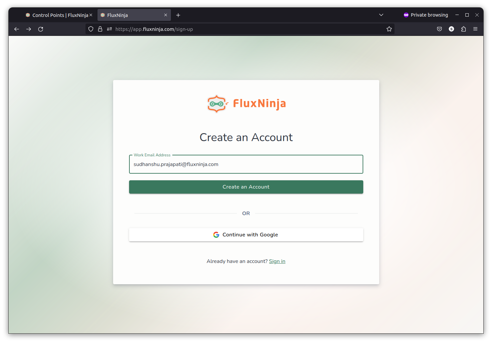

3. Once you have signed up, you will be redirected to the Create Organization
   page. Enter your organization name and click **Create**.

   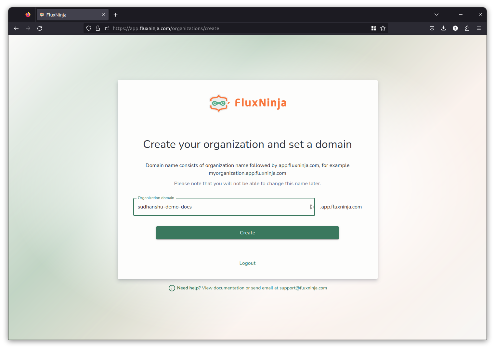

4. After you have created your organization, you will be redirected to the
   Select Subscription page. The default plan is with a trial period of 30 days.

   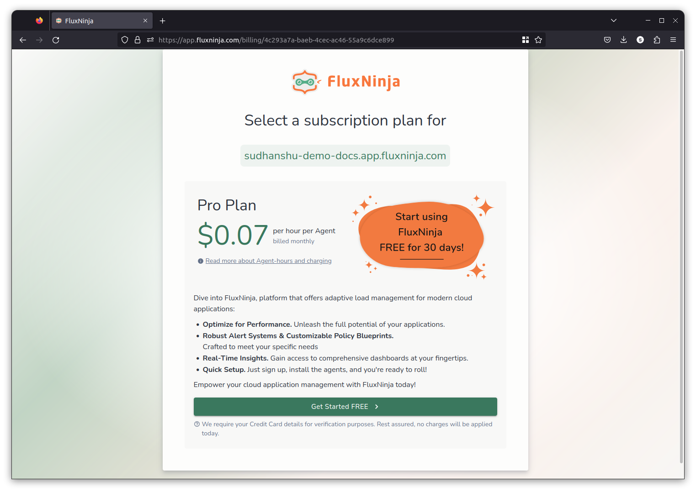

   Credit card details are required for verification purposes. Please rest
   assured that your information will be handled securely and no charges will be
   applied during the trial period.

   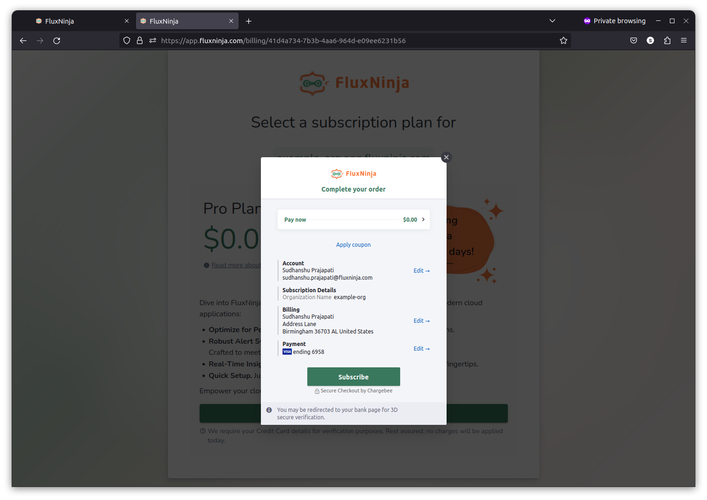

5. After completing the subscription, you will be redirected to Get Started
   page. Read the instructions and click **Next**.

   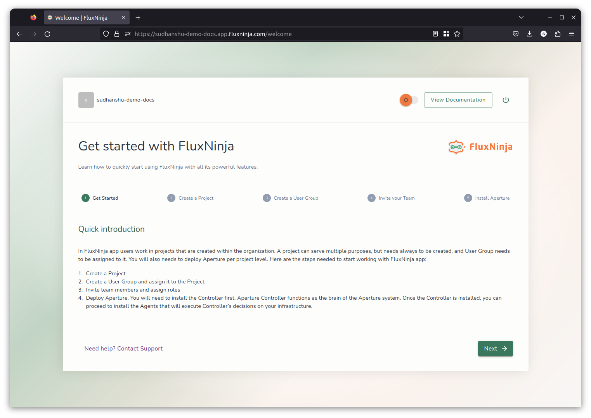

6. By default, Aperture Cloud create one project for you. You can create more
   later on. Enter your project name and description, click **Next**.

   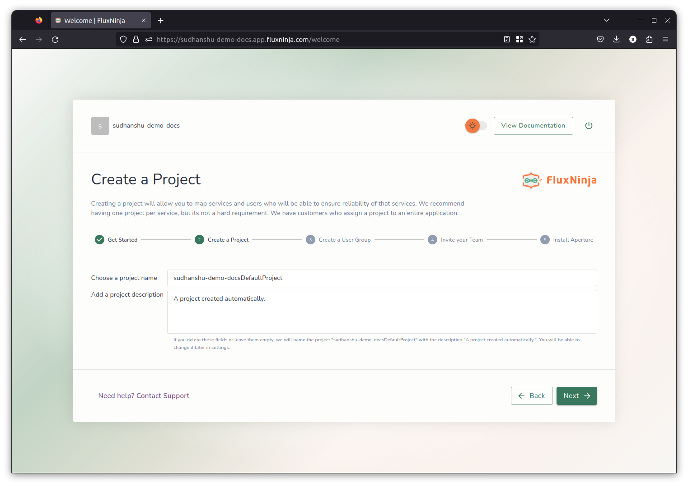

7. Each project has a user group associated with it. Only the users in the user
   group will have access to the project. You can add users to the user group by
   entering their email address, in next step.
   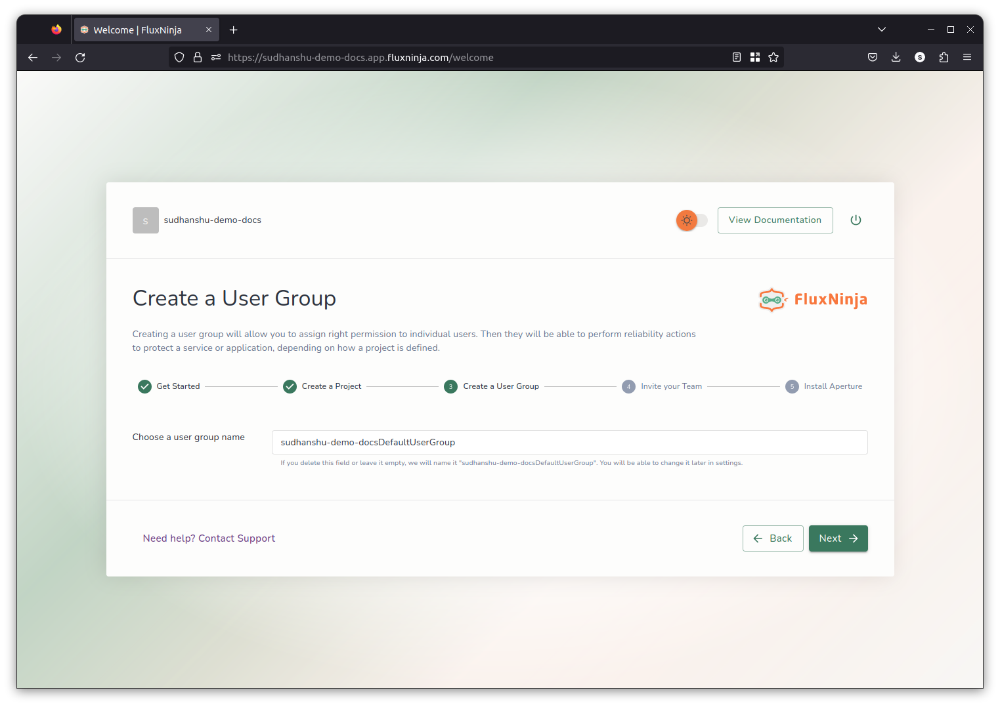

8. You're by default added in that group, but you can invite more users by
   entering their email address and assigning them a role. Once you have entered
   all the email addresses, click **Send Invitations**. You can also skip this
   step and add users later on.

   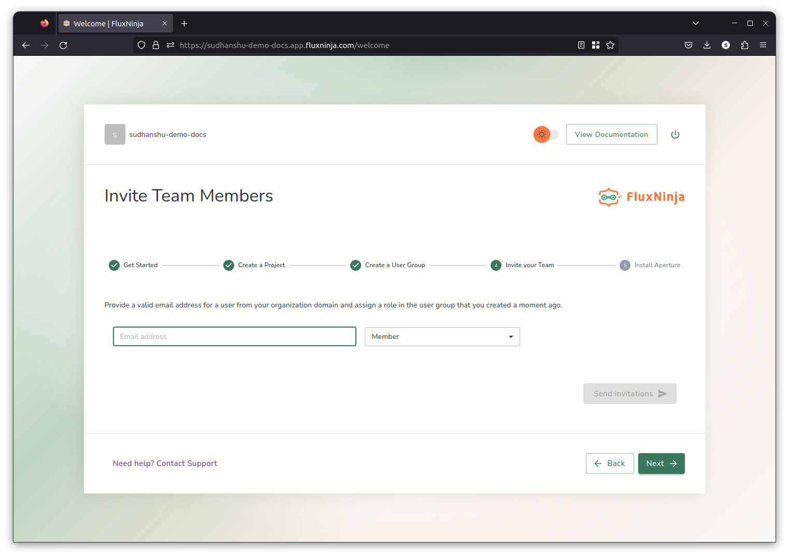

9. Now, you can install Aperture using the instructions provided. You can also
   skip this step and install Aperture later on.

   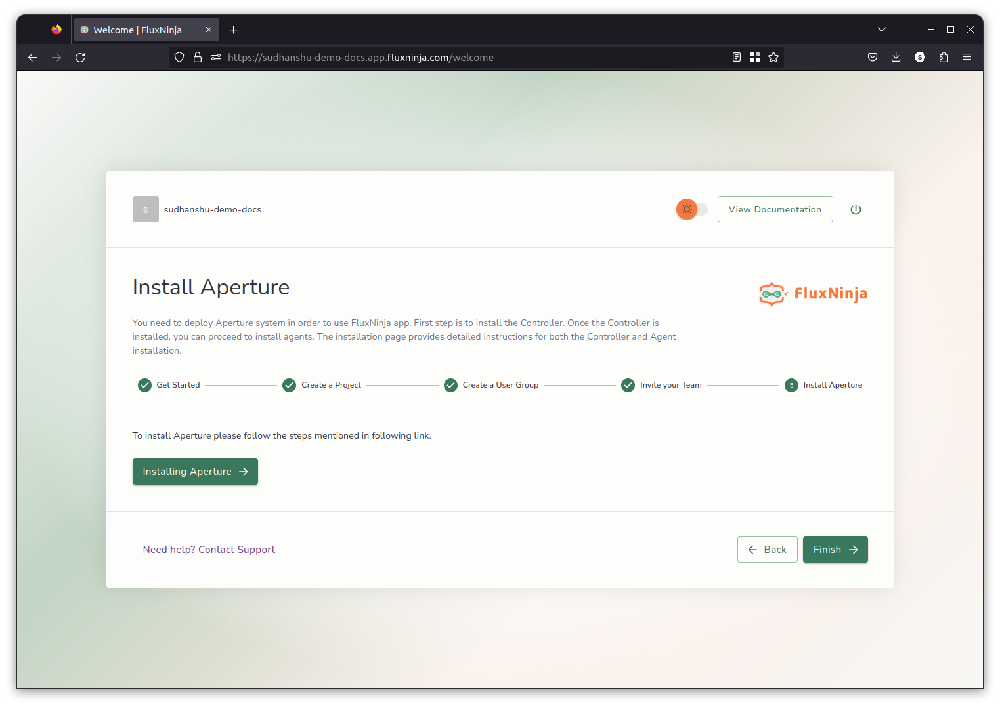

10. To start using Aperture Cloud. Click **Finish**. You be redirected to the
    Aperture Cloud UI.

    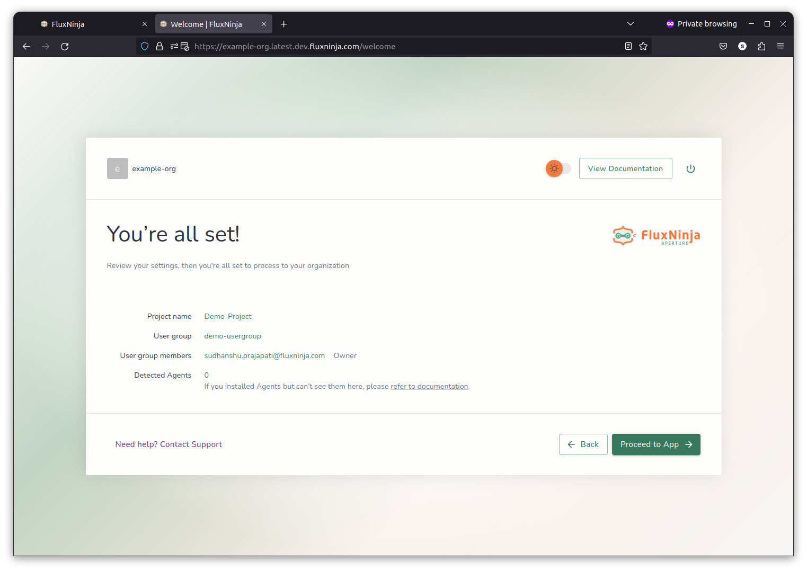

## Aperture Cloud

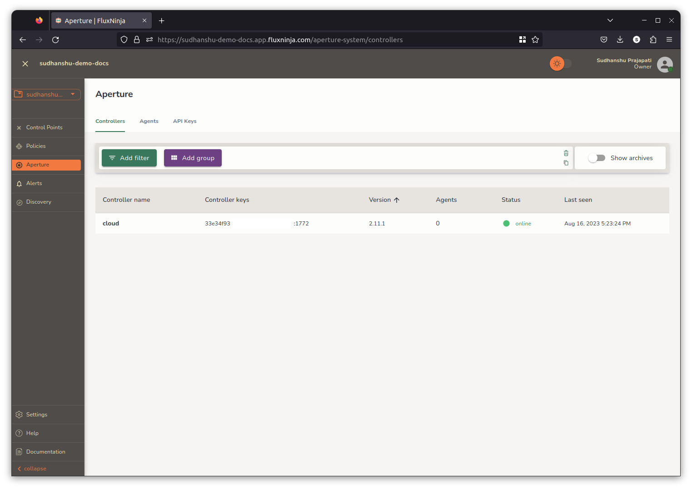

[plans]: https://www.fluxninja.com/pricing
