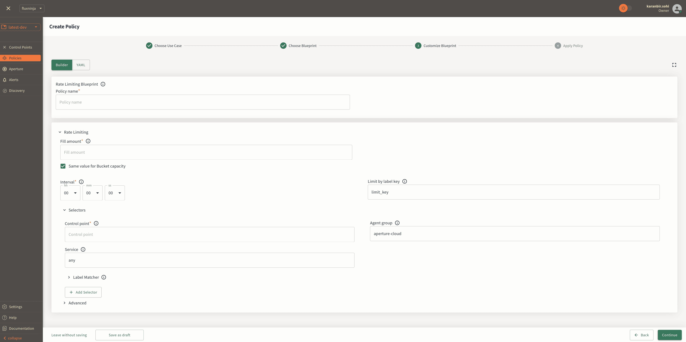

```mdx-code-block
import { Cards } from '@site/src/components/Cards';
import Tabs from '@theme/Tabs';
import TabItem from '@theme/TabItem';
```

Aperture is available as a managed service, [Aperture Cloud][cloud], or can be
self-hosted within your infrastructure.

<!-- markdownlint-disable -->

## 1. Sign up to Aperture Cloud

For signing up, head over to
[Aperture Cloud](https://app.fluxninja.com/sign-up). For detailed instructions,
please refer to our [step-by-step][sign-up] guide.

## 2. Pick your Integration

These are two main modes on how to get started with Aperture.

<Tabs>

<TabItem value="Aperture Serverless">

The Serverless mode is the quickest way to start using Aperture.


## 3. Get your API key

In Aperture Cloud, authentication for SDK integrations is handled using API
keys. These keys can be found in the Aperture Cloud UI. For detailed
instructions on locating API Keys, please refer to the [API Keys][api-keys]
section.

## 4. Install SDK and Define Control Points

Aperture provides SDKs for various languages. You can find the SDKs and
installation instructions [here][sdks].

```mdx-code-block
<Tabs groupId="language" queryString>
<TabItem value="TypeScript">
```

```bash
npm install @fluxninja/aperture-js
```

```mdx-code-block
</TabItem>
<TabItem value="Go">
```

```bash
go get github.com/fluxninja/aperture-go/v2
```

```mdx-code-block
</TabItem>
<TabItem value="Python">
```

```bash
pip install aperture-py
```

```mdx-code-block
</TabItem>
</Tabs>
```

Connect to Aperture Cloud by creating an Aperture Client with your
organization's address and API Key.

```mdx-code-block
<Tabs groupId="language" queryString>
<TabItem value="TypeScript">
```

```typescript
import { ApertureClient, FlowStatusEnum } from "@fluxninja/aperture-js";

// Create aperture client
export const apertureClient = new ApertureClient({
  address: "ORGANIZATION.app.fluxninja.com:443",
  agentAPIKey: "API_KEY",
});
```

```mdx-code-block
</TabItem>
<TabItem value="Go">
```

```go
// grpcOptions creates a new gRPC client that will be passed in order to initialize the Aperture client.
func grpcOptions() []grpc.DialOption {
  var grpcDialOptions []grpc.DialOption
  grpcDialOptions = append(grpcDialOptions, grpc.WithConnectParams(grpc.ConnectParams{
    Backoff:           backoff.DefaultConfig,
    MinConnectTimeout: time.Second * 10,
  }))
  grpcDialOptions = append(grpcDialOptions, grpc.WithUserAgent("aperture-go"))
  certPool, err := x509.SystemCertPool()
  if err != nil {
    return nil
  }
  grpcDialOptions = append(grpcDialOptions, grpc.WithTransportCredentials(credentials.NewClientTLSFromCert(certPool, "")))
  return grpcDialOptions
}

// Create aperture client
agentAddress := "ORGANIZATION.app.fluxninja.com:443"
apiKey := "API_KEY"

opts := aperture.Options{
    Address:     agentAddress,
    APIKey: apiKey,
    DialOptions: grpcOptions(),
}

// initialize Aperture Client with the provided options.
apertureClient, err := aperture.NewClient(ctx, opts)
if err != nil {
    log.Fatalf("failed to create client: %v", err)
}
```

```mdx-code-block
</TabItem>
<TabItem value="Python">
```

```python
from aperture_sdk import ApertureClient

aperture_client = ApertureClient.new_client(address="ORGANIZATION.app.fluxninja.com:443", api_key="API_KEY")
```

```mdx-code-block
</TabItem>
</Tabs>
```

**Define a Control Point**

Once the SDK is connected to Aperture Cloud, you can create a feature control
point anywhere within your code. For example, before executing the business
logic of a specific API, you can create a feature control point that can control
the execution flow of the API and can reject the request based on the policy
defined in Aperture.

Let's create a feature control point in the following code snippet.

```mdx-code-block
<Tabs groupId="language" queryString>
<TabItem value="TypeScript">
```

```typescript
async function handleRequest(req, res) {
  const flow = await apertureClient.StartFlow("archimedes-service", {
    labels: {
      api_key: "some_api_key",
    },
    grpcCallOptions: {
      deadline: Date.now() + 300, // ms
    },
    rampMode: false,
    cacheKey: "cache",
  });

  if (flow.ShouldRun()) {
    // Check if the response is cached in Aperture from a previous request
    if (flow.CachedValue().GetLookupStatus() === LookupStatus.Hit) {
      res.send({ message: flow.CachedValue().GetValue()?.toString() });
    } else {
      // Do Actual Work
      // After completing the work, you can return store the response in cache and return it, for example:
      const resString = "foo";

      // create a new buffer
      const buffer = Buffer.from(resString);

      // set cache value
      const setResult = await flow.SetCachedValue(buffer, {
        seconds: 30,
        nanos: 0,
      });
      if (setResult?.error) {
        console.log(`Error setting cache value: ${setResult.error}`);
      }

      res.send({ message: resString });
    }
  } else {
    // Handle flow rejection
    flow.SetStatus(FlowStatusEnum.Error);
  }

  if (flow) {
    flow.End();
  }
}
```

The code snippet below shows how to wrap your
[Control Point](/concepts/control-point.md) within the `StartFlow` call while
also passing [labels](/concepts/flow-label.md) and `cacheKey` to Aperture
Agents.

- The function `Flow.ShouldRun()` checks if the flow allows the request.
- The `Flow.End()` function is responsible for sending telemetry, and updating
  the specified cache entry within Aperture.
- The `flow.CachedValue().GetLookupStatus()` function returns the status of the
  cache lookup. The status can be `Hit` or `Miss`.
- If the status is `Hit`, the `flow.CachedValue().GetValue()` function returns
  the cached response.
- The `flow.SetCachedValue()` function is responsible for setting the response
  in Aperture cache with the specified TTL (time to live).

```mdx-code-block
</TabItem>
<TabItem value="Go">
```

```go
  // business logic produces labels
  labels := map[string]string{
      "key": "value",
  }

  rampMode := false

  // StartFlow performs a flowcontrolv1.Check call to Aperture Agent. It returns a Flow object.
  flow := apertureClient.StartFlow(ctx, "featureName", labels, rampMode, 200 * time.Millisecond)

  // See whether flow was accepted by Aperture Agent.
  if flow.ShouldRun() {
      // do actual work
  } else {
      // handle flow rejection by Aperture Agent
      flow.SetStatus(aperture.Error)
  }
  _ = flow.End()

```

```mdx-code-block
</TabItem>
<TabItem value="Python">
```

```python
  # business logic produces labels
  labels = {
      "key": "value",
  }

  # start_flow performs a flowcontrol.v1.Check call to Aperture Agent.
  # It returns a Flow or raises an error if any.
  flow = aperture_client.start_flow(
    control_point="AwesomeFeature",
    explicit_labels=labels,
    check_timeout=timedelta(seconds=200),
  )

  # Check if flow check was successful.
  if not flow.success:
      logger.info("Flow check failed - will fail-open")

  # See whether flow was accepted by Aperture Agent.
  if flow.should_run():
      # do actual work
  else:
      # handle flow rejection by Aperture Agent
      flow.set_status(FlowStatus.Error)
  flow.end()
```

```mdx-code-block
</TabItem>
</Tabs>
```

This is how you can create a feature control point in your code. The complete
example is available
[here](https://github.com/fluxninja/aperture-js/blob/main/example/routes/use_aperture.ts).

## 5. Create Your Policy

Within the Aperture UI, navigate to the policy in tab in the sidebar menu, and
click on the `Create Policy` button in the top right corner. There you can pick
the blueprint that best aligns with your needs. After a few clicks, you'll be
directed to a screen where you can input the necessary parameters to generate
the policy.



For more details on how to create a policy, follow our [step-by-step
guide][policies].

</TabItem>
<TabItem value="Aperture for Infrastructure">

There are two ways to integrate Aperture into your infrastructure. The first
option includes a cloud-hosted controller and self-managed agents to ensure
minimal performance impact. The second option involves hosting Aperture entirely
within your infrastructure, making it perfect for air-gapped environments.

## 3. Set Up the Environment

The Aperture Agent can be installed in various modes. For installation steps,
see [Agent][agent-docs] docs under [Aperture For Infra
section][aperture-for-infra].

:::info

For more details on fully self-hosted installation, please refer to the
[Self-hosted][aperture-for-infra] section.

:::

## 4. Integrate with Aperture

Here are various [Integrations][integrations] methods with Aperture

- [SDKs](../sdk/sdk.md)
- [Istio](/aperture-for-infra/integrations/istio/istio.md)
- [Gateways](/aperture-for-infra/integrations/gateway/gateway.md)
- [Consul](/aperture-for-infra/integrations/consul/consul.md)
- [Auto Scale](/aperture-for-infra/integrations/auto-scale/auto-scale.md)
- [Metrics](/aperture-for-infra/integrations/metrics/metrics.md)

## 5. Map to Aperture SaaS Controller

Aperture Cloud authenticates requests from integrations using API keys, which
are created for your project and can be found within the Aperture Cloud UI. Copy
the API key and save it in a secure location. This key will be used during the
configuration of [Self-hosted][aperture-for-infra] Agents. For detailed
instructions on locating API Keys, please refer to the [API Keys][api-keys]
section.

:::info

Using the API key, you can map your integration to the Aperture Cloud. See
[FluxNinja Cloud Extension][cloud-extension] for more details.

:::

## 6. Create Your Policy

For more details on how to create a policy, follow our [step-by-step
guide][policies].

</TabItem>
</Tabs>

[cloud]: https://www.fluxninja.com/product
[aperture-for-infra]: /aperture-for-infra/aperture-for-infra.md
[sign-up]: /reference/cloud-ui/sign-up.md
[policies]: /reference/cloud-ui/policies/policy-creation.md
[cloud-extension]: /reference/fluxninja.md
[agent-docs]: /aperture-for-infra/agent/agent.md
[integrations]: /aperture-for-infra/integrations/integrations.md
[sdks]: /sdk/sdk.md
[api-keys]: /reference/cloud-ui/api-keys.md
