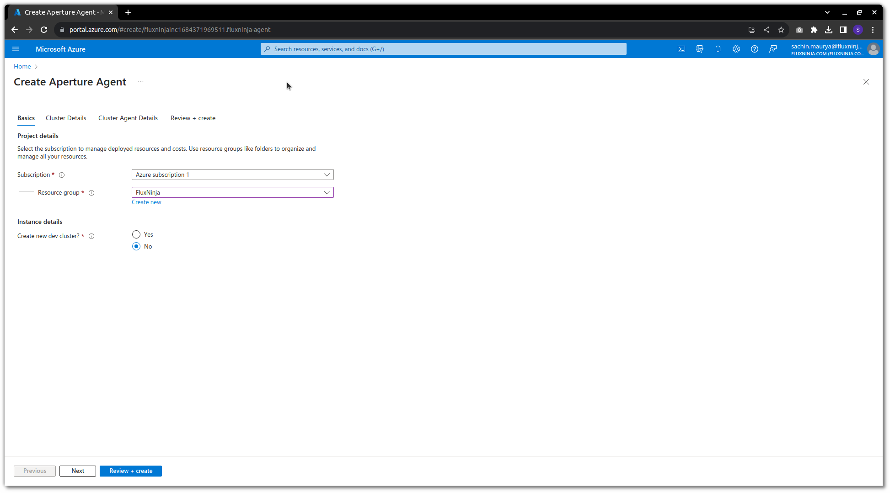
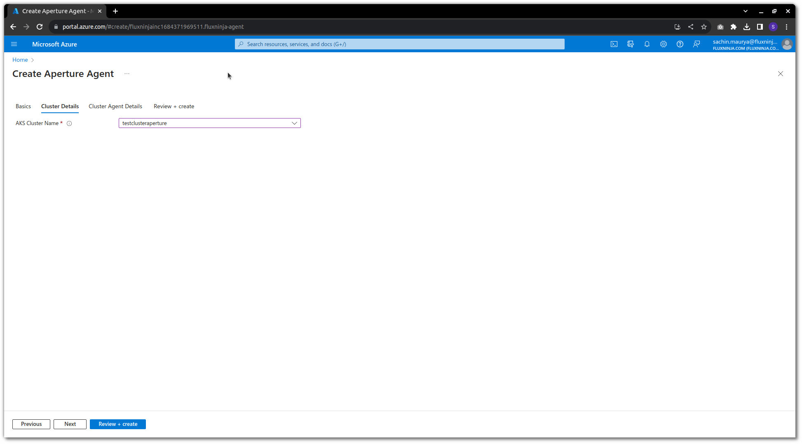
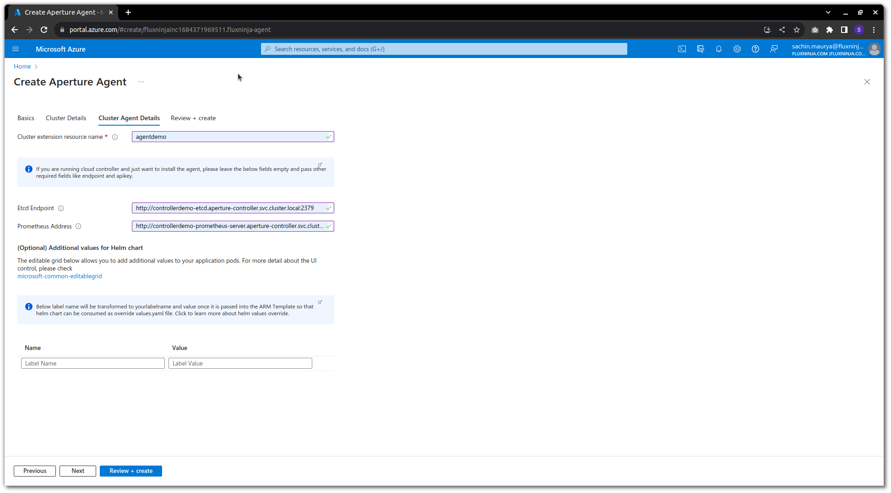
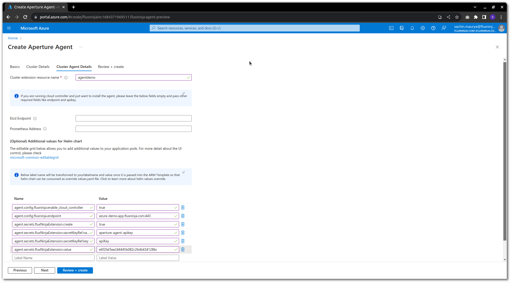

```mdx-code-block
import Zoom from 'react-medium-image-zoom';
```

To get started with Agent Deploy on Azure, you'll need to go Azure Marketplace.

1. On Azure Marketplace search for
   [Fluxninja Agent](https://azuremarketplace.microsoft.com/en-us/marketplace/apps/fluxninjainc1684371969511.fluxninja-agent?tab=Overview).

2. Click on **Get it now.**

3. You will see a New UI asking for details like Subscription and Resource
   Group. Instance details are also needed on this page.If you want to create a
   new cluster to install the agent you can create a new cluster or you can also
   install the agent on cluster that is already running on azure and you have
   already controller deployed on that cluster.

   

4. On the Cluster Details section provide the details based on the option that
   you selected earlier. (Here we are going with the older cluster that we
   already had controller deployed on.)

   

5. Cluster Agent Details

   - Here you will need to provide the etcdEndpoint and Prometheus Address that
     you used while deploying controller.
   - In our case we have deployed controller on same cluster so the details are
     provided accordingly.

   

6. Once all the details are provided click on create and agent deployment
   starts.

7. Their is optional section on Cluster Agent Details page which can be used to
   pass other details to agent which is similar to how we pass fields to
   values.yaml file while installing it using helm.

:::info

Here your agent deployment completes but if your are looking to use the cloud
controller and want to deploy agent for that then follow on.

:::

1. If you did like to use cloud-controller and deploy agent on azure cluster.

   - First you need to
     [sign up](https://docs.fluxninja.com/get-started/aperture-cloud/sign-up).
   - On the Cluster Agent Details page you can provide all the details required
     for
     [agent](https://docs.fluxninja.com/get-started/installation/agent/kubernetes/operator/daemonset#agent-daemonset-installation)
     and skip step 5 as etcd Endpoint and Prometheus Address are not required if
     you are using cloud controller.

   

2. Click on create to deploy agent on azure cluster which will be using cloud
   controller.

:::info

If you want to pass some extra field which is of type list below is how we do
it.

Example: If you are installing agent in sidecar mode and want to use
`enableNamespacesByDefault` field which will inject the sidecar label to
specified namespace.

```md
agent.sidecar.enableNamespacesByDefault[0] : dev-ns
agent.sidecar.enableNamespacesByDefault[1] : test-ns
```

:::
