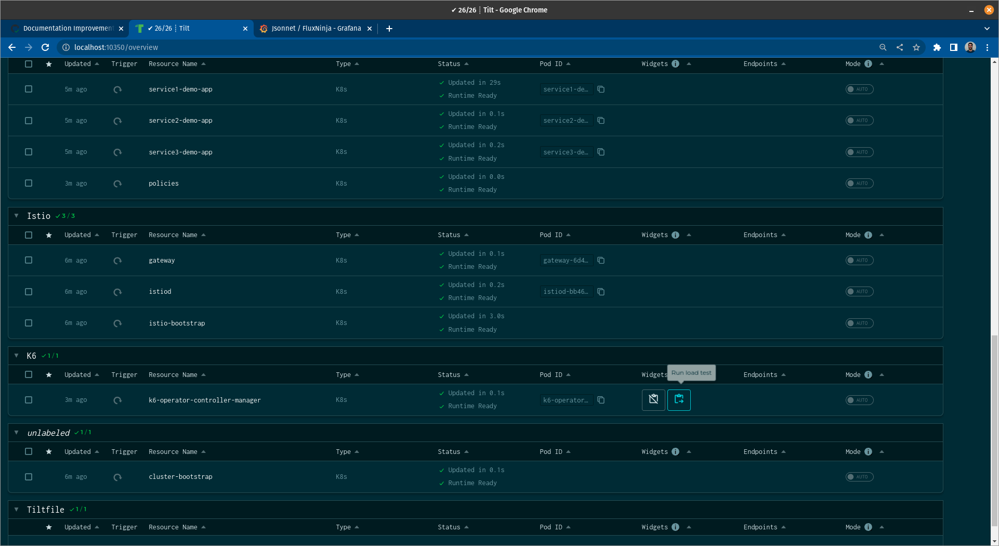

# Playground

Playground is a Kubernetes based environment for exploring the capabilities of
Aperture. Additionally it is used as a development environment for Aperture.
Playground uses [Tilt](https://tilt.dev/) for orchestrating the deployments in
Kubernetes. Tilt watches for changes to local files and auto-deploys any
resources that change. This is very convenient for getting quick feedback during
development of Aperture.

**<em>Environment:</em>**<br></br> Aperture is loaded with a <em>Latency Gradient Control Policy</em> which protects the
demo application against sudden surges in traffic load.

## How to Run

**<em>Cluster:</em>**<br></br>
Playground deploys resources to the Kubernetes cluster that `kubectl` on your
machine points at.
For convenience, refer to [prerequisites](#prerequisites-k8s)
which includes instructions for deploying a local Kubernetes cluster using
[Kind](https://kind.sigs.k8s.io/).

Once [requirements](#tools) are installed, simply run below commands from the
`playground` directory (present under the aperture home directory):

```
tilt up
```

Can press (Space) to open the Tilt UI.

The above command starts Aperture Controller and an Aperture Agent on each
worker in the Kubernetes cluster. Additionally, it starts a demo application
with an Istio and Envoy based service mesh configured to integrate with
Aperture. There is a Grafana installation as well for viewing metrics from
experiments.

**<em>Grafana Dashboard:</em>**<br></br>
To view results from the
experiment navigate to the "FluxNinja" dashboard in Grafana under
"aperture-system" folder. Grafana runs at
[localhost:3000](http://localhost:3000).
<strong>Note</strong>: Nothing is running locally on port 3000, else you won't be able to
access Grafana dashboard.<br></br><br></br>

**<em>Start Load:</em>**<br></br>Now that you have your Grafana dashboard ready, To run the traffic load,
navigate to K6 resource in the Tilt UI and just click "Start"
button as shown below. 
Once finished, press the `Delete load test` button.

**<em>Monitoring Control Policy:</em>**<br></br> Now that the <em>Latency Gradient Control Policy</em> has started automatically. You can see....

---

## Tools

Described hereafter, deployment methods assume usage of specific deployment and
configuration/management tools (which must be installed beforehand).

To install other required tools, you can use [ASDF](https://asdf-vm.com/) OR
install manually (check
[Tools required for Kubernetes deployment](#tools-required-for-kubernetes-deployment)).

### Install via asdf

When using `asdf`:

- [Download](https://asdf-vm.com/guide/getting-started.html#_2-download-asdf)
  and [install](https://asdf-vm.com/guide/getting-started.html#_3-install-asdf)
  `asdf`
- Run the below command in aperture home directory to install all the required
  tools.

```
make install-asdf-tools
```

### Tools required for Kubernetes deployment

Please skip this section in case you used [asdf to install](#install-via-asdf).

Tools which are required for local Kubernetes deployment:

#### helm

Helm is a package manager for Kubernetes.

To install manually, follow instructions: <https://helm.sh/docs/intro/install/>

#### Tanka and Jsonnet Bundler

Grafana Tanka is the robust configuration utility for your Kubernetes cluster,
powered by the unique Jsonnet language.

Jsonnet Bundler is used to manage Jsonnet dependencies.

To install manually, follow instructions: <https://tanka.dev/install>

#### Local Kubernetes cluster

May use [`kind`](https://kind.sigs.k8s.io/docs/user/quick-start/).

#### kubectl

The Kubernetes command line tool. Follow the instructions:
<https://kubernetes.io/docs/tasks/tools/#kubectl>

## Deploying with Tilt

In case of local deployments and development work, it's nice to be able to
automatically rebuild images and services.

This can be achieved by using `tilt`.

> Note: This builds up on tools mentioned earlier, their installation and
> configuration is required.

### Tilt installation

Tilt can be installed with `asdf install` or manually
<https://docs.tilt.dev/install.html>.

### Prerequisites - Kubernetes cluster bootstrap {#prerequisites-k8s}

> Note: You can skip this section if you already have a running cluster which is
> being pointed by the `kubectl`.

Create a K8s cluster using Kind with configuration file by executing below
command from aperture home directory:

```sh
kind create cluster --config playground/kind-config.yaml
```

This will start a cluster with the name `aperture-playground`.

Once done, you can delete the cluster with following command:

```sh
kind delete cluster --name aperture-playground
```

Alternatively, you can use [`ctlptl`](https://github.com/tilt-dev/ctlptl) to
start a cluster with built-in local registry for Docker images:

```sh
ctlptl apply -f ctlptl-kind-config.yaml
```

Once done, you can delete the cluster and registry with following command:

```sh
ctlptl delete -f ctlptl-kind-config.yaml
```

### Services deployment

Simply run `tilt up` from `playground` directory - it'll automatically start
building and deploying!

You can reach the WebUI by going to <http://localhost:10350> or pressing
(Space).

Tilt should automatically detect new changes to the services, rebuild and
re-deploy them.

Useful flags:

- `--port` or `TILT_PORT` - the port on which WebUI should listen

- `--stream` - will stream both tilt and pod logs to terminal (useful for
  debugging `tilt` itself)

- `--legacy` - if you want a basic, terminal-based frontend

By default, `tilt` will deploy and manage Agent and Controller.

If you want to limit it to only manage some namespace(s) or resource(s), simply
pass their name(s) as additional argument(s).

Examples:

- `tilt up aperture-grafana` - only bring up `grafana` and dependent services
  (`grafana-operator`, ...)
- `tilt up agent demoapp aperture-grafana` - you can mix namespace names and
  resource names, as well as specify as many of them as you want.

If you want to manage only explicitly passed resources/namespaces, you should
pass the `--only` argument:

- `tilt up -- --only aperture-grafana` - only bring up grafana, namespace
  resolving to resources still works

To view the available namespaces and resources, either:

- run `tilt up --stream -- --list-resources`
- read the `DEP_TREE` at the top of `Tiltfile`

To disable automatic updates in Tilt, add `--manual` with the command.

### To many open files "warning"

If you are getting following message in cluster container:

> failed to create fsnotify watcher: to many open files

If `sysctl fs.inotify.{max_queued_events,max_user_instances,max_user_watches}`
less than:

```bash
fs.inotify.max_queued_events = 16384
fs.inotify.max_user_instances = 1024
fs.inotify.max_user_watches = 524288
```

change it, using (temporary method):

```bash
sudo sysctl fs.inotify.max_queued_events = 16384
sudo sysctl fs.inotify.max_user_instances = 1024
sudo sysctl fs.inotify.max_user_watches = 524288
```

or add following lines to `/etc/sysctl.conf`:

```bash
fs.inotify.max_queued_events = 16384
fs.inotify.max_user_instances = 1024
fs.inotify.max_user_watches = 524288
```

### Teardown

Simply run `tilt down`. All created resources will be deleted.

Once finished, don't forget to press the `Delete load test` button by navigating to the K6 resource in the Tilt UI

### Port forwards

Tilt will automatically setup forwarding for the services.

Below is the mapping of the ports being forwarded by Tilt:

| Component  | Container Port | Local Port |
| ---------- | -------------- | ---------- |
| Prometheus | 9090           | 9090       |
| Etcd       | 2379           | 2379       |
| Grafana    | 3000           | 3000       |
