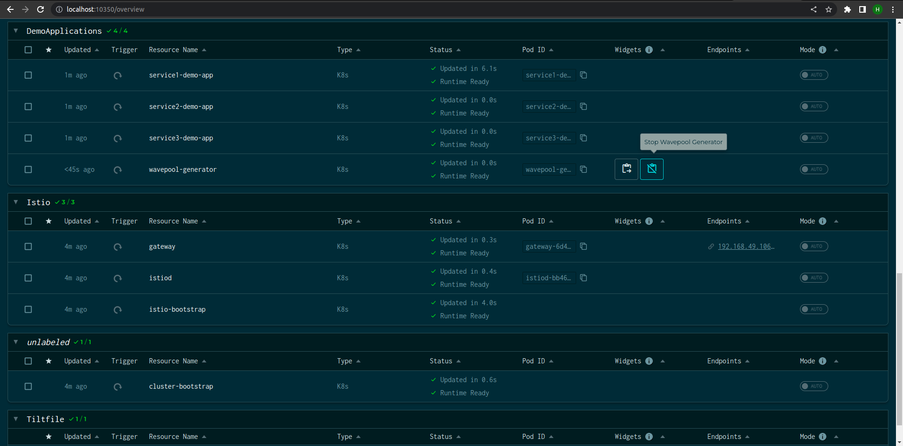

```mdx-code-block
import Tabs from '@theme/Tabs';
import TabItem from '@theme/TabItem';
import Zoom from 'react-medium-image-zoom';
```

Playground is a Kubernetes-based environment for exploring the capabilities of
Aperture. Additionally, it is used as a development environment for Aperture.
Playground uses [Tilt](https://tilt.dev/) for orchestrating the deployments in
Kubernetes. Tilt watches for changes to local files and auto-deploys any
resources that change. This is convenient for getting quick feedback during
development of Aperture.

Playground deploys resources to the Kubernetes cluster that `kubectl` on your
machine points at. For convenience, refer to [Prerequisites](#prerequisites-k8s)
for deploying a local Kubernetes cluster using
[Kind](https://kind.sigs.k8s.io/).

## How to Run

Assuming that you have already cloned the aperture repository and brought up a
[local Kubernetes cluster](#prerequisites-k8s), proceed to install the
[required tools](#tools). To bring up the Playground, run the following
commands:

```sh
$ git clone https://github.com/fluxninja/aperture.git
# change directory to playground
$ cd aperture/playground
# start a local kubernetes cluster
$ ctlptl apply -f ctlptl-kind-config.yaml
# start Tilt and run services defined in Tiltfile
$ tilt up
Tilt started on http://localhost:10350/
v0.30.2, built 2022-06-06

(space) to open the browser
(s) to stream logs (--stream=true)
(t) to open legacy terminal mode (--legacy=true)
(ctrl-c) to exit
```

Now, press Space to open the Tilt UI in your default browser.

:::note

Verify that nothing else is running on the [ports forwarded](#port-forwards) by
`Tilt`.

:::

The above command starts an Aperture Controller and an Aperture Agent on each
worker node in the local Kubernetes cluster. Additionally, it starts a demo
application with an Istio and Envoy based service mesh configured to integrate
with Aperture. There is an instance of Grafana running on the cluster as well
for viewing metrics from experiments.

The Playground's default scenario is demonstrating
[Latency Gradient Policy](/applying-policies/service-protection/basic-service-protection.md),
which protects the demo application against sudden surges in traffic load. You
can verify it using the following command:

```sh
$ kubectl get policy -n aperture-controller service1-demo-app
NAME                STATUS     AGE
service1-demo-app   uploaded   103s
```

The Playground includes a demo application so that you can generate simulated
traffic and see the policy in action. The demo application can be found in the
`demoapp` namespace. You can read more about the demo application
[here](https://github.com/fluxninja/aperture/tree/main/playground/resources/demo-app).

```sh
$ kubectl get pods -n demoapp
NAME                                 READY   STATUS    RESTARTS   AGE
service1-demo-app-54f6549446-ct8k9   2/2     Running   0          7m14s
service1-demo-app-54f6549446-r4mmq   2/2     Running   0          7m14s
service2-demo-app-759bbcc899-kxgwj   2/2     Running   0          7m13s
service2-demo-app-759bbcc899-njpxj   2/2     Running   0          7m13s
service3-demo-app-788857c7cc-557zj   2/2     Running   0          7m13s
service3-demo-app-788857c7cc-vlchn   2/2     Running   0          7m13s
```

<Zoom>

```mermaid
{@include: ../assets/playground/playground-app.mmd}
```

</Zoom>

The above diagram shows the interaction between different services and the
policy running on Aperture Agent:

- `service1` calls `service2`, which then calls `service3`. This call graph is
  programmed in the request payload of the traffic generator.
- `service3` (the last service in the call graph) simulates concurrency
  constraint by limiting the number of requests it can process in parallel.
- Each service simulates an artificial workload by taking a few milliseconds to
  reply to a request.
- The _Flux Meter_ is configured on `service3`. The _Flux Meter_ helps monitor
  service-level health signals such as latency, which are used in the Latency
  Gradient policy.
- Concurrency Limiter and Rate Limiter are configured on `service1`. That's,
  when the `service3` is overloaded, load shedding happens on `service1`.

Once all the resources are in the running state, simulated traffic will start
getting generated automatically against the demo application. The traffic is
designed to overload the demo application to showcase the capabilities of
Aperture.

The load generator is configured to generate the following traffic pattern for
`subscriber`, `guest` and `crawler` traffic types:

- Ramp up to `5` concurrent users in `10s`.
- Hold at `5` concurrent users for `2m`.
- Ramp up to `30` concurrent users in `1m` (overloads `service3`).
- Hold at `30` concurrent users for `2m` (overloads `service3`).
- Ramp down to `5` concurrent users in `10s`.
- Hold at `5` concurrent users for `2m`.

Once the traffic is running, you can visualize the decisions made by Aperture in
Grafana. Navigate to [localhost:3000](http://localhost:3000) on your browser to
reach Grafana. You can open the `FluxNinja` dashboard under `aperture-system`
folder to a bunch of useful panels.

<Zoom>


</Zoom>

:::info

Grafana's dashboard browser address is
[localhost:3000/dashboards](http://localhost:3000/dashboards)

:::

To stop the traffic at any point of time, press the `Stop Wavepool Generator`
button in the `DemoApplications` resource.



To re-start the traffic, press the `Start Wavepool Generator` button in the
`DemoApplications` resource.

:::note

To manually run the traffic, please press the `Stop Wavepool Generator` button
first to stop the automatic runner.

:::

---

## Tools

The Playground environment assumes usage of specific deployment and
configuration management tools, which must be installed beforehand.

To install the required tools, you have two options:

- Use [`asdf`](#install-using-asdf)
- Or, manually install the tools
  [mentioned here](#tools-required-for-kubernetes-deployment).

### Install using `asdf` {#install-using-asdf}

First,
[download](https://asdf-vm.com/guide/getting-started.html#_2-download-asdf) and
[install](https://asdf-vm.com/guide/getting-started.html#_3-install-asdf)
`asdf`. Then, run the following command in the playground directory to install
all the required tools.

```bash
./scripts/install_tools.sh
```

### Tools required for Kubernetes deployment

:::note

Please skip this section in case you already installed the required tools using
[`asdf`](#install-using-asdf).

:::

Tools required are listed below

- **Helm**: it is a package manager for Kubernetes. To install manually, follow
  instructions [here](https://helm.sh/docs/intro/install/).
- **Tanka and Jsonnet Bundler**: Grafana Tanka is a robust configuration utility
  for your Kubernetes cluster, powered by the unique Jsonnet language. Jsonnet
  Bundler is used to manage Jsonnet dependencies. To install manually, follow
  instructions [here](https://tanka.dev/install).
- **Kind**: This allows you to run local Kubernetes clusters. To install
  manually, follow instructions
  [here](https://kind.sigs.k8s.io/docs/user/quick-start/#installation).
- **kubectl**: It's the command-line tool to interact with Kubernetes clusters.
  To install manually, follow instructions
  [here](https://kubernetes.io/docs/tasks/tools/#kubectl).

## Deploying with Tilt

In the case of local deployments and development work, it is nice to be able to
automatically rebuild images and services. Aperture Playground uses Tilt to
achieve this.

### Tilt installation

Tilt can be installed using [`asdf`](#install-using-asdf) or manually by
following instructions [here](https://docs.tilt.dev/install.html).

### Prerequisites - Kubernetes cluster bootstrap {#prerequisites-k8s}

:::note

You can skip this section if you already have a running cluster which is being
pointed by the `kubectl`.

:::

Create a Kubernetes cluster using Kind with a configuration file by executing
the following command from aperture home directory:

```sh
kind create cluster --config playground/kind-config.yaml
```

This will start a cluster with the name `aperture-playground`.

Once done, you can delete the cluster with the following command:

```sh
kind delete cluster --name aperture-playground
```

Alternatively, you can use [`ctlptl`](https://github.com/tilt-dev/ctlptl) to
start a cluster with a built-in local registry for Docker images:

```sh
ctlptl apply -f playground/ctlptl-kind-config.yaml
```

Once done, you can delete the cluster and registry with the following command:

```sh
ctlptl delete -f playground/ctlptl-kind-config.yaml
```

### Services deployment

Simply run `tilt up` from the `playground` directory - it'll automatically start
building and deploying.

You can reach the web UI by going to <http://localhost:10350> or pressing
(Space).

Tilt should automatically detect new changes to the services, rebuild and
re-deploy them.

Useful flags:

- `--port` or `TILT_PORT` - the port on which web UI should listen

- `--stream` - will stream both Tilt and pod logs to a terminal (useful for
  debugging Tilt itself)

- `--legacy` - if you want a basic, terminal-based frontend

By default, `tilt` will deploy and manage the Agent and Controller.

If you want to limit it to only manage some namespace(s) or resource(s), simply
pass their name(s) as an additional argument(s).

Examples:

- `tilt up aperture-grafana` brings up the Grafana service and its dependent
  services, such as `grafana-operator`.
- `tilt up agent demoapp aperture-grafana` - you can mix namespace names and
  resource names, as well as specify as many of them as you want.

If you want to manage only explicitly passed resources or namespaces, you should
pass the `--only` argument:

- `tilt up -- --only aperture-grafana` - only bring up Grafana, namespace
  resolving to resources still works

To view the available namespaces and resources, either:

- run `tilt up --stream -- --list-resources`
- read the `DEP_TREE` at the top of `Tiltfile`

To disable automatic rebuilding in `Tilt`, add `--manual` with the command.

### Tear down

Simply run `tilt down`. All created resources will be deleted.

### Port Forwards {#port-forwards}

Tilt will automatically set up forwarding for the services.

Below is the mapping of the ports being forwarded by Tilt:

| Component  | Container Port | Local Port |
| ---------- | -------------- | ---------- |
| Prometheus | 9090           | 9090       |
| etcd       | 2379           | 2379       |
| Grafana    | 3000           | 3000       |

### Running demo applications and designing test scenarios

By default, playground is started with a simple demo scenario loaded. The demo
application includes three sets of pods and services. There is also a simple
latency gradient policy applied to them, and K6 load generator pattern created.
When the entire deployment turns green, the load generator can be started with
the "Start Wavepool Generator" button in the Tilt UI. It will run a 2-minute
test in a loop, until the "Stop Wavepool Generator" button is not clicked.

There are other playground scenarios under the `playground/scenarios/`
directory, and they can be loaded during `Tilt` setup by passing a relative path
to the scenario, e.g. `tilt up -- --scenario scenarios/feature-rollout`

:::note

You can skip building of aperture container images to speed up your work on the
scenario, by passing `-- --dockerhub-image` to the `tilt up` command. In that
case, the latest images will be pulled from DockerHub and used instead.

:::

#### Creating your own test scenarios

```bash
rate_limiting_escalation
├── dashboards
│  └── main.jsonnet
├── load_generator
│  └── test.js
├── metadata.json
└── policies
   ├── service1-demo-app-cr.yaml
   └── service1-demo-app.yaml
```

Each test scenario consists of a few directories, for policies, dashboards and
load generator configuration:

- `metadata.json` describes the test scenario, what images to build, what Tilt
  dependencies to add and so on. See existing test scenarios, as well as
  `Tiltfile`, for examples of how to prepare this file.
- `policies/service1-demo-app.yaml` is a values.yaml file for the given policy
  listed in `metadata.json` under `aperture_policies` key.
- `load_generator/test.js` is configuration for the K6 load generator.

## FAQs

### Too many open files "warning"

If you are getting the following message in cluster container:

```sh
failed to create fsnotify watcher: too many open files
```

If `sysctl fs.inotify.{max_queued_events,max_user_instances,max_user_watches}`
less than:

```sh
fs.inotify.max_queued_events=16384
fs.inotify.max_user_instances=1024
fs.inotify.max_user_watches=524288
```

change it, using (temporary method):

```sh
sudo sysctl fs.inotify.max_queued_events=16384
sudo sysctl fs.inotify.max_user_instances=1024
sudo sysctl fs.inotify.max_user_watches=524288
```

or add the following lines to `/etc/sysctl.conf`:

```sh
fs.inotify.max_queued_events=16384
fs.inotify.max_user_instances=1024
fs.inotify.max_user_watches=524288
```
