```mdx-code-block
import Zoom from 'react-medium-image-zoom';
```

:::info

Aperture Cloud provides a 30-day free trial period. You can use all the features
of Aperture Cloud during the trial period. After the trial period, you can
choose to continue using Aperture Cloud by subscribing to one of the [plans][].

:::

To get started with Aperture Cloud, you'll need to register. This process will
set up an organization and a project for you.

1. For sign up, head over to
   [Aperture Cloud](https://app.fluxninja.com/sign-up).
2. There are two ways you can sign up --

   - Using your Google account
   - Using your email address.

   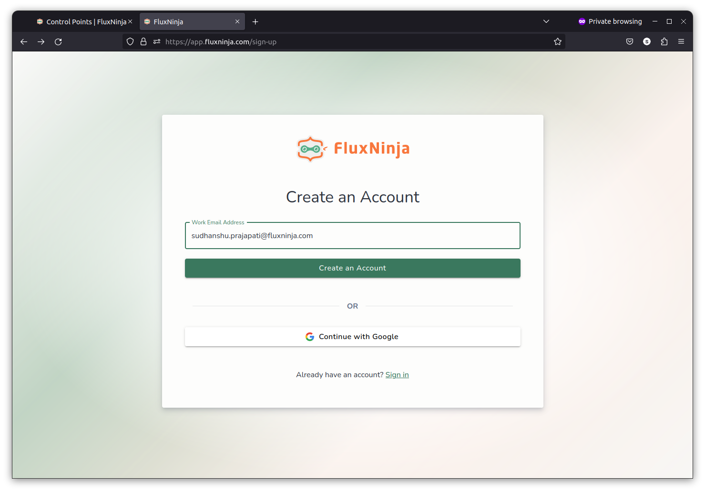

3. Once you have signed up, you will be redirected to the Create Organization
   page. Enter your organization name and click **Create**.

   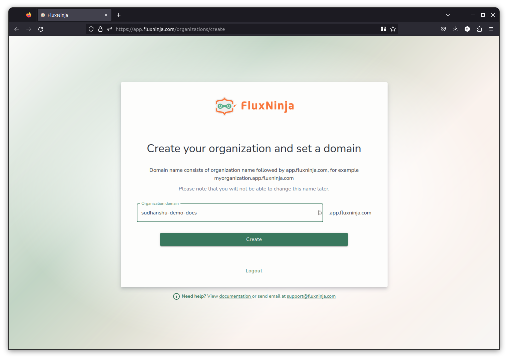

4. After you have created your organization, you will be redirected to the
   Select Subscription page. The default plan is with a trial period of 30 days.

   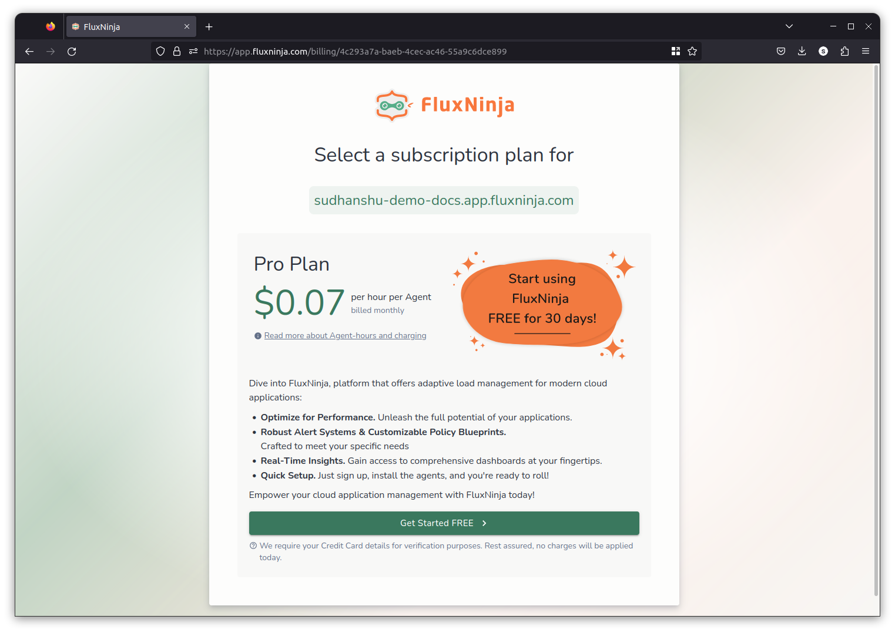

   Credit card details are required for verification purposes. Your information
   will be handled securely, and no charges will be applied during the trial
   period.

   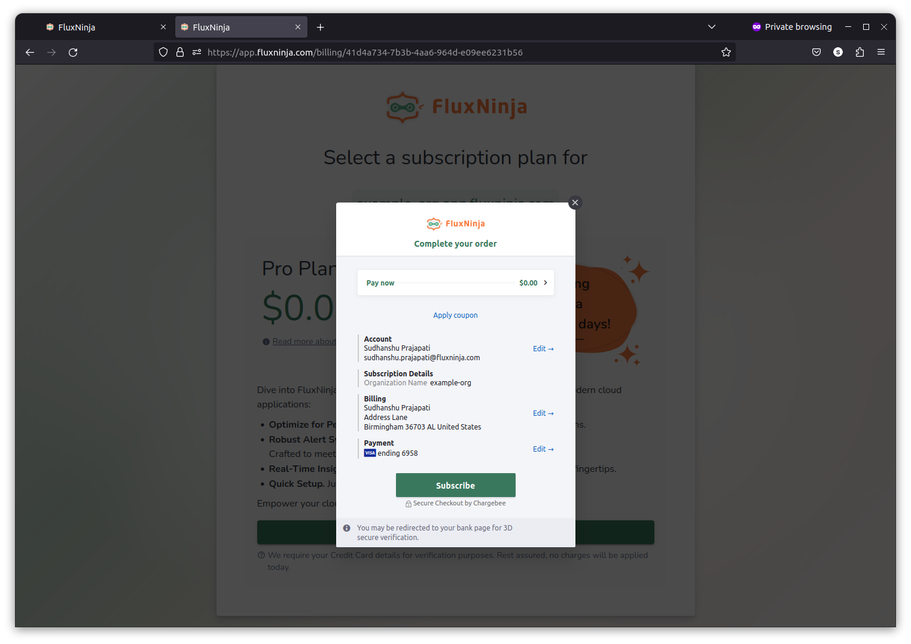

   Once you have entered your credit card details, click **Subscribe**. After
   validating your credit card details, your subscription will be started.
   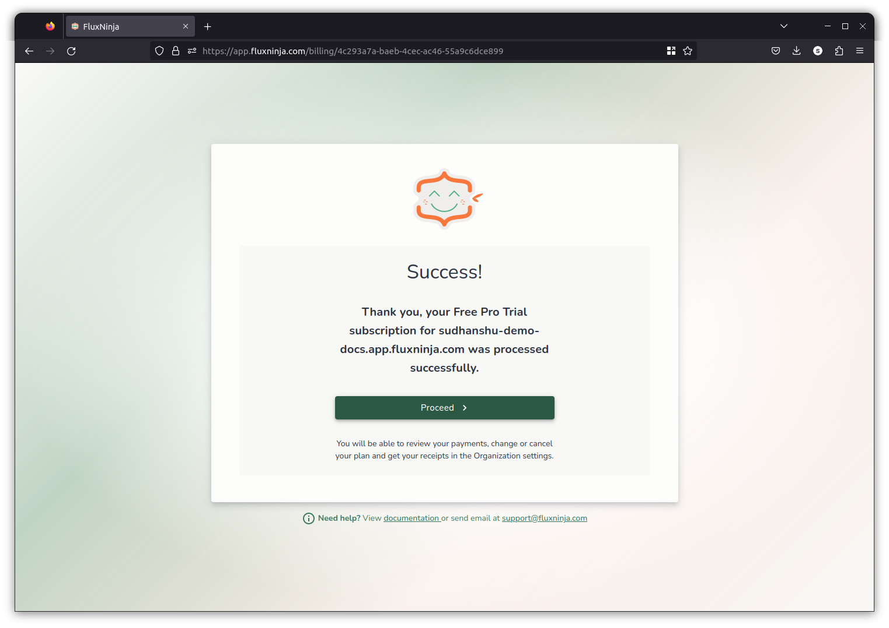

   In case of any issues, reach out to us at <support@fluxninja.com>

5. After completing the select subscription step, you will be redirected to the
   Get Started page. Read the instructions and click **Next**.

   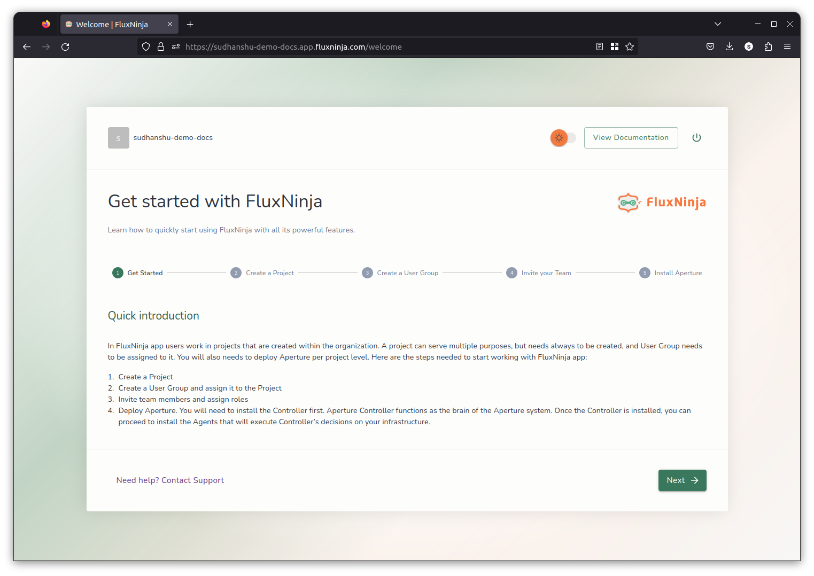

6. By default, Aperture Cloud creates one project for you. You can create more
   later on. Enter your project name and description, click **Next**.

   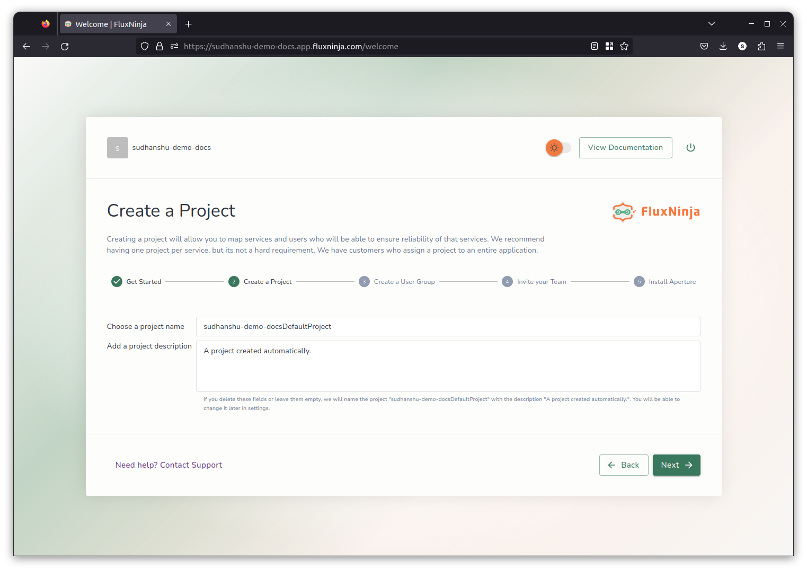

7. Each project has a user group associated with it. Only the users in the user
   group will have access to the project. You can add users to the user group by
   entering their email address, in the next step.
   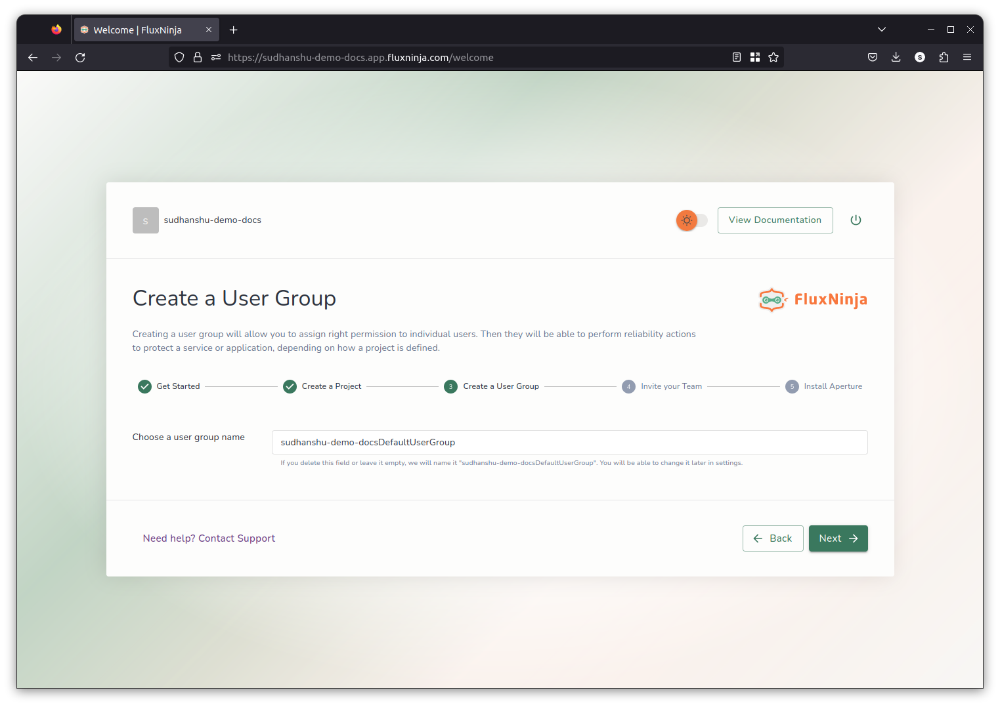

8. You are added by default to the user group created in the previous step, but
   you can invite more users by entering their email addresses and assigning
   them a role. Once you have entered all the email addresses, click **Send
   Invitations**. You can also choose to skip this step and add users later on.

   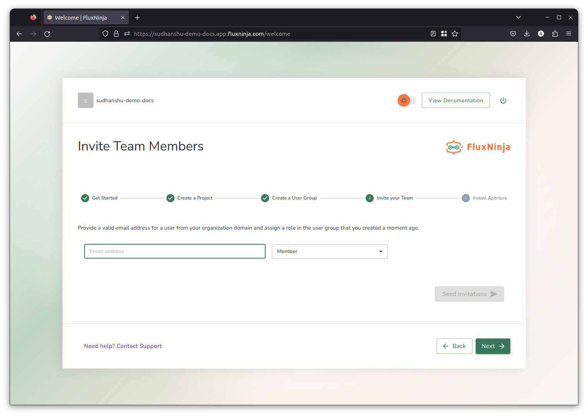

9. Now, you can install Aperture using the instructions provided.

   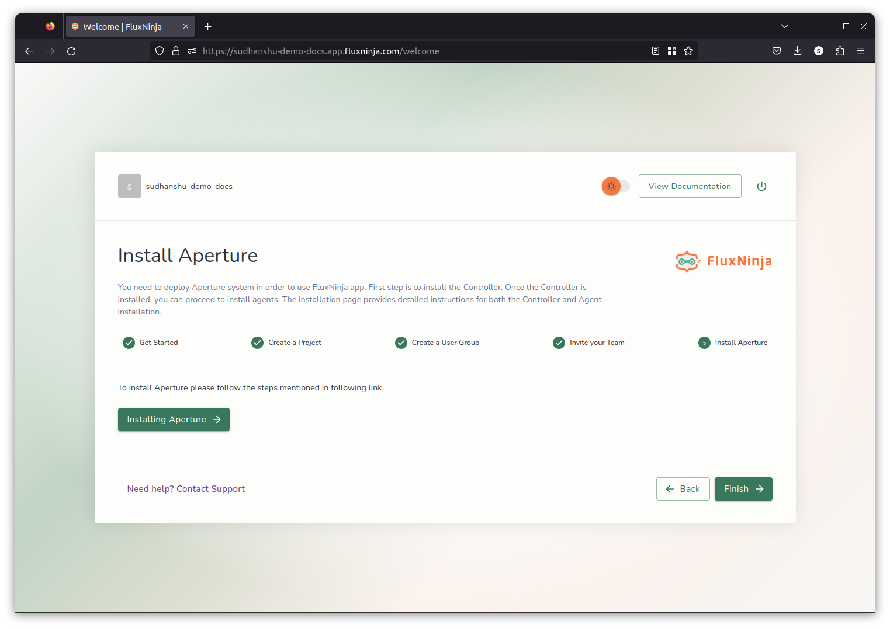

10. To start using Aperture Cloud. Click **Finish**. You will be redirected to
    the Aperture Cloud UI.

    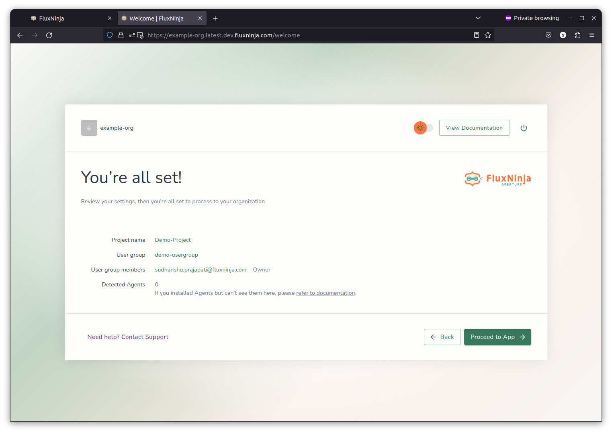

## Aperture Cloud

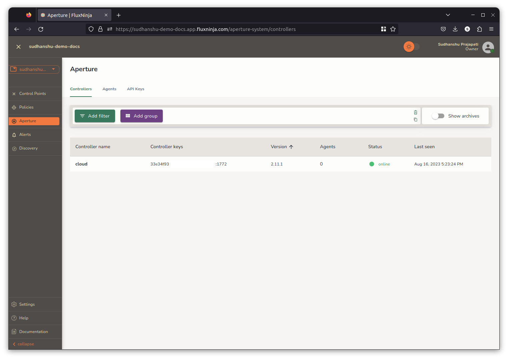

[plans]: https://www.fluxninja.com/pricing
