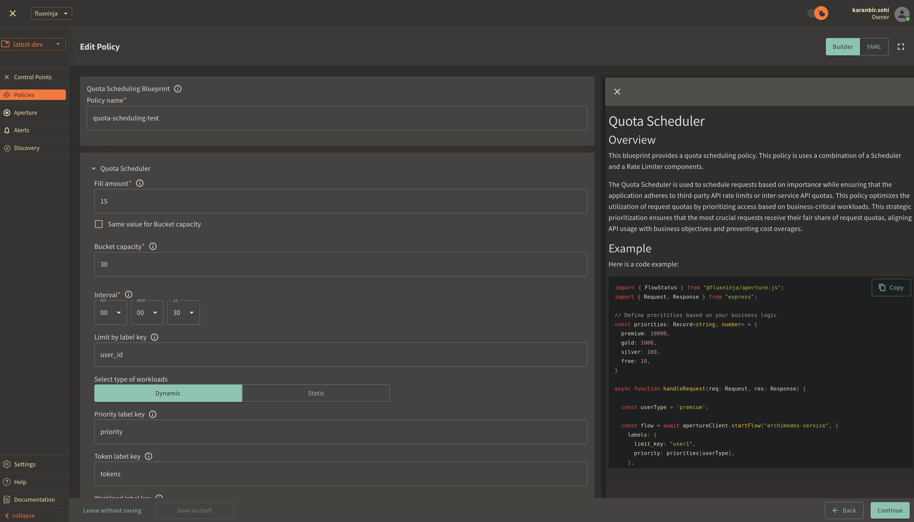

```mdx-code-block
import {apertureVersion} from '../apertureVersion.js';
import CodeBlock from '@theme/CodeBlock';
import Tabs from '@theme/Tabs';
import TabItem from "@theme/TabItem";
import {BashTab, TabContent} from './blueprintsComponents.js';
import Zoom from 'react-medium-image-zoom';
import CodeSnippet from '../codeSnippet.js'

```

:::note

The following policy is based on the
[Quota Scheduling](/reference/blueprints/quota-scheduling/base.md) blueprint.

:::

## Overview

Quota scheduling is a sophisticated technique that enables effective management
of request quotas. This technique empowers services to enforce rate limits for
outbound or external API. This helps ensure that services stay within allocated
rate limits, therefore avoiding penalties, ensuring smooth and uninterrupted
operation.

Moreover, quota scheduling optimizes the utilization of request quotas by
prioritizing access based on business-critical workloads. This strategic
prioritization ensures that the most crucial requests receive their fair share
of request quotas, aligning API usage with business objectives and preventing
cost overages.

<Zoom>

```mermaid
{@include: ./assets/managing-quotas/managing-quotas.mmd}
```

</Zoom>

The diagram provides an overview of quota scheduling in action, including the
operation of the token bucket to assign tokens based on priority.

Requests coming into the system are categorized into different workloads, each
of which is defined by its priority and weight. This classification is crucial
for the request scheduling process.

The scheduler priorities request admission based on two factors: the priority
and weight assigned to the corresponding workload, and the availability of
tokens from the token bucket. This mechanism ensures that high-priority requests
are handled appropriately even under high load or when the request rate is close
to the rate limit.

:::note Pre-Requisites

Before exploring Aperture's quota scheduling capabilities, make sure that you
have signed up to [Aperture Cloud](https://app.fluxninja.com/sign-up) and set up
an organization. For more information on how to sign up, follow our
[step-by-step guide](/reference/cloud-ui/sign-up.md).

:::

## Quota Scheduling with Aperture SDK

The first step to using the Aperture SDK is to import and set up Aperture
Client:

```mdx-code-block
<Tabs>
  <TabItem value="TypeScript">
```

<CodeSnippet lang="ts" snippetName="clientConstructor" />

```mdx-code-block
  </TabItem>
</Tabs>
```

You can obtain your organization address and API Key within the Aperture Cloud
UI by clicking the `Aperture` tab in the sidebar menu.

The next step consists of setting up essential business labels to prioritize
requests when making calls to third-party APIs and effectively avoid hitting
their rate limits. For example, requests can be prioritized by user tier
classifications:

```mdx-code-block
<Tabs>
  <TabItem value="Typescript">
```

<CodeSnippet lang="ts" snippetName="Priority" />

```mdx-code-block
 </TabItem>
</Tabs>
```

The next step is making a `startFlow` call to Aperture. For this call, it is
important to specify the control point (`my-feature` in our example) and the
labels that will align with the quota scheduling policy. The `priority` label is
necessary for request prioritization, while the `workload` label differentiates
each request. In this example, we're only tracking and logging requests sent to
Aperture. However, after making the `startFlow` call, you can execute relevant
business operations.

According to the policy logic designed to prevent third-party API rate limit
breaches, Aperture will, on each `startFlow` call, either give precedence to a
critical request or queue a less urgent one when approaching API limits.

```mdx-code-block
<Tabs>
  <TabItem value="TypeScript">
```

<CodeSnippet lang="ts" snippetName="QSStartFlow" />

```mdx-code-block
  </TabItem>
</Tabs>
```

It is important to make the `end` call made after processing each request, in
order to send telemetry data that would provide granular visibility for each
flow.

## Create a Quota Scheduling Policy

```mdx-code-block
<Tabs>
  <TabItem value="Aperture Cloud UI">
```

Navigate to the `Policies` tab on the sidebar menu, and select `Create Policy`
in the upper right corner. Next, choose the Request Prioritization blueprint,
and from the drop-down options select Quota based. Now, complete the form with
these specific values:

1. `Policy name`: Unique for each policy, this field can be used to define
   policies tailored for different use cases. Set the policy name to
   `rate-limit-test`.
2. `Fill amount`: Configures the number of tokens added to the bucket within the
   selected interval. Set `Fill amount` to `15`.
3. `Bucket Capacity`: Defines the maximum capacity of the bucket in the rate
   limiter. Clear the option `same value for bucket capacity option` to set
   value as `30`.
4. `Interval`: Specifies the time amount of time `Fill amount` will take to
   refill tokens in the bucket. Set `Interval` to `1 minute`.
5. `Limit By Label Key`: Determines the specific label key used for enforcing
   rate limits. We'll use `user_id` as an example.
6. `Priority label key`: This field specifies the label that is used to
   determine the priority. It is set to `priority` in the policy and SDK code
   example.
7. `Workload label key`: This field specifies the label that is used to
   determine the workload. It is set to `workload` in the policy and SDK code
   example.
8. `Control point`: It can be a particular feature or execution block within a
   service. We'll use `my-feature` as an example.



Once you've completed these fields, click `Continue` and then `Apply Policy` to
finalize the policy setup.

```mdx-code-block
  </TabItem>
  <TabItem value="aperturectl (Aperture Cloud)">
```

If you haven't installed aperturectl yet, begin by following the
[Set up CLI aperturectl guide](/reference/aperture-cli/aperture-cli.md). Once
aperturectl is installed, generate the values file necessary for creating the
quota scheduling policy using the command below:

<CodeBlock language="bash"> aperturectl blueprints values
--name=quota-scheduling/base --output-file=quota-scheduling-test.yaml
</CodeBlock>

Following are the fields that need to be filled for creating a quota scheduling
policy:

1. `policy_name`: Unique for each policy, this field can be used to define
   policies tailored for different use cases. Set the policy name to
   `rate-limit-test`.
2. `fill_amount`: Configures the number of tokens added to the bucket within the
   selected interval. Set `Fill amount` to `15`.
3. `bucket_capacity`: Defines the maximum capacity of the bucket in the rate
   limiter. Set `bucket_capacity` to `30`.
4. `interval`: Specifies the time amount of time `Fill amount` will take to
   refill tokens in the bucket. Set `Interval` to `60 seconds`.
5. `limit_by_label_key`: Determines the specific label key used for enforcing
   rate limits. We'll use `user_id` as an example.
6. `priority_label_key`: This field specifies the label that is used to
   determine the priority. It is set to `priority` in the policy and SDK code
   example.
7. `workload_label_key`: This field specifies the label that is used to
   determine the workload. It is set to `workload` in the policy and SDK code
   example.
8. `control_point`: It can be a particular feature or execution block within a
   service. We'll use `my-feature` as an example.

Here is how the complete values file would look:

```yaml
{@include: ./assets/managing-quotas/values.yaml}
```

The last step is to apply the policy using the following command:

<CodeBlock language="bash"> aperturectl cloud blueprints apply
--values-file=quota-scheduling-test.yaml </CodeBlock>

```mdx-code-block
  </TabItem>
</Tabs>
```

Next, we'll proceed to run an example to observe the newly implemented policy in
action.

## Quota Scheduling in Action

Begin by cloning the
[Aperture JS SDK](https://github.com/fluxninja/aperture-js). Look for the
`quota_scheduler_example.ts` in the example directory within the SDK.

Follow these steps to set up and run the example:

1. Install the necessary packages:
   - Run `npm install` to install the base dependencies.
   - Run `npm install @fluxninja/aperture-js` to install the Aperture SDK.
2. Run `npx tsc` to compile the TypeScript example.
3. Run `node dist/quota_scheduler_example.ts` to start the compiled example.

Once the example is running, it will prompt you for your Organization address
and API Key. In the Aperture Cloud UI, select the Aperture tab from the sidebar
menu. Copy and enter both your Organization address and API Key to establish a
connection between the SDK and Aperture Cloud.

## Monitoring Quota Scheduling Policy

After running the example for a few minutes, you can review the telemetry data
in the Aperture Cloud UI. Navigate to the Aperture Cloud UI, and click the
`Policies` tab located in the sidebar menu. Then, select the
`quota-scheduling-test` policy that you previously created.

Once you've clicked on the policy, you will see the following dashboard:


The two panels above provide insights into how the policy is performing by
monitoring the number of accepted and rejected requests along with the
acceptance percentage.


The panels above offer insights into the request details, including their
latency.


These panels display insights into queue duration for `workload` requests and
highlight the average of prioritized requests that moved ahead in the queue.
