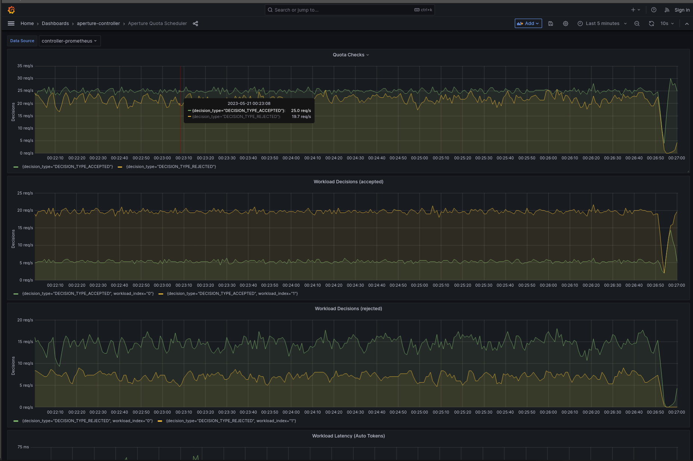

```mdx-code-block
import {apertureVersion} from '../../apertureVersion.js';
import CodeBlock from '@theme/CodeBlock';
import Tabs from '@theme/Tabs';
import TabItem from "@theme/TabItem";
import {BashTab, TabContent} from '../blueprintsComponents.js';
import Zoom from 'react-medium-image-zoom';
```

## Overview

When interacting with external APIs or services, adhering to the rate limits
imposed by the service provider is crucial. Aperture can model these external
API rate limits, enabling rate limits at the calling service in a distributed
application. This approach not only prevents potential penalties for exceeding
the rate limits, but also allows Aperture to prioritize access to the external
API, ensuring essential workloads receive a fair share of the API quota.

## Configuration

This policy is based on the
[Quota Scheduler](/reference/blueprints/quota-scheduling/base.md#policy-quota-scheduler)
blueprint. It uses a quota scheduler to regulate the control point
**`some-external-api`**, which represents all outgoing requests made to an
external API from services within a distributed application. The rate limit is
applied per **`api_key`** label, with an interval set to **`1`** second, meaning
that the token bucket is replenished with **`25`** tokens every second, up to a
maximum of **`500`** tokens. Lazy sync is enabled on the rate limiter, which
allows the rate limit counters on each Agent to sync four times every interval
(1 second).

The WFQ Scheduler prioritizes interactive requests with **`200`** priority and
background requests with **`50`** priority, ensuring that interactive calls
receive roughly four times the quota share of background requests.

The below `values.yaml` file can be generated by following the steps in the
[Installation](#installation) section.

```mdx-code-block
<Tabs>
<TabItem value="aperturectl values.yaml">
```

```yaml
{@include: ./assets/inter-service-rate-limiting/values.yaml}
```

```mdx-code-block
</TabItem>
</Tabs>

```

<details><summary>Generated Policy</summary>
<p>

```yaml
{@include: ./assets/inter-service-rate-limiting/policy.yaml}
```

</p>
</details>

## Installation

Generate a values file specific to the policy. This can be achieved using the
command provided below.

```mdx-code-block
<CodeBlock language="bash">aperturectl blueprints values --name=quota-scheduling/base --version={apertureVersion} --output-file=values.yaml</CodeBlock>
```

Apply the policy using the `aperturectl` CLI or `kubectl`.

```mdx-code-block
<Tabs>
  <TabItem value="aperturectl (Aperture Cloud)" label="aperturectl (Aperture Cloud)">
    <TabContent valuesFile="values" tabValue="aperturectl (Aperture Cloud)"/>
  </TabItem>
  <TabItem value="aperturectl (self-hosted controller)" label="aperturectl (self-hosted controller)">
```

Pass the `--kube` flag with `aperturectl` to directly apply the generated policy
on a Kubernetes cluster in the namespace where the Aperture Controller is
installed.

```mdx-code-block
  <TabContent valuesFile="values" tabValue="aperturectl (self-hosted controller)" policyName="inter-service-rate-limiting" />
</TabItem>
<TabItem value="kubectl (self-hosted controller)" label="kubectl (self-hosted controller)">
```

Apply the generated policy YAML (Kubernetes Custom Resource) with `kubectl`.

```mdx-code-block
  <TabContent valuesFile="values" tabValue="kubectl (self-hosted controller)" policyName="inter-service-rate-limiting" />
</TabItem>

</Tabs>
```

## Policy in Action

The quota scheduler successfully ensures that the request rate remains within
the specified limits, as seen below, with a steady state of 25 requests per
second. Additionally, the workload decisions panel shows that interactive
requests receive approximately four times the acceptance rate compared to
background requests.

:::info

[Circuit Diagram](./assets/inter-service-rate-limiting/graph.mmd.svg) for this
policy.

:::

<Zoom>



</Zoom>
