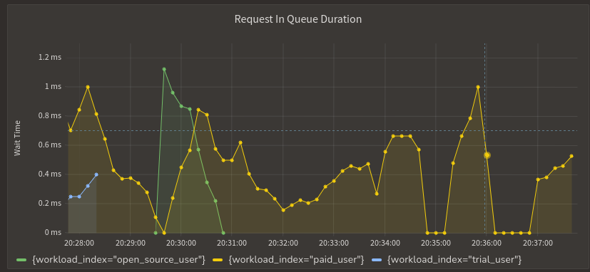
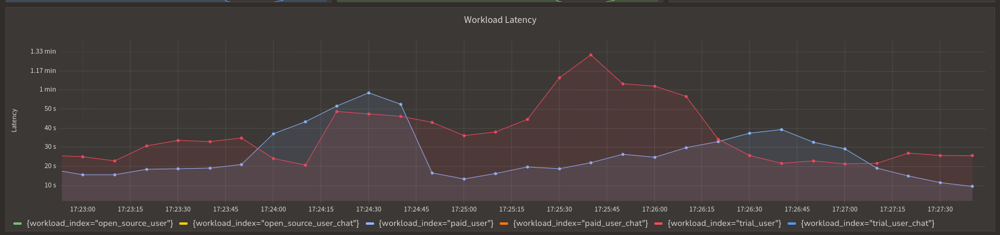

```mdx-code-block
import {apertureVersion} from '../../apertureVersion.js';
import CodeBlock from '@theme/CodeBlock';
import Tabs from '@theme/Tabs';
import TabItem from '@theme/TabItem';
import Zoom from 'react-medium-image-zoom';
```

## Overview

The Quota Scheduler technique can be used to enforce rate limits set by
third-party vendors like OpenAI, which helps minimize the need to retry the
request and increase the success rate of requests. Moreover, it can help reduce
the third-party vendor usage cost by scheduling the request and stopping to go
beyond a certain limit.

This guide will help you understand how to use the Quota Scheduler Blueprint to
manage and stop hitting rate limits imposed by OpenAI. With the help of this
policy, the need to retry the request can be optional and without sacrificing
the user experience.

In this guide, we assume there's an application that makes API calls to OpenAI
GPT. It requests to various model types of GPT, depending on the use case.
Furthermore, requests come from different users, each with unique priorities
aligned to specific tiers like free, paid, and trial. The application has to
ensure that each request makes it to the OpenAI without hitting the rate limits.
Delaying the request is acceptable to some extent, i.e., the request can wait
until the request rate limit is reset. However, the request should not be
dropped.

## Pre-Requisites

Before you begin with this guide, verify the prerequisites are fulfilled.

- Aperture is installed and running. If not, follow the
  [get started guide](http://localhost:3000/development/get-started/).
- `aperturectl` is installed and configured. If not, follow the
  [aperturectl installation guide](http://localhost:3000/development/get-started/installation/aperture-cli/).

## Configuration

Before creating a policy, a control point needs to be defined. Control Point
specifies where the policy should apply the decisions. There are multiple ways
to achieve this; for the scope of this guide, a JavaScript SDK is used to create
a control point—check out the
[Control Point](https://docs.fluxninja.com/concepts/control-point) Concept &
[Integrations](https://docs.fluxninja.com/integrations/) section for more
details.

### Control Point with JavaScript SDK

:::info

💡
[Check out other language SDKs supported by Aperture](/integrations/integrations.md)

:::

The Aperture JavaScript SDK allows you to set a control point manually. How an
Aperture Client instance is created is not discussed in this guide; detailed
information around SDK integration can be found in
[Manually setting feature control points using JavaScript SDK](/integrations/sdk/javascript/manually-setting-feature-control-points-using-javascript-sdk).

The code below provides a general idea of control point creation and setting
labels.

```tsx
import { ApertureClient, FlowStatusEnum } from "@fluxninja/aperture-js"
import { ChatGPTAPI, ChatGPTError } from "chatgpt"
import CryptoES from "crypto-es"
import { logger } from "./logger.js"
import { getTokenCount } from "./tokenizer.js"
import { ProductReason, Settings } from "./settings.js"

const PRIORITIES: Record<ProductReason, number> = {
    paid: 1000,
    trial: 400,
    free_user: 200,
}
async function sendMessageToOpenAI(
    message: string,
    settings: Settings,
    apertureClient: ApertureClient,
    api: ChatGPTAPI,
    priorityBump: number = 0
): Promise<string> {
    let response

    // Calculate the total character count for the message by adding system message length,
    // the message length, and the lengths of the strings "system" and "user".
    const charCount = this.systemMessage.length + message.length + String("system" + "user").length;

    // Create a dictionary to hold labels for the flow
    const labels: Record<string, string> = {

    // Securely hash the API key for privacy and security
    //API key could be used to filter out the requests if required.
    api_key: CryptoES.SHA256(api.apiKey).toString(),

    // OpenAI suggests optimizing rate limits by estimating tokens.
    // The following calculates the estimated number of tokens based on character count.
    // Reference: https://platform.openai.com/docs/guides/rate-limits/reduce-the-max_tokens-to-match-the-size-of-your-completions
    estimated_tokens: (Math.ceil(charCount / 4) + responseTokens).toString(),

    // Model variant being used for the API Call
    model_variant: modelVariant,

    // Reason for product usage, defined in settings
    product_reason: this.settings.product_reason,

    // Calculate priority based on product reason and any additional priority bump
    priority: String(PRIORITIES[this.settings.product_reason] + priorityBump),
  };

    const startTimestamp = Date.now()
    // Set up the control point with the name "openai" using the Aperture client
    // With flow these things are also passed and defined
    // labels, a timeout, and a maximum wait time.
    flow = await this.apertureClient.StartFlow("openai", {
      labels: labels,
      timeoutMilliseconds: 600000, // Maximum time the request can be in the queue.
    });

  const endTimestamp = Date.now()

  // Logging
  logger.info(
    `OpenAI: aperture-js flow should run: ${
      flow.ShouldRun() ? "yes" : "no"
    }, response time: ${endTimestamp - startTimestamp} ms${
      flow.CheckResponse()
        ? `, response: ${JSON.stringify(flow.CheckResponse())}`
        : ""
    }${
      flow.Error() ? `, error: ${JSON.stringify(flow.Error())}` : ""
    }, estimated tokens: ${labels.estimated_tokens}, character count: ${
      message.length + this.systemMessage.length
    }`,
  )

  // Make call to OpenAI API here.
  try {
      const start = Date.now()
      // sending the message
      response = await api.sendMessage(message, opts)
      const end = Date.now()
      logger.info(`openai response time: ${end - start} ms`)
  } catch (e) {
      // Handle ChatGPTError specifically, if it occurs
      if (e instanceof ChatGPTError) {
          logger.info(
              `response: ${response}, failed to send message to openai: ${e}, backtrace: ${e.stack}`,
          )
      }
      // Mark the flow status as Error in case of an exception
      flow.SetStatus(FlowStatusEnum.Error)
      // Re-throw the error to be caught by the chat function
      throw e
  } finally {
      // Ensure that the flow ends correctly in all scenarios
      flow.End()
  }

return response

// Usage example (assuming the necessary settings and API instances are available):
// const responseText = await sendMessageToOpenAI("Hello, OpenAI!", settings, apertureClient, chatGPTAPIInstance);
```

Let's understand the code snippet above; we are creating a control point named
`openai` and setting the labels, which will be used by the policy to identify
and schedule the request. Below are the labels being passed:

- `estimated_tokens`: This is the estimated number of tokens that the request
  will use. This is calculated by adding the number of characters in the prompt
  and the response tokens. This label value can be used to create a policy
  around OpenAI token limits, which differ from request rate limits. More
  information can be found in
  [OpenAI Rate Limits](https://platform.openai.com/docs/guides/rate-limits/what-are-the-rate-limits-for-our-api).
- `model_variant`: Multiple policies can be created based on the model variant
  used. For example, GPT-3, GPT-4, and so on. Since each model variant has
  different rate limits, it is recommended to create a policy for each model
  variant unless the application is using the same model variant for all the
  requests.

These labels serve as a structured method to categorize and prioritize your
requests with enhanced accuracy. While it is encouraged to design labels that
are specific to business needs, here are some example labels for clarity:

- `product_reason`: Typically, businesses offer different tiers of their
  products to cater to various customer segments. For instance, a SaaS company
  might offer Paid, Trial, and Free tiers, each with a different set of features
  and pricing. In this case, as a demo, a `product_reason` label is used to
  categorize requests based on the tier of the product that the request is being
  made. Read more about [Flow Labels](/concepts/flow-label).

### Policy

OpenAI measures rate limits in multiple ways: Request Per Minute, Token Per
Minute, and Request per day (not in the scope of this guide). This makes it more
challenging to keep requests in check with multiple types of rate limits.
However, Aperture can deal with this by creating a policy on top of the token
consumption rate. Let’s generate a policy for both types.

### Generate a Values File

#### For Request Per Minute Rate Limits

To generate a policy using Quota Scheduler Blueprint, A values files should be
generated first, specific to the policy. This can be achieved using the command
provided below.

```mdx-code-block
<CodeBlock language="bash">aperturectl blueprints values --name=quota-scheduling/base --version=main --output-file=gpt-4-rpm-values.yaml</CodeBlock>
```

The values file needs to be adjusted to match the application requirements -

- `policy_name`: Name of the policy — This value should be unique and required.
- `bucket_capacity`: This value defines how many requests can be sent in a given
  interval. For example, if the bucket capacity is 4 & internal is 60, then four
  requests can be sent in 60 seconds.
- `fill_amount`: After the tokens are consumed, the bucket will be filled with
  this amount. For example, if the bucket capacity is 4 & and the fill amount is
  4, then after four requests are sent, the bucket will be filled with four
  tokens. It will help tune how many requests to allow after filling the bucket.
- `rate_limiter`:
  - `interval`: Interval at which the rate limiter will be filled. When to reset
    the bucket.
  - `label_key`: Label key to match the request against. This label key could be
    API key, user id, and so on., which helps determine the quota for the
    request. In this case, it is `api_key`.

The scheduler helps prioritize the requests based on the labels and priority
defined. In this case, we are using `priority` label, which is being passed by
Aperture SDK in code, containing the priority of the request.

- `scheduler`:
  - `priority_label_key`: Priority label key to match the request against. In
    this case, it is `priority`.
  - `workloads`:
    - `name`: To match the label value against the name of workloads. In this
      case, it is `paid_user`, `trial_user`, `free_user`.
    - `label_matcher`:
      - `match_labels`: Labels to match the request against. In this case, it is
        `product_reason`.

Selector parameters allow filtering of the requests to ensure where the policy
will act on.

- `selectors`:
  - `control_point`: Control point name to match the request against. In this
    case, it will be `openai`.
  - `agent_group`: Agent group name to match the request against. It is
    optional.
  - `label_matcher`:
    - `match_labels`: Labels to match the request against. It is optional.

Below is an example of a values file adjusted to match the SDK code snippet &
control point labels.

<details><summary>values.yaml for request-per-minute</summary>
<p>

```yaml
# yaml-language-server: $schema=https://raw.githubusercontent.com/fluxninja/aperture/latest/blueprints/quota-scheduling/base/gen/definitions.json
# Generated values file for quota-scheduling/base blueprint
# Documentation/Reference for objects and parameters can be found at:
# https://docs.fluxninja.com/reference/blueprints/quota-scheduling/base

blueprint: quota-scheduling/base
uri: github.com/fluxninja/aperture/blueprints@latest
policy:
  # Name of the policy.
  # Type: string
  # Required: True
  policy_name: gpt-4-rpm
  quota_scheduler:
    # Bucket capacity.
    # Type: float64
    # Required: True
    bucket_capacity: 4
    # Fill amount.
    # Type: float64
    # Required: True
    fill_amount: 200
    # Rate Limiter Parameters.
    # Type: aperture.spec.v1.RateLimiterParameters
    # Required: True
    rate_limiter:
      interval: 60s
      label_key: api_key
      delay_initial_fill: true
    scheduler:
      priority_label_key: priority
      workloads:
        - name: paid_user
          label_matcher:
            match_labels:
              product_reason: paid_user
        - name: trial_user
          label_matcher:
            match_labels:
              product_reason: trial_user
        - name: free_user
          label_matcher:
            match_labels:
              product_reason: free_user
    # Flow selectors to match requests against
    # Type: []aperture.spec.v1.Selector
    # Required: True
    selectors:
      - control_point: openai
        agent_group: apollo-prod
        label_matcher:
          match_labels:
            model_variant: gpt-4
```

</p>
</details>

#### For Token Per Minute Rate Limit

:::note

⚠️ Aperture Token bucket tokens are different from OpenAI Tokens.

:::

The `estimated_tokens` label value, which the Aperture SDK passed, can be used
for customizing the token bucket and deducting the tokens based on the estimated
token value since each request already has that value, which can be used to
subtract from the bucket capacity. A new policy values file needs to be
generated, following similar steps as earlier.

```mdx-code-block
<CodeBlock language="bash">aperturectl blueprints values --name=quota-scheduling/base --version=main --output-file=gpt-4-tpm-values.yaml</CodeBlock>
```

In the value file, `policy_name`, `bucket_capacity`, `fill_amount`, and
scheduler configuration will have a `token_label_key` defined. According to the
OpenAI Token Rate Limits, `bucket_capacity` & `fill_amount` should be
configured.

<details><summary>values.yaml for tokens-per-minute</summary>
<p>

```yaml
# yaml-language-server: $schema=https://raw.githubusercontent.com/fluxninja/aperture/latest/blueprints/quota-scheduling/base/gen/definitions.json
# Generated values file for quota-scheduling/base blueprint
# Documentation/Reference for objects and parameters can be found at:
# https://docs.fluxninja.com/reference/blueprints/quota-scheduling/base

blueprint: quota-scheduling/base
uri: github.com/fluxninja/aperture/blueprints@latest
policy:
  # Name of the policy.
  # Type: string
  # Required: True
  policy_name: gpt-4-tpm
  quota_scheduler:
    # Bucket capacity.
    # Type: float64
    # Required: True
    bucket_capacity: 10000
    # Fill amount.
    # Type: float64
    # Required: True
    fill_amount: 40000
    # Rate Limiter Parameters
    # Type: aperture.spec.v1.RateLimiterParameters
    # Required: True
    rate_limiter:
      interval: 60s
      label_key: api_key
      delay_initial_fill: true
    scheduler:
      priority_label_key: priority
      tokens_label_key: estimated_tokens
      workloads:
        - name: paid_user
          label_matcher:
            match_labels:
              product_reason: paid_user
        - name: trial_user
          label_matcher:
            match_labels:
              product_reason: trial_user
        - name: free_user
          label_matcher:
            match_labels:
              product_reason: free_user
    # Flow selectors to match requests against
    # Type: []aperture.spec.v1.Selector
    # Required: True
    selectors:
      - control_point: openai
        agent_group: apollo-prod
        label_matcher:
          match_labels:
            model_variant: gpt-4
```

</p>
</details>

#### Generate Policy

Using the adjusted values file, final policies will be generated, which will be
deployed.

To generate, use the following command:

```mdx-code-block
<CodeBlock language="bash">aperturectl blueprints generate --values-file=values_file_name.yaml --output-dir=policy-gen</CodeBlock>
```

#### Apply Policy

Apply the policy using the `aperturectl` CLI or `kubectl`.

```mdx-code-block
<Tabs>
<TabItem value="aperturectl" label="aperturectl">
```

Pass the `--kube` flag with `aperturectl` to directly apply the generated policy
on a Kubernetes cluster in the namespace where the Aperture Controller is
installed.

```mdx-code-block
<CodeBlock language="bash">aperturectl apply policy --file=policy-gen/policies/policy_name.yaml --kube</CodeBlock>
```

```mdx-code-block
</TabItem>
<TabItem value="kubectl" label="kubectl">
```

Apply the policy YAML generated (Kubernetes Custom Resource) using the above
example with `kubectl`.

```bash
kubectl apply -f policy-gen/policies/policy_name.yaml -n aperture-controller
```

```mdx-code-block
</TabItem>
</Tabs>
```

## Policy in Action

Once the policy is active, it will start ensuring that API requests are in check
with rate limits quotas, prioritize requests based on the type of workloads as
defined in the policy, matching with the labels that SDK passed to Aperture,
where paid users have more priority over trial and trial over free users,
establishing an experience baseline for each tier.

If rate limits are exhausted, Aperture will schedule the request, put them in
the queue, and wait for the bucket to be reset or the token to be available.
Requests will wait in the queue till the timeout value, which is set during the
`flow/control point` setup. There is no minimum time for the request to wait; as
soon as the tokens are available, the request will be sent to OpenAI. A request
can be sent to OpenAI as soon as it reaches the application, or it can wait till
the timeout. As the overview states, there should be no request drop; the
highest number of timeout values means no request drop.

### Using Aperture Cloud UI for Advanced Analytics

Aperture Cloud UI provides a 360\* overview of policy, which can be seen from
panels & dashboards, a granular view of each workload, like paid, trial, and
free. Apart from this, Aperture Cloud allows you to view how many policies and
control is active, Acting as centralized policy management & monitoring +
control points, and services discovery.


_Wait Time for Requests in Queue for different Workload Types_


_Workload Latency_
