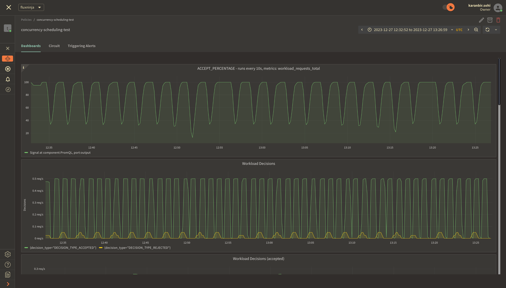

```mdx-code-block
import {apertureVersion} from '../apertureVersion.js';
import CodeBlock from '@theme/CodeBlock';
import Tabs from '@theme/Tabs';
import TabItem from "@theme/TabItem";
import {BashTab, TabContent} from './blueprintsComponents.js';
import Zoom from 'react-medium-image-zoom';
import CodeSnippet from '../codeSnippet.js'

```

:::note

The following policy is based on the
[Concurrency Scheduling](/reference/blueprints/concurrency-scheduling/base.md)
blueprint.

:::

## Overview

Concurrency control and prioritization, is a sophisticated technique that allows
effective management of concurrent requests. With this technique, services can
limit the number of concurrent API calls to alleviate the load on the system.

When service limits are reached, Aperture Cloud can queue incoming requests and
serve them according to their priority, which is determined by business-critical
labels set in the policy and passed via the SDK.

<Zoom>

```mermaid
{@include: ./assets/concurrency-control-and-prioritization/concurrency-scheduling.mmd}
```

</Zoom>

The diagram provides an overview of concurrency scheduling in action, where the
scheduler queues and prioritizes requests once the service limit is hit and
keeps the count with a token counter.

Requests coming into the system are categorized into different workloads, each
of which is defined by its priority and weight. This classification is crucial
for the request scheduling process.

The scheduler priorities request admission based the priority and weight
assigned to the corresponding workload. This mechanism ensures that
high-priority requests are handled appropriately even under high load.

:::note Pre-Requisites

Before exploring Aperture's concurrency scheduling capabilities, make sure that
you have signed up to [Aperture Cloud](https://app.fluxninja.com/sign-up) and
set up an organization. For more information on how to sign up, follow our
[step-by-step guide](/reference/cloud-ui/sign-up.md).

:::

## Concurrency Scheduling with Aperture SDK

The first step to using the Aperture SDK is to import and set up Aperture
Client:

```mdx-code-block
<Tabs>
  <TabItem value="TypeScript">
```

<CodeSnippet lang="ts" snippetName="clientConstructor" />

```mdx-code-block
  </TabItem>
</Tabs>
```

You can obtain your organization address and API Key within the Aperture Cloud
UI by clicking the `Aperture` tab in the sidebar menu.

The next step consists of setting up essential business labels to prioritize
requests. For example, requests can be prioritized by user tier classifications:

```mdx-code-block
<Tabs>
  <TabItem value="Typescript">
```

<CodeSnippet lang="ts" snippetName="Priority" />

```mdx-code-block
 </TabItem>
</Tabs>
```

The next step is making a `startFlow` call to Aperture. For this call, it is
important to specify the control point (`concurrency-scheduling-feature` in our
example) and the labels that will align with the concurrency scheduling policy.
The `priority` label is necessary for request prioritization, while the
`workload` label differentiates each request.

According to the policy logic designed to prevent service limit breaches,
Aperture will, on each `startFlow` call, either give precedence to a critical
request or queue a less urgent one when approaching API limits. The duration a
request remains in the queue is determined by the gRPC deadline, set within the
`startFlow` call. Setting this deadline to `120000` milliseconds, for example,
indicates that the request can be queued for a maximum of 2 minutes. After this
interval, the request will be rejected.

In this example, we're only tracking and logging requests sent to Aperture.
However, once the `startFlow` call is made, business logic can be executed
directly, as excess requests are queued, eliminating the need to check if a flow
`shouldRun`.

```mdx-code-block
<Tabs>
  <TabItem value="TypeScript">
```

<CodeSnippet lang="ts" snippetName="CSStartFlow" />

```mdx-code-block
  </TabItem>
</Tabs>
```

It is important to make the `end` call after processing each request, to remove
in-flight requests and send telemetry data that would provide granular
visibility for each flow.

## Create a Concurrency Scheduling Policy

```mdx-code-block
<Tabs>
  <TabItem value="Aperture Cloud UI">
```

Navigate to the `Policies` tab on the sidebar menu, and select `Create Policy`
in the upper right corner. Next, choose the Request Prioritization blueprint,
and from the drop-down options select Concurrency based. Now, complete the form
with these specific values:

1. `Policy Name`: Unique for each policy, this field can be used to define
   policies tailored for different use cases. Set the policy name to
   `concurrency-scheduling-test`.
2. `Limit by label key`: Determines the specific label key used for concurrency
   limits. We'll use `user_id` as an example.
3. `Max inflight duration`: Configures the time duration after which flow is
   assumed to have ended in case the end call gets missed. We'll set it to `60s`
   as an example.
4. `Max concurrency`: Configures the maximum number of concurrent requests that
   a service can take. We'll set it to `20` as an example.
5. `Priority label key`: This field specifies the label that is used to
   determine the priority. We will leave the label as it is.
6. `Tokens label key`: This field specifies the label that is used to determine
   tokens. We will leave the label as it is.
7. `Workload label key`: This field specifies the label that is used to
   determine the workload. We will leave the label as it is.
8. `Control point`: It can be a particular feature or execution block within a
   service. We'll use `concurrency-scheduling-feature` as an example.


Once you've completed these fields, click `Continue` and then `Apply Policy` to
finalize the policy setup.

```mdx-code-block
   </TabItem>
  <TabItem value="aperturectl">
```

If you haven't installed aperturectl yet, begin by following the
[Set up CLI aperturectl guide](/reference/aperture-cli/aperture-cli.md). Once
aperturectl is installed, generate the values file necessary for creating the
concurrency scheduling policy using the command below:

<CodeBlock language="bash"> aperturectl blueprints values
--name=concurrency-scheduling/base
--output-file=concurrency-scheduling-test.yaml </CodeBlock>

Following are the fields that need to be filled for creating a concurrency
scheduling policy:

1. `policy_name`: Unique for each policy, this field can be used to define
   policies tailored for different use cases. Set the policy name to
   `concurrency-scheduling-test`.
2. `limit_by_label_key`: Determines the specific label key used for concurrency
   limits. We'll use `user_id` as an example.
3. `max_inflight_duration`: Configures the time duration after which flow is
   assumed to have ended in case the end call gets missed. We'll set it to `60s`
   as an example.
4. `max_concurrency`: Configures the maximum number of concurrent requests that
   a service can take. We'll set it to `20` as an example.
5. `priority_label_key`: This field specifies the label that is used to
   determine the priority. We will leave the label as it is.
6. `tokens_label_key`: This field specifies the label that is used to determine
   tokens. We will leave the label as it is.
7. `workload_label_key`: This field specifies the label that is used to
   determine the workload. We will leave the label as it is.
8. `control_point`: It can be a particular feature or execution block within a
   service. We'll use `concurrency-scheduling-feature` as an example.

Here is how the complete values file would look:

```yaml
{@include: ./assets/concurrency-control-and-prioritization/values.yaml}
```

The last step is to apply the policy using the following command:

<CodeBlock language="bash"> aperturectl cloud blueprints apply
--values-file=concurrency-scheduling-test.yaml </CodeBlock>

```mdx-code-block
  </TabItem>
</Tabs>
```

Next, we'll proceed to run an example to observe the newly implemented policy in
action.

## Concurrency Scheduling in Action

Begin by cloning the
[Aperture JS SDK](https://github.com/fluxninja/aperture-js). Look for the
`concurrency_scheduler_example.ts` in the example directory within the SDK.

Switch to the example directory and follow these steps to run the example:

1. Install the necessary packages:
   - Run `npm install` to install the base dependencies.
   - Run `npm install @fluxninja/aperture-js` to install the Aperture SDK.
2. Run `npx tsc` to compile the TypeScript example.
3. Run `node dist/concurrency_scheduler_example.js` to start the compiled
   example.

Once the example is running, it will prompt you for your Organization address
and API Key. In the Aperture Cloud UI, select the Aperture tab from the sidebar
menu. Copy and enter both your Organization address and API Key to establish a
connection between the SDK and Aperture Cloud.

## Monitoring concurrency Scheduling Policy

After running the example for a few minutes, you can review the telemetry data
in the Aperture Cloud UI. Navigate to the Aperture Cloud UI, and click the
`Policies` tab located in the sidebar menu. Then, select the
`concurrency-scheduling-test` policy that you previously created.

Once you've clicked on the policy, you will see the following dashboard:



The two panels above provide insights into how the policy is performing by
monitoring the number of accepted and rejected requests along with the
acceptance percentage.


The panels above offer insights into the request details, including their
latency.


These panels display insights into queue duration for `workload` requests and
highlight the average of prioritized requests that moved ahead in the queue.
Preemption for each token is measured as the average number of tokens a request
belonging to a specific workload gets preempted in the queue.
