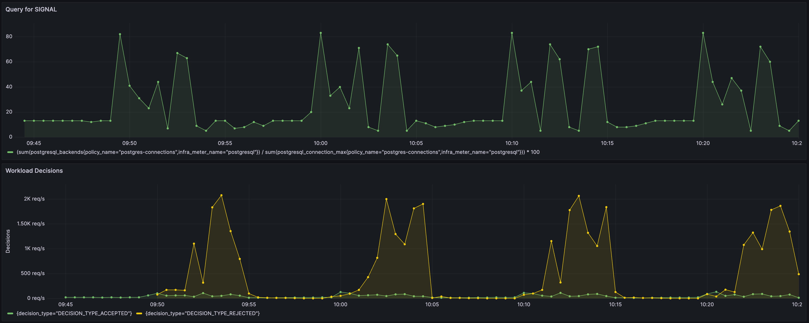
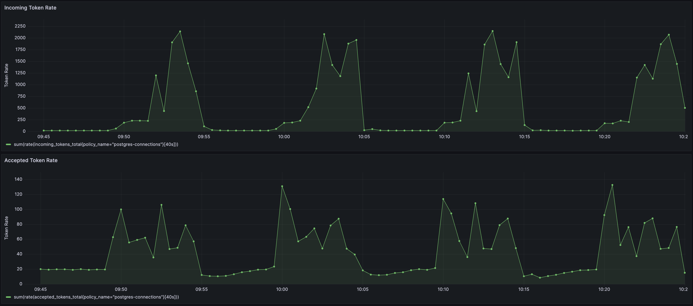

```mdx-code-block
import {apertureVersion} from '../../apertureVersion.js';
import CodeBlock from '@theme/CodeBlock';
import Tabs from '@theme/Tabs';
import TabItem from '@theme/TabItem';
import Zoom from 'react-medium-image-zoom';
```

## Overview

The PostgreSQL primary server process forks a new process every time a client
requests a connection. PostgreSQL sets a connection limit, which determines the
maximum number of connections that can be opened to the backend at any point of
time.

In scenarios where the number of connections exceeds the limit, the PostgreSQL
server will reject the connection request along with a relevant error on the
client side. Such scenarios can indicate that client applications are sending
long-running or heavy queries to the database and constantly creating new
connections instead of reusing existing connections, which can lead to an
overload scenario.

This policy is designed to detect overload in PostgreSQL database based on
real-time percentage of active connections against the maximum number of
connections.

## Configuration

This policy is built using the
[PostgreSQL](/reference/blueprints/load-scheduling/postgresql.md) blueprint.

The below `values.yaml` file can be generated by following the steps in the
[Installation](#installation) section.

```mdx-code-block

<Tabs>
<TabItem value="aperturectl values.yaml">
```

```yaml
{@include: ./assets/postgresql/values.yaml}
```

```mdx-code-block
</TabItem>
</Tabs>
```

<details><summary>Generated Policy</summary>
<p>

```yaml
{@include: ./assets/postgresql/policy.yaml}
```

</p>
</details>

:::info

[Circuit Diagram](./assets/postgresql/graph.mmd.svg) for this policy.

:::

## Installation

Generate a values file specific to the policy. This can be achieved using the
command provided below.

```mdx-code-block
<CodeBlock language="bash">aperturectl blueprints values --name=load-scheduling/postgres --version={apertureVersion} --output-file=values.yaml</CodeBlock>
```

Adjust the values to match the application requirements. Use the following
command to generate the policy.

```mdx-code-block
<CodeBlock language="bash">aperturectl blueprints generate --values-file=values.yaml --output-dir=policy-gen --version={apertureVersion}</CodeBlock>
```

Apply the policy using the `aperturectl` CLI or `kubectl`.

```mdx-code-block
<Tabs>
<TabItem value="aperturectl" label="aperturectl">
```

Pass the `--kube` flag with `aperturectl` to directly apply the generated policy
on a Kubernetes cluster in the namespace where the Aperture Controller is
installed.

```mdx-code-block
<CodeBlock language="bash">aperturectl policy apply --file=policy-gen/policies/postgres-connections.yaml --kube </CodeBlock>
```

```mdx-code-block
</TabItem>
<TabItem value="kubectl" label="kubectl">
```

Apply the policy YAML generated (Kubernetes Custom Resource) using the above
example with `kubectl`.

```bash
kubectl apply -f policy-gen/policies/postgres-connections-cr.yaml -n aperture-controller
```

```mdx-code-block
</TabItem>
</Tabs>
```

## Policy in Action

To see the policy in action, the traffic is generated such that it starts within
the PostgreSQL's max connection limit and then goes beyond the capacity after
some time. Such a traffic pattern is repeated periodically.




