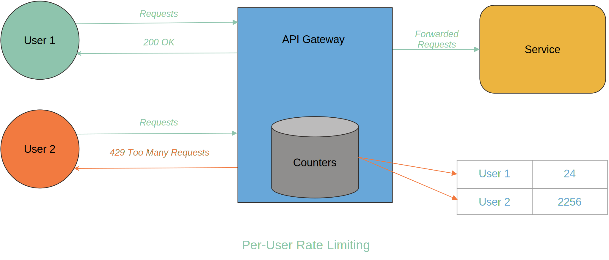
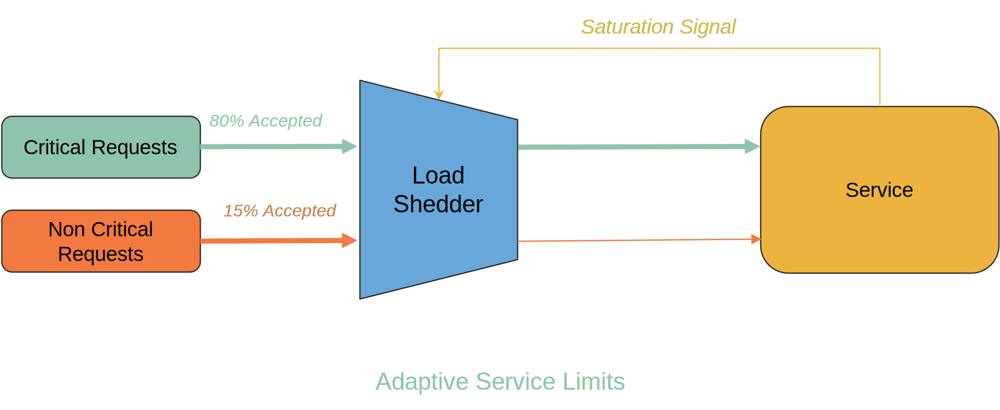

This guide provides a fresh framework for implementing rate limiting in your
services using Aperture. It covers the following topics:

- [Introduction](#introduction)
- [A Framework for Rate Limiting](#a-framework-for-rate-limiting)
  - [Per-user limits](#per-user-limits)
    - [Per-user static limits](#per-user-static-limits)
    - [Per-user adaptive limits](#per-user-adaptive-limits)
  - [Global service limits](#global-service-limits)
    - [Static service limits](#static-service-limits)
    - [Adaptive service limits](#adaptive-service-limits)
- [Summary](#summary)

## Introduction {#introduction}

Rate limiting is usually an effective technique to manage load at a service.

However, it is often misunderstood and misapplied. Often teams apply a blanket
rate limit per-user in hopes of protecting against service overloads. While
per-user rate limits provide a mechanism to prevent abuse, they do not safeguard
against service overloads. This is where the rate limiting framework comes in,
helping you understand the different types of rate limits and which blueprints
to use for implementing them using Aperture.

## A framework for rate limiting {#a-framework-for-rate-limiting}

Rate limiting is more than just setting caps on user requests. It's a strategic
approach to prevent abuse, ensure fairness, and avert overloads, especially at
the service level.

Below is a 2×2 framework that presents a concise overview of four distinct
rate-limiting strategies. A combination of these strategies can be implemented
based on the service's requirements:

|                          | Static           | Adaptive           |
| ------------------------ | ---------------- | ------------------ |
| **Per-user limit**       | Fair access      | Abuse prevention   |
| **Global service limit** | Enforcing quotas | Service protection |

### Per-user limits {#per-user-limits}

Per-user rate limiting is a technique that restricts the number of requests sent
by an end-user or device within a time period. These limits help curb abuse and
ensure fair access across users. They also act as a security measure to prevent
unchecked API access. Typically, a `429 Too Many Requests` HTTP response is
returned when a user exceeds their rate limit.

Such limits are implemented by tracking request counts at the user level and
using algorithms such as:

- **Token Bucket**: Requests consume tokens from the bucket, which refills at a
  consistent rate. If the bucket runs out of tokens, the request is rejected.
  This method can accommodate brief surges in request rates that exceed the
  bucket's refill rate.
- **Leaky Bucket**: Incoming requests are queued in the bucket. Tokens are
  steadily drained (or "leaked") at a fixed rate as the server processes
  requests. If the bucket reaches capacity, new requests are rejected. Unlike
  the token bucket, this approach ensures the request rate never surpasses the
  leak rate, preventing sudden bursts.
- **Fixed Window**: Limits the total requests within specific time intervals.
- **Sliding Window**: Allows a certain number of requests over a continuously
  shifting time frame, providing more fluid control compared to the fixed window
  technique.

These algorithms can be implemented either locally (for instance, on an API
Gateway) or globally, using a service such as Redis to maintain state on a
per-user basis. While the local implementations are lower latency, they don't
scale for larger applications as they require the traffic to go through a single
choke point as compared to the global implementation. However, the global
algorithms are hard to implement because the underlying technologies such as
Redis themselves become a bottleneck at high traffic rates. Sophisticated
approaches for global rate limiting typically involve distributing the state
across multiple instances by sharding the per-user rate limiting keys to handle
scale.

Aperture offers an advanced and scalable approach to global rate limiting
through the
[Rate Limiting Policy Blueprint](/reference/blueprints/rate-limiting/base.md),
eliminating the necessity for manual complex logic implementation.

#### Per-user static limits {#per-user-static-limits}

[Static rate limiting](/guides/rate-limiting.md) is akin to the speed limit on a
highway – a set pace that everyone has to follow.

Most APIs providers implement static rate limits which are well-known and
publicly shared, setting the basic expectations for the end-user in terms of
fair use of the service. With the help of
[**Rate Limiting Policy Blueprint**](/reference/blueprints/rate-limiting/base.md)
per-user static limits can be implemented easily.

The use-cases of per-user static limits include:

- **Fair access**: A single bad actor can degrade performance for all users by
  overusing resources if no limit is in place. A static limit ensures fair usage
  per-user.
- **Throttling data scrapers:** With the rapid adoption of generative AI,
  training data is increasingly becoming the most sought-after commodity.
  However, some aggressive scrapers from AI companies can impact normal users.
  Rate limiting can be applied to keep them in check.
- **Blocking misbehaving scripts**: User scripts might inadvertently send a
  flood of requests. In such cases, per-user static limits serve as a safeguard
  against such abuse.

#### Per-user adaptive limits {#per-user-adaptive-limits}

While static limits provide a basic form of fair access and security, there are
scenarios where adaptive rate limiting is beneficial, either in response to
specific user behaviors or under particular circumstances for certain user
tiers.

Use-cases of adaptive rate limits per-user include:

- **Reputation-based abuse prevention**: Adjusting the rate limit according to a
  user's reputation can be effective. A user frequently surpassing rate limits
  might face a temporary reduction in their allowable rate as a preventive
  measure. For instance, GitHub implements secondary rate limits for users that
  perform actions too quickly.

### Global service limits {#global-service-limits}

These rate limits regulate the overall load on a service to prevent overloads or
conform to service quota agreements. They are usually set at the service level
and are not tied to a specific user. State-of-the-art techniques can also
prioritize requests based on attributes such as service criticality,
user-tiering, and so on.

Such limiters are either implemented by using a token bucket algorithm for the
entire service or by probabilistically shedding a fraction of requests entering
a service.

#### Static service limits {#static-service-limits}

[Static limits are useful](/guides/api-quota-management/inter-service-rate-limiting.md)
when enforcing an agreed-upon quota. With the help of
**[Quota Scheduler Blueprint](/reference/blueprints/quota-scheduling/base.md)**
static service limits can be implemented easily.

Use-cases of static rate limits include:

- **Enforcing capacity limits:** If a service has undergone testing and is known
  to support a specific load, this predefined limit can be enforced to keep the
  load within the operational boundary.
- **Inter-service limits:** In microservices architecture, each client service
  could have different quotas allocated based on their criticality while
  accessing a shared service.
- **Client-side rate limits**: When interfacing with an external API, or a
  shared resource, that has a rate limit, it is important for well-behaved
  clients to comply with the limit to prevent getting penalized due to abuse.

#### Adaptive service limits {#adaptive-service-limits}

[Adaptive service limits](/guides/service-load-management/service-load-management.md)
regulate the overall load on a service based on service health signals such as
database connections, queue sizes, response latency, error rates and so on to
protect the service against overloads. With the help of
**[Load Scheduling Blueprint](/reference/blueprints/load-scheduling/load-scheduling.md)**
adaptive service limits can be implemented easily.

Use-cases of adaptive service limits include:

- **System stability:** An overload in one part of the system often snowballs
  into an application-wide outage. Adaptive service limits act as a protective
  barrier that stabilizes the application by eliminating the characteristic
  self-reinforcing feedback loops that lead to
  [cascading failures](https://www.usenix.org/publications/loginonline/metastable-failures-wild).
- **Adaptive waiting rooms:** Certain web-services such as online ticket
  booking, online shopping and so on can experience a sudden surge in traffic.
  In such cases, adaptive service limits can be used to throttle requests and
  redirect them to a waiting room. This ensures that the service remains
  responsive and prevents it from crashing due to overload.
- **Performance management of heavy APIs:** Heavy APIs such as queries to
  analytical databases and generative AI can pose challenges, especially when
  they're overwhelmed with requests. This can lead to reduced throughput, noisy
  neighbor problems in multi-tenant environments, or even cascading failures in
  some cases. Adaptive service limits can be used to protect such APIs from
  overload and ensure that they remain responsive.
- **Fault tolerance:** Even with rigorous testing and adherence to best
  practices, unforeseen failures can occur in production. For instance, failures
  in a few read replicas can increase load on healthy instances,
  [leading to an outage](https://github.blog/2021-12-01-github-availability-report-november-2021/#november-27-2040-utc-lasting-2-hours-and-50-minutes).
  In such scenarios, adaptive service limits can help achieve graceful
  degradation.

Checkout Aperture implemented use cases of adaptive service limits
[here](/guides/service-load-management/service-load-management.md).

## Summary {#summary}

Rate limiting is integral to maintaining system performance and fairness. By
leveraging [Aperture's Blueprints](/reference/blueprints/blueprints.md), you can
efficiently implement a rate-limiting strategy tailored to your service's needs.
