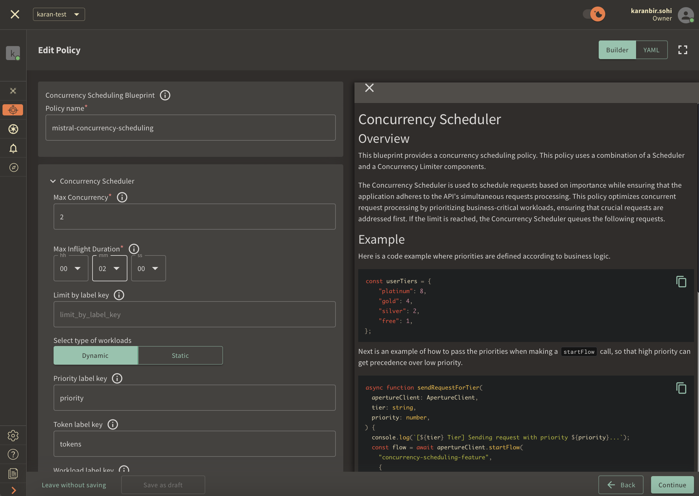
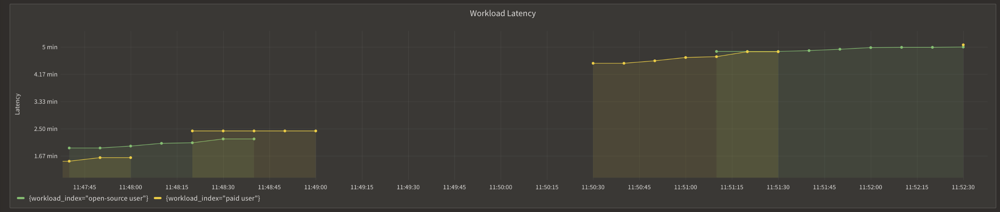
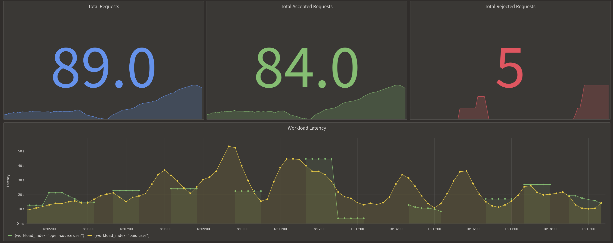
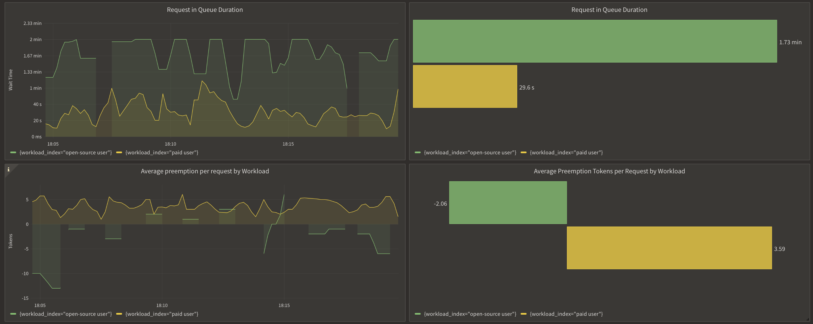

```mdx-code-block
import {apertureVersion} from '../apertureVersion.js';
import CodeBlock from '@theme/CodeBlock';
import Tabs from '@theme/Tabs';
import TabItem from "@theme/TabItem";
import {BashTab, TabContent} from './blueprintsComponents.js';
import Zoom from 'react-medium-image-zoom';
import CodeSnippet from '../codeSnippet.js'

```

## Mistral AI

[Mistral](https://github.com/mistralai/mistral-src) is an open-source Large
Language Model (LLM) increasingly used by numerous companies to develop
AI-driven applications. Its open-source framework enables diverse implementation
strategies, ranging from productizing Mistral as a service to running it locally
for computation and feature development. However, one common challenge faced in
all use cases is the limitation posed by GPUs, limiting LLMs full potential.

Such constraints, combined with an increase in demand, often result in slower
response times to prompts, which leads to degradation of user experience during
peak loads.

Aperture handles peak loads and preserves the user experience with the
Concurrency Scheduling feature by efficiently scheduling in-flight requests
directed to Mistral. This guide will provide detailed instructions on how to use
the Aperture SDK when interfacing with Mistral, and define a concurrency
scheduling policy using Aperture Cloud.

## Schedule Requests in Mistral with Aperture

Aperture can help schedule in-flight requests and improve user experience by
queuing and prioritizing requests before sending them to Mistral. Aperture
offers a blueprint for
[concurrency scheduling](https://docs.fluxninja.com/reference/blueprints/concurrency-scheduling/base),
consisting of two main components:

- Concurrency Limiter: It allows setting the max number of concurrent requests
  that can be processed. This parameter can be set according to an application's
  ability to set to handle the maximum number of concurrent requests at a given
  time.
- Scheduler: Aperture has a
  [weighted fair queuing](https://docs.fluxninja.com/concepts/scheduler/)
  scheduler that prioritizes the requests based on multiple factors such as the
  number of tokens, priority levels and workload labels.

<Zoom>

```mermaid
{@include: ./assets/mistral/mistral.mmd}
```

</Zoom>

The diagram provides an overview of concurrency scheduling in action, where the
scheduler queues and prioritizes requests once the service limit is hit and
keeps the count with a token counter.

Requests coming into the system are categorized into different workloads, each
of which is defined by its priority and weight. This classification is crucial
for the request scheduling process.

The scheduler priorities request admission based on the priority and weight
assigned to the corresponding workload. This mechanism ensures that
high-priority requests are handled appropriately even under high load.

:::note Pre-Requisites

Before exploring Aperture's concurrency scheduling capabilities, make sure that
you have signed up to [Aperture Cloud](https://app.fluxninja.com/sign-up) and
set up an organization. For more information on how to sign up, follow our
[step-by-step guide](/reference/cloud-ui/sign-up.md).

:::

## Concurrency Scheduling with Aperture SDK

The first step to using the Aperture SDK is to import and set up Aperture
Client:

```mdx-code-block
<Tabs>
  <TabItem value="TypeScript">
```

<CodeSnippet lang="ts" snippetName="clientConstructor" />

```mdx-code-block
  </TabItem>
</Tabs>
```

You can obtain your organization address and API Key within the Aperture Cloud
UI by clicking the `Aperture` tab in the sidebar menu.

The next step consists of setting up essential business labels to prioritize
requests. For example, requests can be prioritized by user tier classifications:

```mdx-code-block
<Tabs>
  <TabItem value="Typescript">
```

<CodeSnippet lang="ts" snippetName="Priority" />

```mdx-code-block
 </TabItem>
</Tabs>
```

The next step is making a `startFlow` call to Aperture. For this call, it is
important to specify the control point (`mistral-prompt` in our example) and the
labels that will align with the concurrency scheduling policy. The `priority`
label is necessary for request prioritization, while the `workload` label
differentiates each request.

According to the policy logic designed to limit the number of concurrent
requests sent to Mistral, Aperture will, on each `startFlow` call, either give
precedence to a critical request or queue a less urgent one when approaching API
limits. The duration a request remains in the queue is determined by the gRPC
deadline, set within the `startFlow` call. Setting this deadline to `120000`
milliseconds, for example, indicates that the request can be queued for a
maximum of 2 minutes. After this interval, the request will be rejected.

Once the `startFlow` call is made, we send the prompt to Mistral and wait for
its response. Excess requests are automatically queued by Aperture, eliminating
the need to check if a flow `shouldRun` or not.

```mdx-code-block
<Tabs>
  <TabItem value="TypeScript">
```

```Typescript
try {
  flow = await apertureClient.startFlow("mistral-prompt", {
      labels: {
          user_id: user,
          priority: priority.toString(),
          workload: `${tier} user`,
      },
      grpcCallOptions: {
          deadline: Date.now() + 120000, // ms
      },
  });

  const response = await fetch('http://localhost:11434/api/generate', {
      method: 'POST',
      headers: {
          'Content-Type': 'application/json'
      },
      body: requestBody
  });

  if (!response.ok) {
      throw new Error(`Error: ${response.status}`);
  }

  return response.text();
  } catch (error) {
      console.error('Error sending prompt to Mistral:', error);
  } finally {
      await flow?.end();
  }
```

```mdx-code-block
  </TabItem>
</Tabs>
```

It is important to make the `end` call after processing each request, to remove
in-flight requests and send telemetry data that would provide granular
visibility for each flow.

## Create a Concurrency Scheduling Policy

```mdx-code-block
<Tabs>
  <TabItem value="Aperture Cloud UI">
```

Navigate to the `Policies` tab on the sidebar menu, and select `Create Policy`
in the upper-right corner. Next, choose the Rate Limiting blueprint, select
Concurrency and complete the form with these specific values:

1. `Policy name`: Unique for each policy, this field can be used to define
   policies tailored for different use cases. Set the policy name to
   `concurrency-scheduling-test`.
2. `Limit by label key`: Determines the specific label key used for concurrency
   limits. This parameter becomes essential for more granular concurrency
   limiting use cases such as, per-user limiting where a parameter like the
   `user_id` can be passed. For now, we will test global concurrency limiting,
   we will leave the label as it is.
3. `Max inflight duration`: Configures the time duration after which flow is
   assumed to have ended in case the end call gets missed. We'll set it to `60s`
   as an example.
4. `Max concurrency`: Configures the maximum number of concurrent requests that
   a service can take. We'll set it to `2` as an example.
5. `Priority label key`: This field specifies the label that is used to
   determine the priority. We will leave the label as it is.
6. `Tokens label key`: This field specifies the label that is used to determine
   tokens. We will leave the label as it is.
7. `Workload label key`: This field specifies the label that is used to
   determine the workload. We will leave the label as it is.
8. `Control point`: It can be a particular feature or execution block within a
   service. We'll use `mistral-prompt` as an example.



Once you've completed these fields, click `Continue` and then `Apply Policy` to
finalize the policy setup.

```mdx-code-block
  </TabItem>
  <TabItem value="aperturectl">
```

If you haven't installed aperturectl yet, begin by following the
[Set up CLI aperturectl guide](/reference/aperture-cli/aperture-cli.md). Once
aperturectl is installed, generate the values file necessary for creating the
concurrency scheduling policy using the command below:

<CodeBlock language="bash"> aperturectl blueprints values
--name=concurrency-scheduling/base
--output-file=mistral-concurrency-scheduling.yaml </CodeBlock>

Following are the fields that need to be filled for creating a concurrency
scheduling policy:

1. `policy_name`: Unique for each policy, this field can be used to define
   policies tailored for different use cases. Set the policy name to
   `concurrency-scheduling-test`.
2. `limit_by_label_key`: Determines the specific label key used for concurrency
   limits. This parameter becomes essential for more granular concurrency
   limiting use cases such as, per-user limiting where a parameter like the
   `user_id` can be passed. For now, since we want to do a global concurrency
   limiting, we will leave the label as it is.
3. `max_inflight_duration`: Configures the time duration after which flow is
   assumed to have ended in case the end call gets missed. We'll set it to `60s`
   as an example.
4. `max_concurrency`: Configures the maximum number of concurrent requests that
   a service can take. We'll set it to `2` as an example.
5. `priority_label_key`: This field specifies the label that is used to
   determine the priority. We will leave the label as it is.
6. `tokens_label_key`: This field specifies the label that is used to determine
   tokens. We will leave the label as it is.
7. `workload_label_key`: This field specifies the label that is used to
   determine the workload. We will leave the label as it is.
8. `control_point`: It can be a particular feature or execution block within a
   service. We'll use `mistral-prompt` as an example.

Here is how the complete values file would look:

```yaml
{@include: ./assets/mistral/values.yaml}
```

The last step is to apply the policy using the following command:

<CodeBlock language="bash"> aperturectl cloud blueprints apply
--values-file=mistral-concurrency-scheduling.yaml </CodeBlock>

```mdx-code-block
  </TabItem>
</Tabs>
```

Next, we'll proceed to run an example to observe the newly implemented policy in
action.

## Concurrency Scheduling and Mistral

We opted to set up a local instance of Mistral using
[Ollama](https://ollama.ai/library/mistral) due to their straightforward
installation process and accessible API for prompt submission.

Following installation, we developed a simple TypeScript application to send
prompts to Mistral. These prompts were integrated with Aperture's `startFlow`
and `endFlow` functions. To mimic real-world usage, we generated lists of
prompts for paid and open source users, which were sent concurrently to Mistral.
With around 50 users simultaneously requesting responses from Mistral, we
observed significant latency differences. Without Aperture, the response time
for generative AI workloads spiked up to 5 minutes. In contrast, with Aperture's
concurrency scheduling policy in place, not only was the latency reduced to as
low as 50 seconds, but our paying users also experienced much faster responses
compared to those using the open-source version due to paid users having a high
priority.

Here is a comparison of the latencies before and after Aperture.

Before Aperture:



After Aperture:



Here is the queueing and prioritization of requests when the max concurrency is
met, and how it bumps up paid requests up in the queue.



In summary, whether you're operating Mistral as a service or employing its API
for app development, managing the demands of generative AI workloads remains a
challenge, primarily due to GPU limitations impacting computation speed.
Implementing Aperture's concurrency scheduling policy is essential as it ensures
an optimal user experience while allowing to scale operations.
