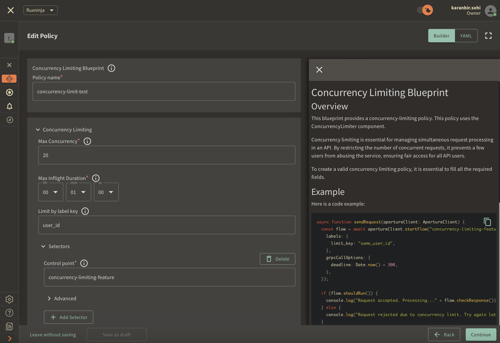
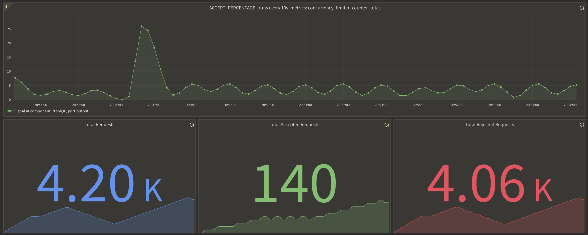
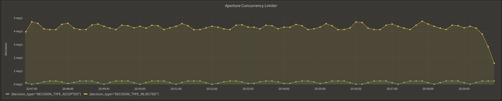

```mdx-code-block
import Zoom from 'react-medium-image-zoom';
import {apertureVersion} from '../apertureVersion.js';
import CodeBlock from '@theme/CodeBlock';
import Tabs from '@theme/Tabs';
import TabItem from "@theme/TabItem";
import {BashTab, TabContent} from './blueprintsComponents.js';
import CodeSnippet from '../codeSnippet.js'

```

:::note

The following policy is based on the
[Concurrency Limiting](/reference/blueprints/concurrency-limiting/base.md)
blueprint.

:::

## Overview

Concurrency limiting is a critical strategy for managing the load on an API. By
setting limits on the number of concurrent requests API consumers can make,
concurrency limiting ensures balanced resource utilization, preventing a single
user or small groups of users from monopolizing resources, which can lead to
overloading the API. This approach is key to maintaining service reliability and
fair access for all API consumers.

Aperture enforces per-key concurrency limits, offering precise control over API
usage. Each unique key is assigned a maximum concurrency limit, which dictates
the maximum number of concurrent requests allowed. When this limit is reached
new requests are rejected.

<Zoom>

```mermaid
{@include: ./assets/per-user-concurrency-limiting/concurrency-limiting.mmd}
```

</Zoom>

The diagram shows how the Aperture SDK interacts with Aperture Cloud to
determine whether to allow or reject incoming requests based on the defined
maximum concurrency parameters.

:::note Pre-Requisites

Before exploring Aperture's concurrency limiting capabilities, make sure that
you have signed up to [Aperture Cloud](https://app.fluxninja.com/sign-up) and
set up an organization. For more information on how to sign up, follow our
[step-by-step guide](/reference/cloud-ui/sign-up.md).

:::

## Concurrency Limiting with Aperture SDK

The first step to using the Aperture SDK is to import and set up Aperture
Client:

```mdx-code-block
<Tabs>
  <TabItem value="TypeScript">
```

<CodeSnippet lang="ts" snippetName="clientConstructor" />

```mdx-code-block
  </TabItem>
</Tabs>
```

You can obtain your organization address and API Key within the Aperture Cloud
UI by clicking the `Aperture` tab in the sidebar menu.

The next step is making a `startFlow` call to Aperture. For this call, it is
important to specify the control point (`concurrency-limiting-feature` in our
example) and the labels that will align with the concurrency limiting policy,
which we will create in Aperture Cloud in one of the next steps.

```mdx-code-block
<Tabs>
  <TabItem value="TypeScript">
```

<CodeSnippet lang="ts" snippetName="CLStartFlow" />

```mdx-code-block
  </TabItem>
</Tabs>
```

Now, the next part is assessing whether a request is permissible or not by
checking the decision returned by the `ShouldRun` call. Developers can leverage
this decision to either reject requests made by abusive users or to allow
requests if the concurrent limit has not been crossed. While our current example
only logs the request, in real-world applications, you can execute relevant
business logic when a request is allowed. It is important to make the `end` call
made after processing each request, in order to send telemetry data that would
provide granular visibility for each flow.

```mdx-code-block
<Tabs>
  <TabItem value="TypeScript">
```

<CodeSnippet lang="ts" snippetName="CLFlowShouldRun" />

```mdx-code-block
  </TabItem>
</Tabs>
```

## Create a Concurrency Limiting Policy

```mdx-code-block
<Tabs>
  <TabItem value="Aperture Cloud UI">
```

Navigate to the `Policies` tab on the sidebar menu, and select `Create Policy`
in the upper-right corner. Next, choose the Rate Limiting blueprint, select
Concurrency and complete the form with these specific values:

1. `Policy name`: Unique for each policy, this field can be used to define
   policies tailored for different use cases. Set the policy name to
   `concurrency-limit-test`.
2. `Max concurrency`: Configures the maximum number of concurrent requests
   allowed. Set `Max concurrency` to `20`.
3. `Limit by label key`: Determines the specific label key used for enforcing
   concurrency limits. We'll use `user_id` as an example.
4. `Max inflight duration`: Configures the time duration after which a flow is
   assumed to have ended in case end call is missed. Set `Max inflight duration`
   to `60s`.
5. `Control point`: It can be a particular feature or execution block within a
   service. We'll use `concurrency-limiting-feature` as an example.



Once you've entered these six fields, click `Continue` and then `Apply Policy`
to finalize the policy setup.

```mdx-code-block
  </TabItem>
  <TabItem value="aperturectl">
```

If you haven't installed aperturectl yet, begin by following the
[Set up CLI aperturectl guide](/reference/aperture-cli/aperture-cli.md). Once
aperturectl is installed, generate the values file necessary for creating the
concurrency limiting policy using the command below:

<CodeBlock language="bash"> aperturectl blueprints values
--name=concurrency-limiting/base --output-file=concurrency-limit-test.yaml
</CodeBlock>

Following are the fields that need to be filled for creating a concurrency
limiting policy:

1. `policy_name`: Unique for each policy, this field can be used to define
   policies tailored for different use cases. Set the policy name to
   `concurrency-limit-test`.
2. `max_concurrency`: Configures the maximum number of concurrent requests
   allowed. Set `max_concurrency` to `20`.
3. `limit_by_label_key`: Determines the specific label key used for enforcing
   concurrency limits. We'll use `user_id` as an example.
4. `max_inflight_duration`: Configures the time duration after which a flow is
   assumed to have ended in case end call is missed. Set `max_inflight_duration`
   to `60s`.
5. `control_point`: It can be a particular feature or execution block within a
   service. We'll use `concurrency-limiting-feature` as an example.

Here is how the complete values file would look:

```yaml
{@include: ./assets/per-user-concurrency-limiting/values.yaml}
```

The last step is to apply the policy using the following command:

<CodeBlock language="bash"> aperturectl cloud blueprints apply
--values-file=concurrency-limit-test.yaml </CodeBlock>

```mdx-code-block
  </TabItem>
</Tabs>
```

For this policy, users are permitted to make up to 10 concurrent requests in
before hitting the concurrency limit. Additional requests made after the maximum
number of concurrent requests is reached are rejected.

Next, we'll proceed to run an example to observe the newly implemented policy in
action.

## Concurrency Limiting in Action

Begin by cloning the
[Aperture JS SDK](https://github.com/fluxninja/aperture-js).

Switch to the example directory and follow these steps to run the example:

1. Install the necessary packages:
   - Run `npm install` to install the base dependencies.
   - Run `npm install @fluxninja/aperture-js` to install the Aperture SDK.
2. Run `npx tsc` to compile the TypeScript example.
3. Run `node dist/concurrency_limit_example.js` to start the compiled example.

Once the example is running, it will prompt you for your Organization address
and API Key. In the Aperture Cloud UI, select the Aperture tab from the sidebar
menu. Copy and enter both your Organization address and API Key to establish a
connection between the SDK and Aperture Cloud.

## Monitoring Concurrency Limiting Policy

After running the example for a few minutes, you can review the telemetry data
in the Aperture Cloud UI. Navigate to the Aperture Cloud UI, and click the
`Policies` tab located in the sidebar menu. Then, select the
`concurrency-limiter-test` policy that you previously created.

Once you've clicked on the policy, you will see the following dashboard:




These panels provide insights into how the policy is performing by monitoring
the number of total, accepted and rejected requests along with the acceptance
percentage. Observing these graphs will help you understand the effectiveness of
your concurrency limiting setup and help in making any necessary adjustments or
optimizations.
