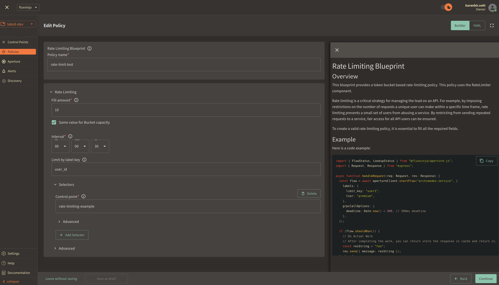

```mdx-code-block
import Zoom from 'react-medium-image-zoom';
import {apertureVersion} from '../apertureVersion.js';
import CodeBlock from '@theme/CodeBlock';
import Tabs from '@theme/Tabs';
import TabItem from "@theme/TabItem";
import {BashTab, TabContent} from './blueprintsComponents.js';
import CodeSnippet from '../codeSnippet.js'

```

:::note

The following policy is based on the
[Rate Limiting](/reference/blueprints/rate-limiting/base.md) blueprint.

:::

## Overview

Rate limiting is a critical strategy for managing the load on an API. By
imposing restrictions on the number of requests a unique consumer can make
within a specific time frame, rate limiting prevents a small set of users from
monopolizing the majority of resources on a service, ensuring fair access for
all API consumers.

Aperture implements this strategy through its high-performance, distributed rate
limiter. This system enforces per-key limits based on fine-grained labels,
thereby offering precise control over API usage. For each unique key, Aperture
maintains a token bucket of a specified bucket capacity and fill rate. The fill
rate dictates the sustained requests per second (RPS) permitted for a key, while
transient overages over the fill rate are accommodated for brief periods, as
determined by the bucket capacity.

<Zoom>

```mermaid
{@include: ./assets/per-user-rate-limiting/rate-limiting.mmd}
```

</Zoom>

The diagram shows how the Aperture SDK interacts with a global token bucket to
determine whether to allow or reject a request. Each call decrements tokens from
the bucket and if the bucket runs out of tokens, indicating that the rate limit
has been reached, the incoming request is rejected. Conversely, if tokens are
available in the bucket, the request is accepted. The token bucket is
continually replenished at a predefined fill rate, up to the maximum number of
tokens specified by the bucket capacity.

:::note Pre-Requisites

Before exploring Aperture's rate limiting capabilities, make sure that you have
signed up to [Aperture Cloud](https://app.fluxninja.com/sign-up) and set up an
organization. For more information on how to sign up, follow our
[step-by-step guide](/reference/cloud-ui/sign-up.md).

:::

## Rate Limiting with Aperture SDK

The first step to using the Aperture SDK is to import and set up Aperture
Client:

```mdx-code-block
<Tabs>
  <TabItem value="TypeScript">
```

<CodeSnippet lang="ts" snippetName="clientConstructor" />

```mdx-code-block
  </TabItem>
</Tabs>
```

You can obtain your organization address and API Key within the Aperture Cloud
UI by clicking the `Aperture` tab in the sidebar menu.

The next step is making a `startFlow` call to Aperture. For this call, it is
important to specify the control point (`rate-limiting-feature` in our example)
and the labels that will align with the rate limiting policy, which we will
create in Aperture Cloud in one of the next steps.

```mdx-code-block
<Tabs>
  <TabItem value="TypeScript">
```

<CodeSnippet lang="ts" snippetName="RLStartFlow" />

```mdx-code-block
  </TabItem>
</Tabs>
```

Now, the next part is assessing whether a request is permissible or not by
checking the decision returned by the `ShouldRun` call. Developers can leverage
this decision to either rate limit abusive users or to allow requests that are
within the limit. While our current example only logs the request, in real-world
applications, you can execute relevant business logic when a request is allowed.
It is important to make the `end` call made after processing each request, in
order to send telemetry data that would provide granular visibility for each
flow.

```mdx-code-block
<Tabs>
  <TabItem value="TypeScript">
```

<CodeSnippet lang="ts" snippetName="RLFlowShouldRun" />

```mdx-code-block
  </TabItem>
</Tabs>
```

## Create a Rate Limiting Policy

```mdx-code-block
<Tabs>
  <TabItem value="Aperture Cloud UI">
```

Navigate to the `Policies` tab on the sidebar menu, and select `Create Policy`
in the upper-right corner. Next, choose the Rate Limiting blueprint and complete
the form with these specific values:

1. `Policy name`: Unique for each policy, this field can be used to define
   policies tailored for different use cases. Set the policy name to
   `rate-limit-test`.
2. `Fill amount`: Configures the number of tokens added to the bucket within the
   selected interval. Set `Fill amount` to `10`.
3. `Bucket Capacity`: Defines the maximum capacity of the bucket in the rate
   limiter. Check the option `same value for bucket capacity option` to set the
   same value for bucket capacity and fill amount.
4. `Interval`: Specifies the time amount of time `Fill amount` will take to
   refill tokens in the bucket. Set `Interval` to `30 seconds`.
5. `Limit By Label Key`: Determines the specific label key used for enforcing
   rate limits. We'll use `user_id` as an example.
6. `Control point`: It can be a particular feature or execution block within a
   service. We'll use `rate-limiting-feature` as an example.



Once you've entered these six fields, click `Continue` and then `Apply Policy`
to finalize the policy setup.

For this policy, a unique token bucket is created for each user identified by
their `user_id`. Users are permitted to make up to 10 requests in a burst before
encountering rate limiting. As the bucket gradually refills with 10 requests
over a span of 30 seconds, users can make a restricted number of successive
requests.

```mdx-code-block
  </TabItem>
  <TabItem value="aperturectl">
```

If you haven't installed aperturectl yet, begin by following the
[Set up CLI aperturectl guide](/reference/aperture-cli/aperture-cli.md). Once
aperturectl is installed, generate the values file necessary for creating the
rate limiting policy using the command below:

<CodeBlock language="bash"> aperturectl blueprints values
--name=rate-limiting/base --output-file=rate-limit-test.yaml </CodeBlock>

Following are the fields that need to be filled for creating a rate limiting
policy:

1. `policy_name`: Unique for each policy, this field can be used to define
   policies tailored for different use cases. Set the policy name to
   `rate-limit-test`.
2. `fill_amount`: Configures the number of tokens added to the bucket within the
   selected interval. Set `Fill amount` to `10`.
3. `bucket_capacity`: Defines the maximum capacity of the bucket in the rate
   limiter. Set `bucket_capacity` to `10`.
4. `interval`: Specifies the time amount of time `Fill amount` will take to
   refill tokens in the bucket. Set `Interval` to `30 seconds`.
5. `limit_by_label_key`: Determines the specific label key used for enforcing
   rate limits. We'll use `user_id` as an example.
6. `control_point`: It can be a particular feature or execution block within a
   service. We'll use `rate-limiting-feature` as an example.

Here is how the complete values file would look:

```yaml
{@include: ./assets/per-user-rate-limiting/values.yaml}
```

The last step is to apply the policy using the following command:

<CodeBlock language="bash"> aperturectl cloud blueprints apply
--values-file=rate-limit-test.yaml </CodeBlock>

For this policy, a unique token bucket is created for each user identified by
their `user_id`. Users are permitted to make up to 10 requests in a burst before
encountering rate limiting. As the bucket gradually refills with 10 requests
over a span of 30 seconds, users can make a restricted number of successive
requests.

```mdx-code-block
  </TabItem>
</Tabs>
```

Next, we'll proceed to run an example to observe the newly implemented policy in
action.

## Rate Limiting in Action

Begin by cloning the
[Aperture JS SDK](https://github.com/fluxninja/aperture-js).

Switch to the example directory and follow these steps to run the example:

1. Install the necessary packages:
   - Run `npm install` to install the base dependencies.
   - Run `npm install @fluxninja/aperture-js` to install the Aperture SDK.
2. Run `npx tsc` to compile the TypeScript example.
3. Run `node dist/rate_limit_example.js` to start the compiled example.

Once the example is running, it will prompt you for your Organization address
and API Key. In the Aperture Cloud UI, select the Aperture tab from the sidebar
menu. Copy and enter both your Organization address and API Key to establish a
connection between the SDK and Aperture Cloud.

## Monitoring Rate Limiting Policy

After running the example for a few minutes, you can review the telemetry data
in the Aperture Cloud UI. Navigate to the Aperture Cloud UI, and click the
`Policies` tab located in the sidebar menu. Then, select the `rate-limiter-test`
policy that you previously created.

Once you've clicked on the policy, you will see the following dashboard:


These two panels provide insights into how the policy is performing by
monitoring the number of accepted and rejected requests along with the
acceptance percentage. Observing these graphs will help you understand the
effectiveness of your rate limiting setup and help in making any necessary
adjustments or optimizations.
