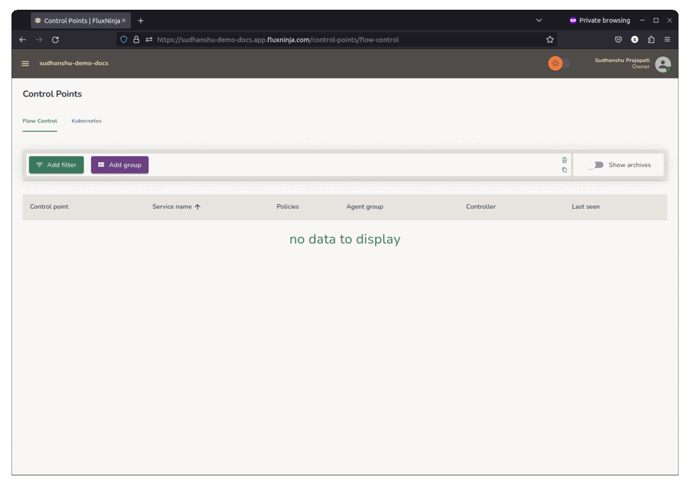

```mdx-code-block
import Zoom from 'react-medium-image-zoom';
```

Aperture Cloud uses API keys to authenticate requests coming from
[Agents][Agents] and [Controllers][Controllers]. You can copy or create API keys for
your project in the Aperture Cloud UI.

## Pre-requisites

You have [signed up][sign-up] on Aperture Cloud and created a project.

## Create API Keys

1. In the Aperture Cloud UI, navigate to your project. _API keys are
   project-specific. You need to create a new API key for each project.
2. Now, from the left sidebar, click **Aperture**.
3. Click **API Keys** tab.
4. Copy the generated API key or click on **Create API Key**.
5. Copy the API key and save it in a secure location.



[Agents]: /aperture-for-infra/agent/agent.md
[Controllers]: /aperture-for-infra/controller/controller.md
[sign-up]: /reference/cloud-ui/sign-up.md
