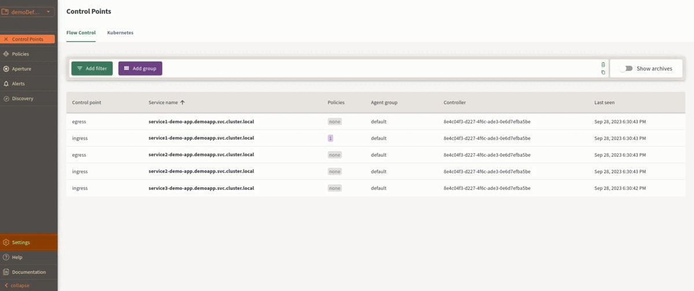

```mdx-code-block
import Zoom from 'react-medium-image-zoom';
```

Aperture Cloud uses Personal Access Tokens to authenticate requests coming from
[aperturectl][configure aperturectl]. You can create Personal Access Tokens for
your user in the Aperture Cloud UI.

## Pre-requisites

You have [signed up][sign-up] on Aperture Cloud and created an organization.

## Create Personal Access Tokens

1. In the Aperture Cloud UI, navigate to your organization. _Personal Access
   Tokens are user-specific per organization. You need to create a new Access
   Token for each organization._
2. Now, from the left sidebar, click **Settings**.
3. Click **Personal Access Tokens** tab.
4. Click **New Personal Access Token**.
5. Copy the Access Token and save it in a secure location.



[configure aperturectl]: /reference/aperture-cli/aperture-cli.md
[sign-up]: /reference/cloud-ui/sign-up.md
