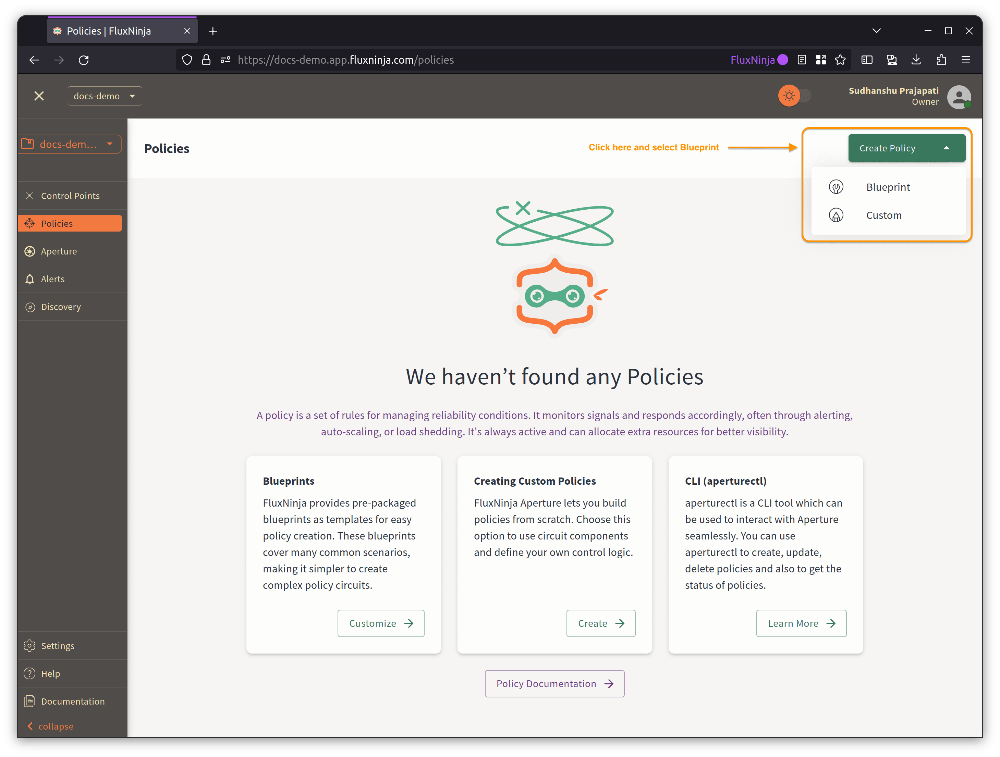
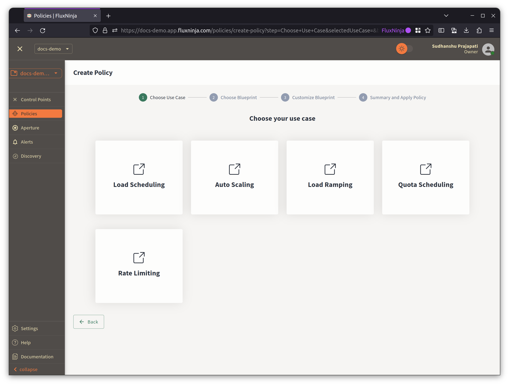
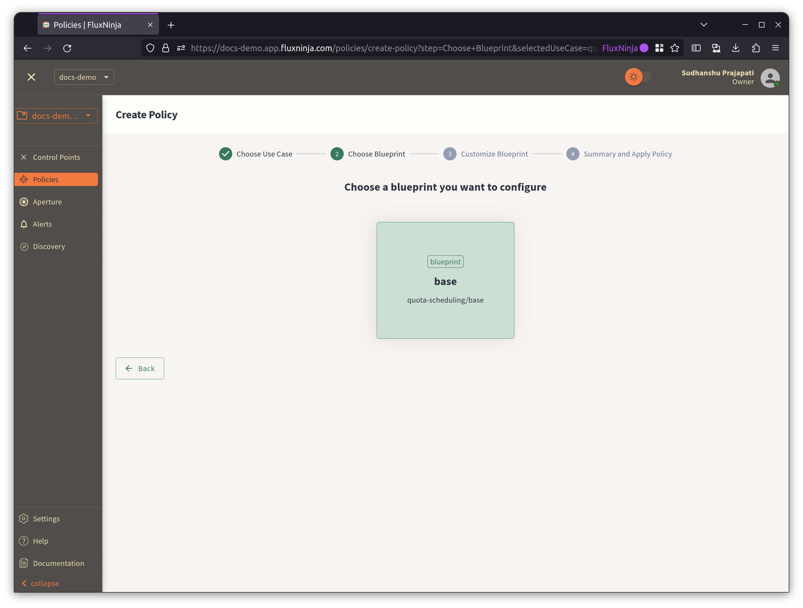
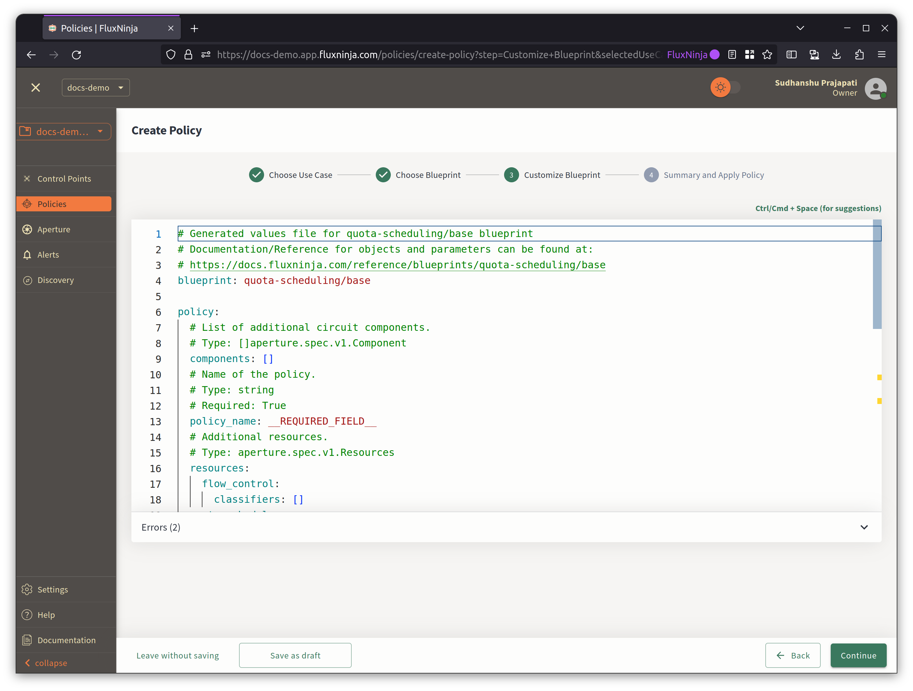
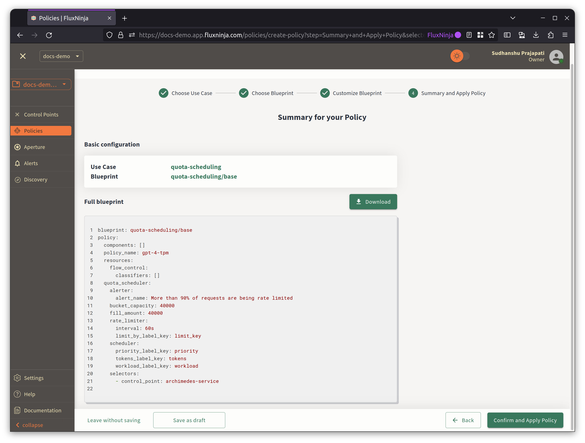

```mdx-code-block
import Zoom from 'react-medium-image-zoom';
```

To simplify the process of creating policies in Aperture Cloud, it includes UI
Policy Builder. Providing several [blueprints][blueprints] that can help you
generate [policies][policies] according to the use case. These blueprints serve
as starting points for creating new policies, or can be used as-is by providing
the required parameters or customizations.

Let's see how to create a policy in Aperture Cloud.

Before beginning, ensure you've [signed up][] and created an organization and
project

1. To create & deploy a policy, head over to the policies dashboard. Click on
   **Create Policy** button. 
2. Now, you will be directed to use case selection page. Select the use case for
   which you want to create a Policy.

   

3. After choosing the use case, select the Blueprint to customize.

   

4. It will open the Blueprint in the Policy Builder, allowing you to customize
   it according to your requirements. This editor offers syntax highlighting,
   auto-completion, and linting features for your convenience. If there is a
   syntax error in the policy, the editor will highlight the line and provide
   you with an error message, as shown in the example below.

   

5. Once you have completed the customization, the next step will provide you
   with the draft policy and an overview of the policy before the final
   submission.

   

6. After submitting, it will redirect to the policies dashboard, where you can
   see the policy status. It will take some time to deploy the policy. Once the
   policy is deployed, you can see the status as **Applied**.

   

7. Now, you can see the policy in the policy dashboard. You can also edit,
   delete, and view the policy from here.

[blueprints]: /reference/blueprints/blueprints.md
[policies]: /concepts/advanced/policy.md
[signed up]: /reference/cloud-ui/sign-up.md
