```mdx-code-block
import Tabs from '@theme/Tabs';
import TabItem from '@theme/TabItem';
import Zoom from 'react-medium-image-zoom';
```

There are two main components of Aperture: the Aperture Controller and Aperture
Agents.

## Aperture Controller {#aperture-controller}

The Aperture Controller is responsible for managing agents, evaluating and
synchronizing declarative load management policies. These policies define
service-level objectives, telemetry metrics, and make adjustments in response to
metric deviations. The controller can be hosted in _Aperture Cloud or
self-hosted_.

## Aperture Agents

Agents serve as the workhorses of the platform, providing powerful flow control
components. This includes a weighted fair queuing scheduler for workload
prioritization and a distributed rate-limiter for abuse prevention.

These agents are deployed adjacent to services requiring load management and
control traffic flows based on real-time adjustments from the Aperture
Controller. They seamlessly
[integrate](/self-hosting/integrations/integrations.md) with service meshes,
gateways, and HTTP middlewares. For more specific control, developers can use
[SDKs](/sdk/sdk.md) to manage specific features or code sections within
services.

The Agents monitor service and infrastructure health signals using an in-built
telemetry system. In addition, a programmable, high-fidelity flow classifier is
used to label requests based on attributes such as customer tier or request
type. These metrics are then analyzed by the Aperture Controller.

Aperture Agents schedule workloads based on their priorities, helping prioritize
critical features over less important workloads during overload scenarios. For
example, a video streaming service might prioritize a request to play a movie by
a customer over a recommended movies API. A SaaS product might prioritize
features used by paid users over those being used by free users.

Aperture Agents can be
[installed on various infrastructure](/self-hosting/agent/agent.md) (such as
Kubernetes, VMs, or bare-metal) or Aperture Cloud can manage them for you. In
addition to flow control capabilities, Agents work with auto-scaling APIs for
platforms such as Kubernetes, to help scale infrastructure when needed.

The diagram below shows the core components of Aperture architecture for
different modes of Controller and Agent installation and various integrations.

<Tabs>

<TabItem value="Cloud-Hosted Controller">

In this mode, Aperture Cloud hosts the Controller, while the Agents are
self-hosted. This is ideal for those who prefer not to maintain their own
Prometheus and etcd databases.


</TabItem>

<TabItem value="Fully Self-Hosted">

The fully self-hosted configuration requires independent deployment of the
Controller and Agents. Where Aperture Controller also requires its two
supporting databases ([prometheus](https://prometheus.io) and
[etcd](https://etcd.io)) to store configuration, telemetry, and flow control
information.

Prometheus enables Aperture to monitor the system and detect deviations from the
service-level objectives (SLOs) defined in the declarative policies. The
Aperture controller uses etcd (distributed key-value store) to persist the
declarative policies that define the control circuits and their components, and
the adjustments synchronized between the Controller and Agents.

Existing etcd and
[scalable Prometheus](https://promlabs.com/blog/2021/10/14/promql-vendor-compatibility-round-three)
installations can be reused to integrate into existing monitoring
infrastructure.



</TabItem>
</Tabs>
