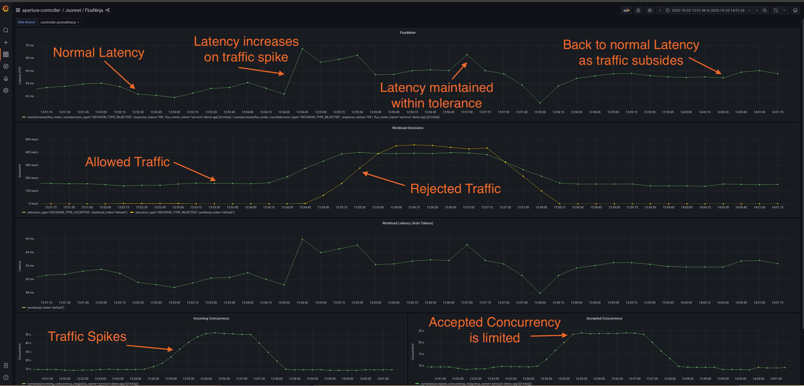

```mdx-code-block
import Tabs from '@theme/Tabs';
import TabItem from '@theme/TabItem';
import Zoom from 'react-medium-image-zoom';
```

The most effective technique to protect services from cascading failures is to
limit the concurrency on the service to match the processing capacity of the
service. However, figuring out concurrency limit of a service is a hard problem
in face of continuously changing service infrastructure. Each new version
deployed, horizontal scaling, or a change in access patterns can change the
concurrency limit of a service.

To accurately model the concurrency limit of a service, it's critical to track
its
[golden signals](https://sre.google/sre-book/monitoring-distributed-systems/#xref_monitoring_golden-signals).
For instance, queue buildup can be detected by tracking deviation of current
latency from historically normal values.

## Policy

In this policy we will be using the
[Latency Gradient](https://github.com/fluxninja/aperture/tree/main/blueprints/lib/1.0/blueprints/latency-gradient)
blueprint to instantiate the policy via Jsonnet. Various building blocks used in
the policy are described separately in the Signal Processing tutorials.

At a high-level, this policy consists of:

- Latency EMA based overload detection: A Flux Meter is used to gather latency
  metrics from a [service control point](/concepts/flow-control/selector.md).
  The latency signal is then fed into EMA component to help establish a
  long-term trend that we can compare current latency against to detect
  overloads. See tutorial on
  [Detecting Overload](/tutorials/signal-processing/detecting-overload.md) to
  learn more about how this is achieved.
- Gradient Controller: Setpoint Latency and current Latency signals are fed to
  the gradient controller that calculates the proportional response to adjust
  the Accepted Concurrency (Control Variable).
- Integral Optimizer: When the service is detected to be in the normal state, an
  integral optimizer is used to additively increase the concurrency on the
  service in each execution cycle of the circuit. This design allows warming-up
  a service from cold start state. This also protects applications from sudden
  spikes in traffic as it sets an upper bound to the concurrency allowed on a
  service in each execution cycle of circuit based on the observed incoming
  concurrency.
- Concurrency Limiting Actuator: The concurrency limits are actuated via
  [weighted-fair queueing scheduler](/concepts/flow-control/concurrency-limiter.md).
  The output of the adjustments to accepted concurrency made by gradient
  controller and optimizer logic are translated to a load multiplier that is
  synchronized with Aperture Agents via etcd. The load multiplier adjusts
  (increases or decreases) the token bucket fill rates based on the incoming
  concurrency observed at each agent.

```mdx-code-block
<Tabs>
<TabItem value="Jsonnet">
```

```jsonnet
{@include: ./assets/basic-concurrency-limiting/basic-concurrency-limiting.jsonnet}
```

```mdx-code-block
</TabItem>
<TabItem value="YAML">
```

```yaml
{@include: ./assets/basic-concurrency-limiting/basic-concurrency-limiting.yaml}
```

```mdx-code-block
</TabItem>
</Tabs>
```

:::tip

You can run the above policy in the `Dry Run` mode by setting the
`dynamicConfig.dryRun` option to `true`. In the `Dry Run` mode, the policy
doesn't actuate (i.e. traffic is never dropped) while still evaluating the
decision it would take in each cycle. This helps understanding how the policy
would behave as the input signals change.

Note: In the `Dry Run` mode, because the policy doesn't actuate, the outcome
would be very different in the live mode as input signals will change based on
actuation decisions. While `Dry Run` mode is not a simulation, it's still useful
in understanding the signal processing and decisions made in an _execution
cycle_.

:::

### Circuit Diagram

<Zoom>

```mermaid
{@include: ./assets/basic-concurrency-limiting/basic-concurrency-limiting.mmd}
```

</Zoom>

### Playground

When the above policy is loaded in Aperture's
[Playground](/get-started/playground.md), we will see that as the traffic spikes
above the concurrency limit of `service1-demo-app.demoapp.svc.cluster.local`,
controller triggers load-shed for a proportion of requests matching the
Selector. This helps protect the service from becoming unresponsive and keeps
the latency within the tolerance limit (`1.1`) configured in the circuit.

<Zoom>



</Zoom>
