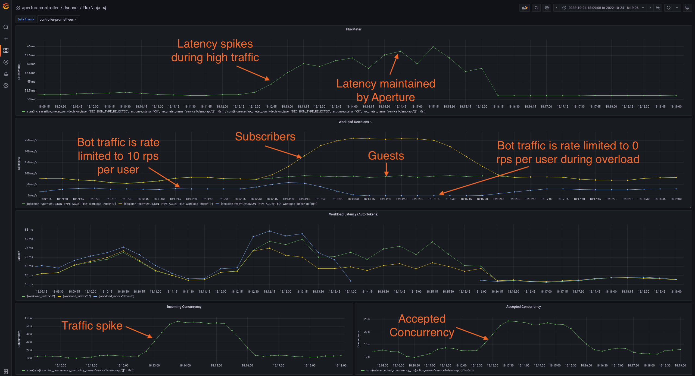

```mdx-code-block
import Tabs from '@theme/Tabs';
import TabItem from '@theme/TabItem';
import Zoom from 'react-medium-image-zoom';
```

In many scenarios, there is a need to dynamically adjust the rate limits applied
to flow labels. For instance, when a service is overloaded, one of the
escalation strategies beyond concurrency limits could be to more aggressively
restrict traffic of each user by dynamically adjusting their rate limits.

To recap, the
[concurrency limiter](/concepts/flow-control/components/concurrency-limiter.md)
relies on a weighted fair queuing scheduler to make flow control decisions at
the workload level. On the other hand, the
[rate limiter](/concepts/flow-control/components/rate-limiter.md) uses a
distributed cache to maintain global counters for each flow label (for example:
unique users) and restricts traffic when they exceed their allocated quota.
These two technologies can be used together, as shown in the example below.

## Policy

The policy used in
[Workload Prioritization](../concurrency-limiting/workload-prioritization.md)
will be extended to dynamically adjust the limits applied to `bot` traffic
originating from web crawlers and other sources.

For this example, it's assumed that `bot` users have been classified with the
`User-Type: bot` HTTP header and the `User-Id: <id>` HTTP header identifies
unique users. The policy will rate limit each unique bot user to `10 rps` and,
during overload scenarios, completely restrict bot traffic (`0 rps` limit) after
`30s` to further relieve the service.

To accomplish this, additional
[components](/concepts/policy/circuit.md#components) will be added to extend the
base policy with the escalation logic. The additional components are highlighted
in the Jsonnet specification below.

```mdx-code-block
<Tabs>
<TabItem value="aperturectl values.yaml">
```

```yaml
{@include: ./assets/rate-limiting-escalation/values.yaml}
```

```mdx-code-block
</TabItem>
<TabItem value="Jsonnet Mixins">
```

```jsonnet
{@include: ./assets/rate-limiting-escalation/rate-limiting-escalation.jsonnet}
```

```mdx-code-block
</TabItem>

</Tabs>
```

<details><summary>Generated Policy</summary>
<p>

```yaml
{@include: ./assets/rate-limiting-escalation/rate-limiting-escalation.yaml}
```

</p>
</details>

:::info

[Circuit Diagram](./assets/rate-limiting-escalation/rate-limiting-escalation.mmd.svg)
for this policy.

:::

### Playground

The traffic generator in the [playground](/get-started/playground/playground.md)
is configured to generate a similar traffic pattern (number of concurrent users)
for bots as the other 2 types of users - subscribers and guests.

After loading the above policy in the playground, the `bot` traffic will be
dynamically rate-limited based on whether the service is overloaded. In the
`Latency Gradient` dashboard, the bot traffic will match the `default` workload,
since there is no workload matching rule for the `bot` traffic. Since rate
limiting is applied before the concurrency limiter, the default workload metrics
will stop reporting when `bot` traffic is completely restricted.

<Zoom>



</Zoom>
