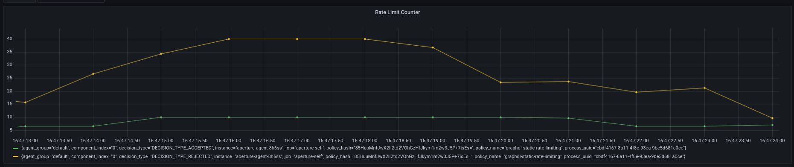

```mdx-code-block
import Tabs from '@theme/Tabs';
import TabItem from '@theme/TabItem';
import Zoom from 'react-medium-image-zoom';
```

In this tutorial, we will use [Flow Classifier Rego Rules][rego-rules] to rate
limit a GraphQL query. We will build upon what we've seen in
[Static Rate Limiting](static-rate-limiting.md) and
[Workload Prioritization](workload-prioritization.md) tutorials.

## Policy

We will use a policy that will rate limit unique users based on `user_id` [Flow
Label][flow-label]. This label is extracted using [Flow
Classifier][flow-classifier] and is mapped from the `userId` argument of
`createTodo` GraphQL mutation query.

```mdx-code-block
<Tabs>
<TabItem value="Jsonnet">
```

```jsonnet
{@include: ./assets/graphql-rate-limiting/graphql-rate-limiting.jsonnet}
```

```mdx-code-block
</TabItem>
<TabItem value="YAML">
```

```yaml
{@include: ./assets/graphql-rate-limiting/graphql-rate-limiting.yaml}
```

```mdx-code-block
</TabItem>
</Tabs>
```

For example, if the mutation query is as follows

```graphql
mutation createTodo {
  createTodo(input: { text: "todo", userId: 1 }) {
    user {
      id
    }
    text
    done
  }
}
```

Without diving deep into how Rego works, the source section mentioned in this
tutorial does the following:

1. Parse the query
2. Check if the mutation query is `createTodo`
3. Find the argument to the mutation query that matches `userId`
4. Assign the value of `userId` to variable `userID`

From there on, the classifier rule assigns the value of the exported variable
`userID` in Rego source to `user_id` flow label, effectively creating a label
`user_id:1`. This label is used by the [Rate Limiter][rate-limiter] component in
the policy to limit the `createTodo` mutation query to 10 requests/second for
each `userId`.

### Circuit Diagram

```mermaid
{@include: ./assets/graphql-rate-limiting/graphql-rate-limiting.mmd}
```

### Playground

The traffic generator for this example in the
[playground](/get-started/playground.md) is configured to generate 50
requests/second for 2 minutes. When the above policy is loaded in the
playground, we see that no more than 10 requests are accepted at any given time
and that 40 out of the 50 requests are rejected.

<Zoom>



</Zoom>

[rego-rules]: ../../concepts/flow-control/flow-classifier#rego
[flow-label]: ../../concepts/flow-control/flow-label.md
[flow-classifier]: ../../concepts/flow-control/flow-classifier.md
[rate-limiter]: ../../concepts/flow-control/rate-limiter
