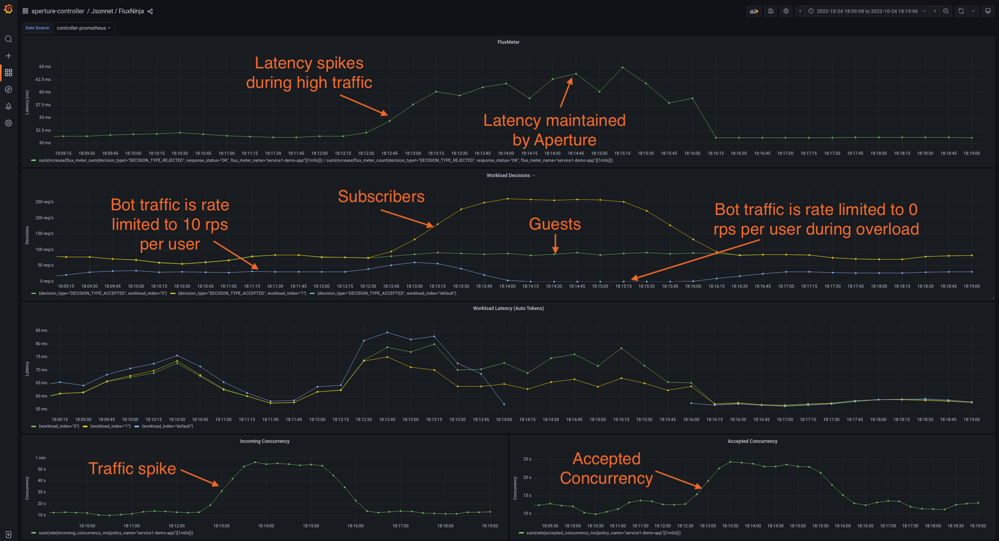

```mdx-code-block
import Tabs from '@theme/Tabs';
import TabItem from '@theme/TabItem';
import Zoom from 'react-medium-image-zoom';
```

In many scenarios, there is a need to dynamically adjust the rate limits applied
to flow labels. For instance, when a service is overloaded, one of the
escalation strategies beyond concurrency limits could be to more aggressively
restrict traffic of each user by dynamically adjusting their rate limits.

To recap,
[concurrency limiter](/concepts/policy/circuit/components/concurrency-limiter.md)
relies on weighted-fair queueing scheduler to make flow-control decisions at the
workload level. On the other hand, the
[rate limiter](/concepts/policy/circuit/components/rate-limiter.md) uses a
distributed cache to maintain global counters for each flow label (e.g. unique
users) and restricts traffic when they exceed their allocated quota. These 2
technologies can be made to work together as we will see in the below example.

## Policy

We will be extending the policy we used in
[Workload Prioritization](../concurrency-limiting/workload-prioritization.md) to
dynamically adjust the limits we apply to `bot` traffic coming from web-crawlers
etc.

In this example, we will make an assumption that `bot` users have been
classified with `User-Type: bot` HTTP header and `User-Id: <id>` HTTP header
identifies unique users. In the policy, we will be rate limiting each unique bot
user to `10 rps` and during the overload scenario, we will completely restrict
bot traffic (`0 rps` limit) after `30s` to further relieve the service.

To accomplish this, we will be adding additional
[components](/concepts/policy/circuit/circuit.md#component) to extend the base
policy with this escalation logic. The additional components are highlighted in
the Jsonnet spec below.

```mdx-code-block
<Tabs>
<TabItem value="YAML">
```

```yaml
{@include: ./assets/dynamic-rate-limiting/dynamic-rate-limiting.yaml}
```

```mdx-code-block
</TabItem>
<TabItem value="Jsonnet">
```

```jsonnet
{@include: ./assets/dynamic-rate-limiting/dynamic-rate-limiting.jsonnet}
```

```mdx-code-block
</TabItem>

</Tabs>
```

### Circuit Diagram

<Zoom>

```mermaid
{@include: ./assets/dynamic-rate-limiting/dynamic-rate-limiting.mmd}
```

</Zoom>

### Playground

The traffic generator in the [playground](/get-started/playground/playground.md)
is configured to generate similar traffic pattern (number of concurrent users)
for bots as the other 2 types of users - subscribers and guests.

When the above policy is loaded in the playground, we see that the `bot` traffic
is dynamically rate limited based on whether or not the service is overloaded.
In the `Latency Gradient` dashboard, the bot traffic matches `default` workload
as we don't have the workload matching rule for the `bot` traffic. As rate
limiting is applied before concurrency limiter, we will see that the default
workload metrics stop reporting when `bot` traffic is completely restricted.

<Zoom>



</Zoom>
