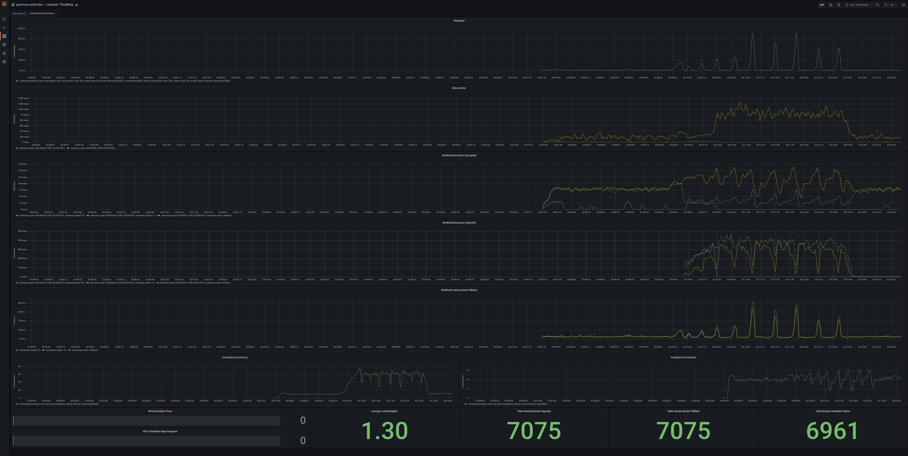

# **Auto Scaling in Kubernetes**

```mdx-code-block
import Tabs from '@theme/Tabs';
import TabItem from '@theme/TabItem';
import Zoom from 'react-medium-image-zoom';
```

As Kubernetes continues to grow in popularity, auto-scaling has become an
essential tool for managing applications in a Kubernetes environment. Horizontal
Pod Autoscaler (HPA) is one of the most popular auto-scaling solutions for
Kubernetes, but it has limitations. The HPA can only scale based on a limited
set of metrics, such as CPU or memory utilization. Additionally, it can't handle
complex scaling behavior based on multiple metrics, making it difficult to
optimize application performance and efficiency.

While Aperture AutoScaler is a powerful and offers a more flexible and
comprehensive solution for auto-scaling Kubernetes applications. Aperture
AutoScaler allows users to define their own metrics and scaling behavior using a
simple policy file written in YAML. This policy offers a declarative way for
Kubernetes users to automate the deployment and scaling of their applications.

One of the key advantages of Aperture AutoScaler is its ability to handle
complex scaling behavior based on multiple metrics. For example, Aperture
AutoScaler can use a combination of latency, throughput, and error rates to
determine how many replicas to deploy, providing a more accurate and nuanced
approach to scaling. This is essential for applications where performance is
critical, such as e-commerce or financial applications.

Another advantage of Aperture AutoScaler is its comprehensive flow control
system, which regulates the flow of incoming requests to prevent overload. This
ensures that the application remains responsive and available, even during
periods of high traffic. The flow control component is responsible for
regulating the flow of incoming requests to prevent overload, while the query
component handles the evaluation of metrics used to determine scaling behavior.

More over, Aperture AutoScaler is highly configurable, allowing users to
fine-tune their scaling behavior based on specific needs and requirements. Users
can define custom flow selectors, service selectors, and other parameters to
ensure that their application is optimized for performance and efficiency. This
flexibility makes it an essential tool for organizations that need to optimize
their applications for specific workloads or use cases.

While overload protection can be happen via basic concurrency limiting and
circuit breaking, it is also important to scale your services up and down based
on the traffic. Aperture provides a way to scale your services up and down based
on the metrics using Horizontal Pod Autoscaler (HPA).

Let's see how to use Aperture AutoScaler to auto-scale a Kubernetes application.

## Policy

In this policy we will be using the Latency based AIMD (Additive
Increase,Multiplicative Decrease) Concurrency Limiting
[Blueprint](reference/policies/bundled-blueprints/policies/latency-aimd-concurrency-limiting.md).
Policy will do load-based autoscaling for a Kubernetes deployment. The policy
calculates a latency metric based on the sum of recent metered requests divided
by the count of recent metered requests, and then uses this metric to adjust the
number of replicas of the deployment based on a setpoint.

The Policy includes the following components:

1. A Prometheus query to calculate the current latency metric, using a 5-second
   sliding window for recent requests. The resulting metric is named "LATENCY".
2. An arithmetic combinator to multiply the latency metric by a constant factor
   of 2. The resulting metric is named "MAX_EMA".
3. An exponential moving average (EMA) filter to smooth the latency metric over
   time, using a 1500-second window with a 60-second warm up. The resulting
   metric is named "LATENCY_EMA".
4. A flow control component that uses an AIMD
   (additive-increase/multiplicative-decrease) concurrency controller to adjust
   the number of replicas based on the difference between the current latency
   and the setpoint. The controller includes a load multiplier that is adjusted
   up or down based on the observed latency and a "gradient" parameter that
   determines the slope of the adjustment. The resulting metrics include
   "ACCEPTED_CONCURRENCY", "DESIRED_LOAD_MULTIPLIER", "INCOMING_CONCURRENCY",
   "IS_OVERLOAD", and "OBSERVED_LOAD_MULTIPLIER".
5. A Prometheus query to calculate the average CPU utilization of the deployment
   over the last 30 seconds. The resulting metric is named "AVERAGE_CPU".
6. An autoscaling component that adjusts the number of replicas based on both
   the observed load multiplier and the average CPU utilization, using a scaler
   that modifies the Kubernetes deployment object. The scaler includes a
   scale-in controller that adjusts the number of replicas based on the observed
   CPU utilization, and a scale-out controller that adjusts the number of
   replicas based on the observed load multiplier.

The Policy also includes a set of resources classifiers and flux meters, which
are used to define the components of the policy that should be applied to the
deployment based on certain criteria (in this case, the "user_type" field in the
request headers).

```mdx-code-block
<Tabs>
<TabItem value="aperturectl values.yaml">
```

```yaml
{@include: ./assets/load-based-autoscale-service1.yaml}
```

```mdx-code-block
</TabItem>
</Tabs>
```

<details><summary>Generated Policy</summary>
<p>

```yaml
{@include: ./assets/load-based-autoscale-service1-cr.yaml}
```

</p>
</details>

### Circuit Diagram

<Zoom>

```mermaid
{@include: ./assets/load-based-autoscale-service1-cr.mmd}
```

</Zoom>

### Playground

When the above policy is loaded in Aperture's
[Playground](/get-started/playground/playground.md), we will see that as the
traffic spikes above the concurrency limit of
`service1-demo-app.demoapp.svc.cluster.local`, controller triggers load-shed for
a proportion of requests matching the Selector and average cpu signal and load
multiplier triggers a signal to do autoscale.

<Zoom>



</Zoom>
