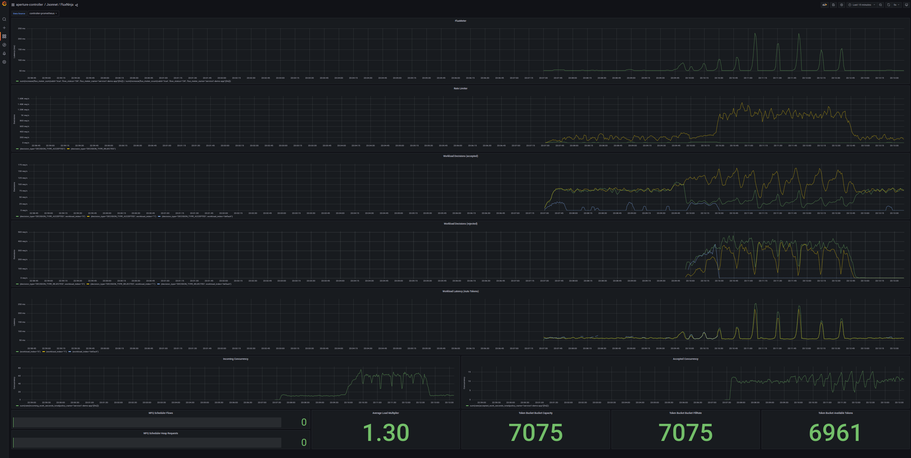

# **Load-based Auto Scaling**

```mdx-code-block
import Tabs from '@theme/Tabs';
import TabItem from '@theme/TabItem';
import Zoom from 'react-medium-image-zoom';
```

Load-based auto-scaling is a technique used to dynamically adjust the number of
instances or resources allocated to a service based on workload demands. This
policy builds upon the _Latency based AIMD Concurrency Limiting_
[blueprint](reference/policies/bundled-blueprints/policies/latency-aimd-concurrency-limiting.md)
to add an escalation for auto-scaling. While concurrency limiting can protect
the service from sudden traffic spikes, it's necessary to scale the service in
response to persistent changes in load.

To achieve this, the policy makes use of an
[_Auto Scaler_](concepts/integrations/auto-scale/components/auto-scaler.md)
component that is configured using _Controllers_ to adjust the number of
instances allocated to the service. Load-based auto-scaling is achieved by
defining a scale-out _Controller_ that acts on a load-shedding signal (load
multiplier) signal from the blueprint. This signal measures the fraction of
traffic that the
[_Concurrency Limiter_](concepts/integrations/flow-control/components/concurrency-limiter.md)
is shedding. The _Auto Scaler_ is configured to scale-out using a _Gradient
Controller_ based on this signal and a setpoint of 1.0.

In addition to load-based scaling, the policy includes scale-in and scale-out
_Controllers_ based on CPU utilization. These _Controllers_ adjust the resources
allocated to the service based on changes in CPU usage, ensuring that the
service can handle the workload efficiently.

## Policy

This policy extends the _Latency based AIMD Concurrency Limiting_
[blueprint](reference/policies/bundled-blueprints/policies/latency-aimd-concurrency-limiting.md)
by adding auto-scaling to meet persistent changes in demand.

At a high Level, this policy consist of:

- Concurrency limiting based on response latency trend of the service.
- An _Auto Scaler_ that adjusts the number of replicas of the Kubernetes
  Deployment for the service.
- Load based scale-out is done based on `OBSERVED_LOAD_MULTIPLIER` signal from
  the blueprint. This signal measures the fraction of traffic that the
  _Concurrency Limiter_ is shedding. The _Auto Scaler_ is configured to
  scale-out based on a _Gradient Controller_ using this signal and a setpoint of
  1.0.
- In addition to the load based scale-out, the policy also includes scale-in and
  scale-out _Controllers_ based on CPU utilization. These _Controllers_ adjust
  the resources allocated to the service based on changes in CPU usage, ensuring
  that the service can handle the workload efficiently.

```mdx-code-block
<Tabs>
<TabItem value="aperturectl values.yaml">
```

```yaml
{@include: ./assets/values.yaml}
```

```mdx-code-block
</TabItem>
</Tabs>
```

<details><summary>Generated Policy</summary>
<p>

```yaml
{@include: ./assets/load-based-auto-scale.yaml}
```

</p>
</details>

### Circuit Diagram

<Zoom>

```mermaid
{@include: ./assets/load-based-auto-scale.mmd}
```

</Zoom>

### Playground

When the above policy is loaded in Aperture's
[Playground](/get-started/playground/playground.md), we will see that as the
response latency increases, the AIMD policy load-sheds a proportion of requests.
The auto-scaler makes a scale-out decision as the `OBSERVED_LOAD_MULTIPLIER`
becomes less than 1. As replicas get added to the deployment the
`OBSERVED_LOAD_MULTIPLIER` gets larger than 1. At this point the service will be
able to meet the increased demand. The response latency will be in normal range
and _Concurrency Limiter_ won't load shed any traffic.

After the scale-out cooldown period, the scale-in based on CPU utilization gets
triggered which will cause the replicas to decrease. Once the traffic ramps up
again, the above cycle continues.

<Zoom>



</Zoom>
