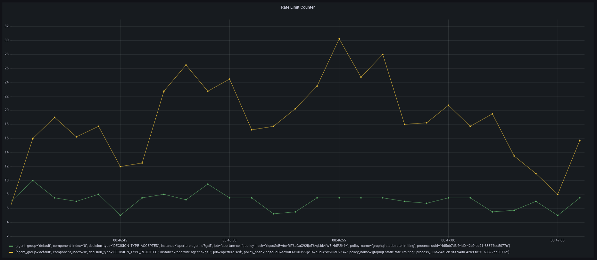

```mdx-code-block
import Tabs from '@theme/Tabs';
import TabItem from '@theme/TabItem';
import Zoom from 'react-medium-image-zoom';
```

In this tutorial, we will use [_Classifier_][rego-rules] to
[statically rate limit](/reference/policies/bundled-blueprints/policies/static-rate-limiting.md)
a GraphQL query.

## Policy

We will use a policy that will rate limit unique users based on `user_id` [_Flow
Label_][flow-label]. This label is extracted using [_Classifier_][classifier]
and is mapped from the `userID` claim in the JWT token sent as Authorization
header in the request.

:::tip

You can quickly write classification rules on
[HTTP requests](concepts/integrations/flow-control/resources/classifier.md#live-previewing-requests)
and define scheduler priorities on
[Flow Labels](concepts/integrations/flow-control/flow-label.md#live-previewing-flow-labels)
by live previewing them first via introspection APIs.

:::

```mdx-code-block
<Tabs>
<TabItem value="aperturectl values.yaml">
```

```yaml
{@include: ./assets/graphql-rate-limiting/values.yaml}
```

```mdx-code-block
</TabItem>
<TabItem value="Jsonnet Mixin">
```

```jsonnet
{@include: ./assets/graphql-rate-limiting/graphql-rate-limiting-jwt.jsonnet}
```

```mdx-code-block
</TabItem>
</Tabs>
```

<details><summary>Generated Policy</summary>
<p>

```yaml
{@include: ./assets/graphql-rate-limiting/graphql-rate-limiting-jwt.yaml}
```

</p>
</details>

:::info

[Circuit Diagram](./assets/graphql-rate-limiting/graphql-rate-limiting-jwt.mmd.svg)
for this policy.

:::

For example, if the mutation query is as follows

```graphql
mutation createTodo {
  createTodo(input: { text: "todo" }) {
    user {
      id
    }
    text
    done
  }
}
```

Without diving deep into how Rego works, the source section mentioned in this
tutorial does the following:

1. Parse the query
2. Check if the mutation query is `createTodo`
3. Verify the JWT token with a very secretive secret key `secret` (only for
   demonstration purposes)
4. Decode the JWT token and extract the `userID` from the claims
5. Assign the value of `userID` to the exported variable `userID` in Rego source

From there on, the classifier rule assigns the value of the exported variable
`userID` in Rego source to `user_id` flow label, effectively creating a label
`user_id:1`. This label is used by the
[`RateLimiter`](/concepts/integrations/flow-control/components/rate-limiter.md)
component in the policy to limit the `createTodo` mutation query to 10
requests/second for each userID.

### Playground

The traffic generator for this example is configured to generate 50
requests/second for 2 minutes. When the above policy is loaded in the
playground, we see that no more than 10 requests are accepted at any given time
and rest of the requests are rejected.

<Zoom>



</Zoom>

[rego-rules]: /concepts/integrations/flow-control/resources/classifier.md#rego
[flow-label]: /concepts/integrations/flow-control/flow-label.md
[classifier]: /concepts/integrations/flow-control/resources/classifier.md
