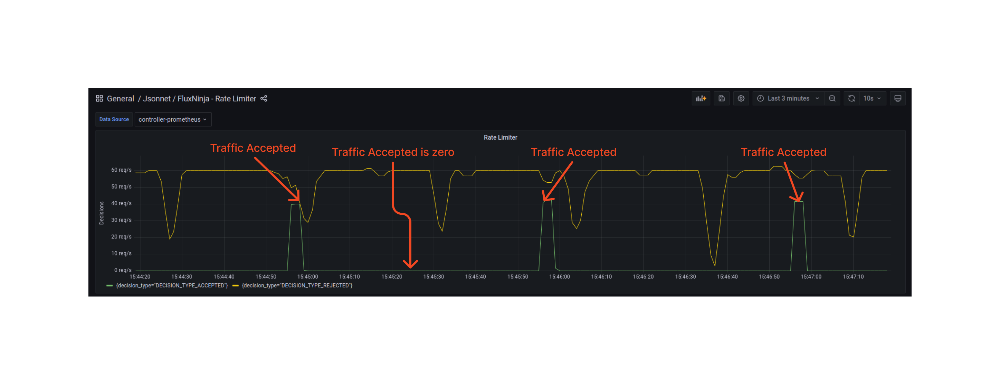

```mdx-code-block
import Tabs from '@theme/Tabs';
import TabItem from '@theme/TabItem';
import Zoom from 'react-medium-image-zoom';
```

One of the simplest flow control policies is static rate limiting to regulate
heavy-hitters. It uses
[Rate Limiting Actuator](/concepts/integrations/flow-control/components/rate-limiter.md)
to block specific flow labels that exceed their quota within a certain timeframe
(limit reset interval).

## Policy

In this example, we will be rate limiting unique users based on the `User-Id`
header in the HTTP traffic. This header is provided by Envoy proxy under the
label key `http.request.header.user_id` (See
[Flow Labels](/concepts/integrations/flow-control/flow-label.md)).

We will be configuring our rate limiter to allow at most `120 requests` for each
user in the `60s` period.

In addition, we will be configuring our rate limiter to apply these limits to
`ingress` traffic on Kubernetes service
`service1-demo-app.demoapp.svc.cluster.local`.

```mdx-code-block
<Tabs>
<TabItem value="aperturectl values.yaml">
```

```yaml
{@include: ./assets/static-rate-limiting/values.yaml}
```

```mdx-code-block
</TabItem>
<TabItem value="Jsonnet Mixin">
```

```jsonnet
{@include: ./assets/static-rate-limiting/static-rate-limiting.jsonnet}
```

```mdx-code-block
</TabItem>
</Tabs>

```

<details><summary>Generated Policy</summary>
<p>

```yaml
{@include: ./assets/static-rate-limiting/static-rate-limiting.yaml}
```

</p>
</details>

:::info

[Circuit Diagram](./assets/static-rate-limiting/static-rate-limiting.mmd.svg)
for this policy.

:::

### Playground

When the above policy is loaded in the playground, we see that no more than 120
requests are accepted in 60 sec and rest of the requests are rejected.

<Zoom>



</Zoom>
