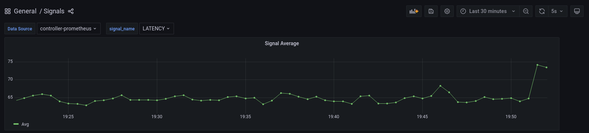
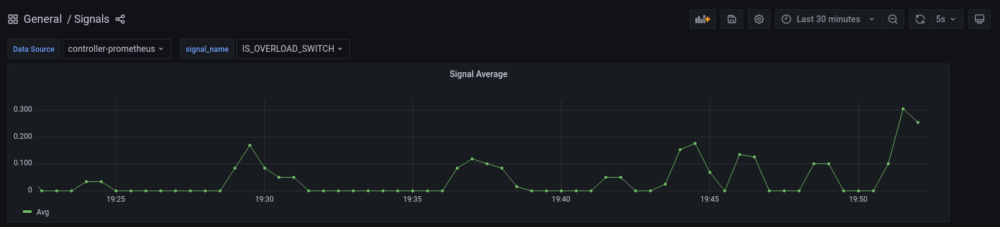

```mdx-code-block
import Tabs from '@theme/Tabs';
import TabItem from '@theme/TabItem';
import Zoom from 'react-medium-image-zoom';
```

Aperture's control-loop policies are programmable "circuits" that are evaluated
periodically. One of the primary goals of these policies is to calculate the
deviation from objectives and apply counter-measures such as concurrency limits
to keep the system is safe operational zone. The policies are used to express
where the metrics are collected from and where the actuation happens, along with
signal processing needed to translate health metrics to corrective actions.

For instance, a policy can be written to detect overload build-up at an upstream
service and trigger load-shedding at a downstream service.

## Policy

One of the most reliable metrics to detect overload state is latency of the
service requests. In Aperture, latency of service requests can be easily
reported using a [Flux Meter](/concepts/flow-control/resources/flux-meter.md).

:::tip

It is recommended to apply the Flux Meter to a single type of workload in order
to avoid mixing the latency measurements across distinct workloads. For example,
if there are Select and Insert API calls on the same service, it is recommended
to measure the latency of only one of those workloads using a Flux Meter. Refer
[FlowSelector](/concepts/flow-control/flow-selector.md#flowselector) on how to
apply the Flux Meter to a subset of API calls for a service.

:::

In this example, we will be computing exponential moving average (EMA) of
latency, gathered periodically from a
[PromQL](https://prometheus.io/docs/prometheus/latest/querying/basics/) query on
Flux Meter reported metrics. Further, we will multiply EMA of latency with a
tolerance factor to calculate setpoint latency, which is a threshold to detect
overloaded state. That is, if the real-time latency of the service is more than
this setpoint (which is based on long-term EMA), then we can consider the
service to be overloaded at that time.

```mdx-code-block
<Tabs>
<TabItem value="YAML">
```

```yaml
{@include: ./assets/detecting-overload/detecting-overload.yaml}
```

```mdx-code-block
</TabItem>
<TabItem value="Jsonnet">
```

```jsonnet
{@include: ./assets/detecting-overload/detecting-overload.jsonnet}
```

```mdx-code-block
</TabItem>
</Tabs>
```

### Circuit Diagram

<Zoom>

```mermaid
{@include: ./assets/detecting-overload/detecting-overload.mmd}
```

</Zoom>

### Playground

When the above policy is loaded in Aperture's
[Playground](/get-started/playground/playground.md), we will see the various
signal metrics collected from the execution of the policy:

<Zoom>

 `LATENCY`: Signal gathered
from the periodic execution of PromQL query on Flux Meter metrics.

</Zoom>

<Zoom>

 `LATENCY_EMA`:
Exponential Moving Average of `LATENCY` signal.

</Zoom>

<Zoom>


`LATENCY_SETPOINT`: Latency above which we consider service to be overloaded.
This is calculated by multiplying the exponential moving average with a
tolerance factor (`LATENCY_EMA` \* `1.1`).

</Zoom>

<Zoom>


`IS_OVERLOAD_SWITCH` is a signal that decides whether the overload is currently
happening or not based on comparing `LATENCY` with `LATENCY_SETPOINT`. Its value
is `0` when there is no overload and `1` during overloads.

</Zoom>
