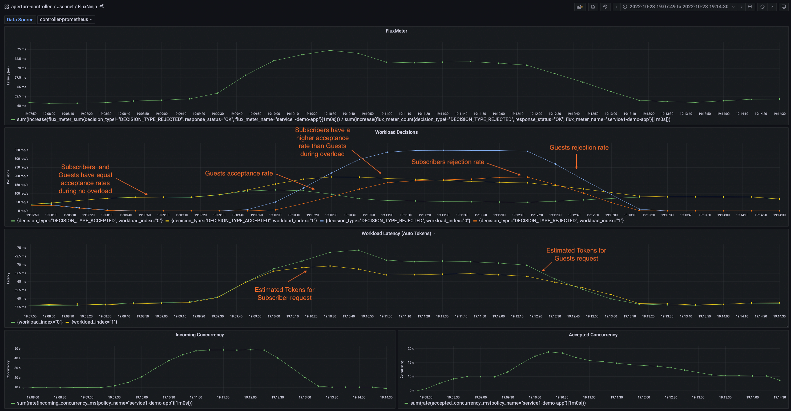

```mdx-code-block
import {apertureVersion} from '../../apertureVersion.js';
import CodeBlock from '@theme/CodeBlock';
import Tabs from '@theme/Tabs';
import TabItem from '@theme/TabItem';
import Zoom from 'react-medium-image-zoom';
```

## Overview

When dealing with services in resource-limited scenarios, it becomes paramount
to prioritize key user experiences and business-critical features over less
crucial tasks or background workloads. For instance, in an e-commerce platform,
the checkout process must take precedence over functionalities like personalized
recommendations, especially during resource shortage or high traffic. Aperture's
[Weighted Fair Queuing Scheduler (WFQ)](/concepts/scheduler/scheduler.md)
enables such prioritization of flows over others based on their labels, ensuring
user experience or revenue is maximized during overloads or other failure
scenarios.

## Configuration

This policy is based on the
[Load Scheduling with Average Latency Feedback](/reference/blueprints/load-scheduling/average-latency.md)
blueprint. It defines service protection on
**`cart-service.prod.svc.cluster.local`** using a load scheduler and overload
detection is based on average latency similar to the
[protection policy](average-latency-feedback.md). In addition, workload
prioritization is specified in the load scheduler based on user types accessing
the service. User types are identified based on the value of a header label
`http.request.header.user_type`. Requests matching label value **`guest`** are
assigned a priority of 50, whereas those matching **`subscriber`** are given a
priority of 200.

The below `values.yaml` file can be generated by following the steps in the
[Installation](#installation) section.

```mdx-code-block
<Tabs>
<TabItem value="aperturectl values.yaml">
```

```yaml
{@include: ./assets/workload-prioritization/values.yaml}
```

```mdx-code-block
</TabItem>
</Tabs>
```

<details><summary>Generated Policy</summary>
<p>

```yaml
{@include: ./assets/workload-prioritization/policy.yaml}
```

</p>
</details>

:::info

[Circuit Diagram](./assets/workload-prioritization/graph.mmd.svg) for this
policy.

:::

## Installation

Generate a values file specific to the policy. This can be achieved using the
command provided below.

```mdx-code-block
<CodeBlock language="bash">aperturectl blueprints values --name=load-scheduling/average-latency --version={apertureVersion} --output-file=values.yaml</CodeBlock>
```

Adjust the values to match the application requirements. Use the following
command to generate the policy.

```mdx-code-block
<CodeBlock language="bash">aperturectl blueprints generate --name=load-scheduling/average-latency
--values-file=values.yaml --output-dir=policy-gen --version={apertureVersion}</CodeBlock>
```

Apply the policy using the `aperturectl` CLI or `kubectl`.

```mdx-code-block
<Tabs>
<TabItem value="aperturectl" label="aperturectl">
```

Pass the `--kube` flag with `aperturectl` to directly apply the generated policy
on a Kubernetes cluster in the namespace where the Aperture Controller is
installed.

```mdx-code-block
<CodeBlock language="bash">aperturectl apply policy --file=policy-gen/policies/workload-prioritization.yaml --kube </CodeBlock>
```

```mdx-code-block
</TabItem>
<TabItem value="kubectl" label="kubectl">
```

Apply the policy YAML generated (Kubernetes Custom Resource) using the above
example with `kubectl`.

```bash
kubectl apply -f policy-gen/configuration/workload-prioritization-cr.yaml -n aperture-controller
```

```mdx-code-block
</TabItem>
</Tabs>
```

## Policy in Action

The traffic generator in this scenario is configured to generate similar traffic
pattern (number of concurrent users) for 2 types of users - subscribers and
guests.

The below dashboard shows that, during overload periods, requests from
`subscriber` users have a higher acceptance rate than those from `guest` users.

<Zoom>



</Zoom>

### Demo Video

The below demo video shows the basic concurrency limiter and workload
prioritization policy in action within Aperture Playground.

[](https://www.youtube.com/watch?v=m070bAvrDHM)
